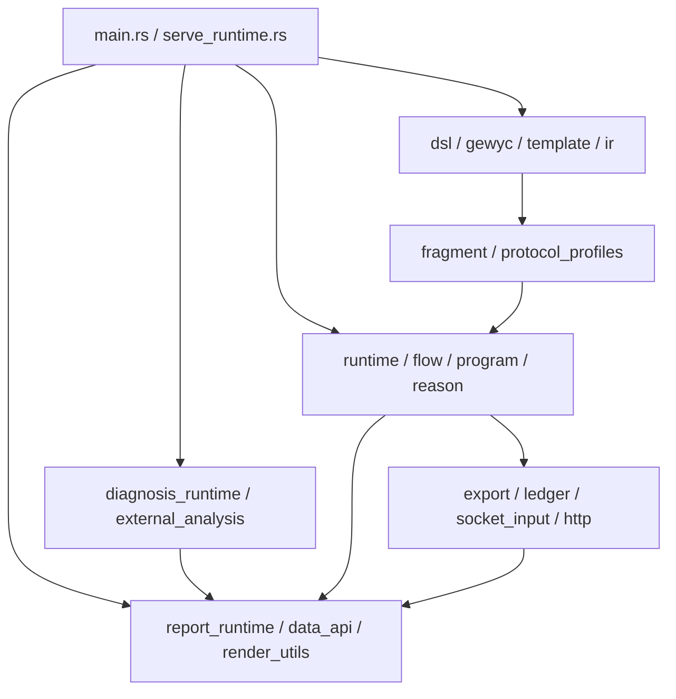

# Architecture Blueprint: Module Map

Use this page when you need the source-level architecture sheet for the
Gewyvern evidence plane. The cross-product authority and intent planes are
defined by [the canonical architecture blueprint](architecture-blueprint.md).

This page complements:

- [docs/architecture-blueprint.md](docs/architecture-blueprint.md)
- [docs/system.md](docs/system.md)
- [docs/module-boundaries.md](docs/module-boundaries.md)

Its job is to show:

- which source clusters exist today
- how they depend on each other
- which ones are policy layers versus substrate layers

## Role In The Shelf

Treat this page as the source-cluster blueprint.

Use it when you want:

- the dependency picture between entrypoints, reporting, diagnosis, runtime,
  compiler, registry, and export
- a module-cluster overview before dropping to file-by-file ownership rules

Then continue with:

- [docs/module-boundaries.md](docs/module-boundaries.md)
  for concrete file ownership rules
- [docs/architecture.md](docs/architecture.md)
  for runtime-pipeline internals

## Module Blueprint

## Source Clusters

### Entry And Lifecycle

- `src/main.rs`
- `src/serve_runtime.rs`

Responsibilities:

- CLI parsing
- mode selection
- service lifecycle
- top-level orchestration

These files should stay thin.

### Reporting And API

- `src/report_runtime.rs`
- `src/data_api.rs`
- `src/render_utils.rs`

Responsibilities:

- output shaping
- snapshot serialization
- latest-state read surfaces

These files should not invent new diagnosis policy.

### Diagnosis Policy

- `src/diagnosis_runtime.rs`
- `src/external_analysis.rs`

Responsibilities:

- competing hypotheses
- confidence shaping
- conservative reduction
- additive augmentation merge

These files should interpret evidence, not collect it.

### Runtime Substrate

- `src/runtime.rs`
- `src/flow.rs`
- `src/program.rs`
- `src/reason.rs`
- `src/loader.rs`
- `src/http.rs`
- `src/socket_input.rs`

Responsibilities:

- ingest
- materialization
- transport reconstruction
- higher-level program posture
- bounded fact handling

These files are the heart of the runtime engine.

### Compiler And IR

- `src/dsl.rs`
- `src/gewyc.rs`
- `src/ir.rs`
- `src/template.rs`
- `crates/gewyc/src/main.rs`

Responsibilities:

- source parsing
- package resolution
- staged reports
- focused IR review
- binding validation

These files own how author intent becomes runtime-ready structure.

### Registry And Protocol Surface

- `src/fragment.rs`
- `src/protocol_profiles.rs`
- `src/protocol_profiles/`

Responsibilities:

- fragment inventory
- protocol family registry
- aliases
- shelves
- built-in protocol/package resolution

This cluster is now intentionally split into small files so protocol expansion
does not force one giant registry table.

### Export And Replay

- `src/export.rs`
- `src/ledger.rs`

Responsibilities:

- durable snapshots
- replay inputs
- audit-friendly runtime bundle structure

These files should stay deterministic and machine-legible.

## Dependency Rules

The intended direction is:

1. entrypoints depend on policy and substrate
2. policy depends on substrate and exported data types
3. substrate depends on compiler/registry contracts, not on report formatting
4. reporting depends on produced runtime truth, not on hidden execution paths

## Extension Rules

When extending the system:

- add protocol families in `protocol_profiles/` and `protocols/`
- add DSL/compiler behavior in `dsl.rs` and `gewyc.rs`
- add runtime evidence semantics in `runtime.rs`, `flow.rs`, `program.rs`, or `reason.rs`
- add operator rendering in `report_runtime.rs`
- add API output shaping in `data_api.rs`

## Architecture Invariants

Keep these invariants true:

- no source file becomes the accidental home for unrelated policy
- protocol addition should not require redesign of runtime core
- IR evolution should remain visible through compiler-facing reports
- machine-facing export should stay replay-oriented
- collaboration hooks should remain append-only around core truth

## Review Checklist

When reviewing a change, ask:

1. Did it land in the right cluster?
2. Did it preserve dependency direction?
3. Did it document any new cross-layer contract?
4. Did it increase hidden coupling?
5. Did it make protocol or IR evolution easier rather than harder?
