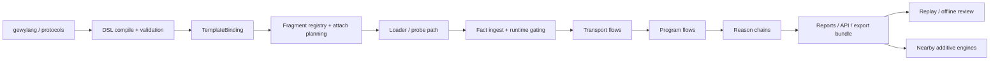
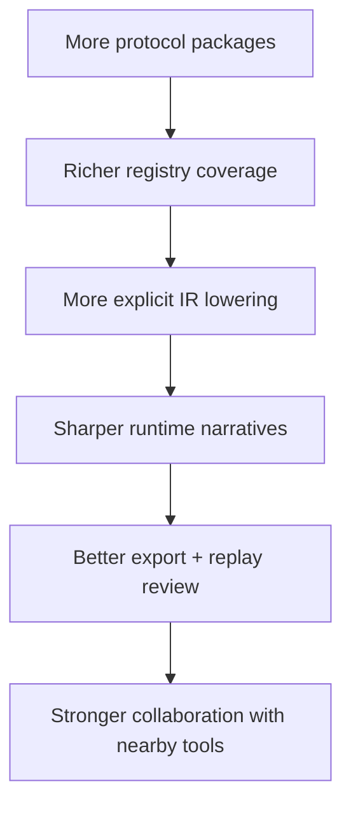

# Architecture Blueprint

Use this page when you need the project-level design sheet for `gewyvern`.

This is the durable blueprint page for the active `1.14.x` line. It is meant
to answer four questions quickly:

- what are the major subsystems?
- how does evidence move through the stack?
- what boundaries are meant to stay stable?
- where should future protocol, IR, and runtime evolution land?

This page is not the deepest runtime internals note. For that, also read:

- [docs/system.md](docs/system.md)
- [docs/architecture.md](docs/architecture.md)
- [docs/module-boundaries.md](docs/module-boundaries.md)
- [docs/book/reference-ir-lowering.md](docs/book/reference-ir-lowering.md)
- [docs/book/explanation-dataflow-topology.md](docs/book/explanation-dataflow-topology.md)

## Role In The Shelf

Treat this page as the quickest architecture design sheet.

Use it when you want:

- one page that names the major subsystems
- a fast evidence-movement picture through the stack
- the stable architectural contracts for the current line

Then branch like this:

- fuller layered prose map:
  [docs/system.md](docs/system.md)
- runtime-pipeline deep dive:
  [docs/architecture.md](docs/architecture.md)
- source-module clustering:
  [docs/architecture-blueprint-modules.md](docs/architecture-blueprint-modules.md)
- project-wide dataflow topology:
  [docs/book/explanation-dataflow-topology.md](docs/book/explanation-dataflow-topology.md)
- evolution and sequencing:
  [docs/architecture-evolution.md](docs/architecture-evolution.md)
  and
  [docs/architecture-coordination.md](docs/architecture-coordination.md)

## One-Sentence Intent

`gewyvern` is a protocol-agnostic, window-bounded network debugger where
`gewylang` selects and parameterizes prebuilt fragment capabilities, the runtime
materializes evidence into structured flows and deterministic reasons, and the
result can be exported, replayed, and augmented by nearby tools without
replacing the core runtime truth.

## Companion Shelves

- [docs/system.md](docs/system.md)
  for the layered system map in prose
- [docs/architecture.md](docs/architecture.md)
  for the runtime-pipeline and IR-bearing deep dive
- [docs/architecture-blueprint-modules.md](docs/architecture-blueprint-modules.md)
  for the source-cluster map
- [docs/module-boundaries.md](docs/module-boundaries.md)
  for file-level ownership rules
- [docs/architecture-evolution.md](docs/architecture-evolution.md)
  and
  [docs/architecture-coordination.md](docs/architecture-coordination.md)
  for how the design is supposed to mature

## System Blueprint

## Major Subsystems

### 1. Authoring Surface

This is the human-facing input layer.

- `dsl/`
- `protocols/`
- `gewy.pkg`
- `gewy.lock`

Its job is to express protocol or diagnostic intent without generating kernel
programs directly.

Design rule:

- authoring selects and parameterizes runtime capability
- authoring does not synthesize arbitrary eBPF bytecode

### 2. Compiler Surface

This is the `gewylang -> TemplateBinding` layer.

- `src/dsl.rs`
- `src/gewyc.rs`
- `crates/gewyc/src/main.rs`

Its job is to:

- parse source
- resolve package/project structure
- validate fragment compatibility
- expose binding, diagnostics, findings, stages, and envelope reports
- expose focused IR review surfaces

Design rule:

- compiler output must stay understandable without requiring a live runtime

### 3. Capability Registry

This is the static runtime inventory.

- `src/fragment.rs`
- `src/protocol_profiles.rs`
- `src/protocol_profiles/`

Its job is to define:

- what evidence can be collected
- what protocol families and entries exist
- what aliases, shelves, and package defaults resolve to

Design rule:

- registry data should be easy to extend without forcing redesign of the core runtime

### 4. Runtime Core

This is the evidence engine.

- `src/loader.rs`
- `src/runtime.rs`
- `src/flow.rs`
- `src/program.rs`
- `src/reason.rs`
- `src/ir.rs`
- `src/template.rs`

Its job is to:

- plan attaches
- gate ingested facts
- reconstruct transport flows
- materialize higher-level program flows
- derive deterministic reasons conservatively

Design rule:

- runtime semantics must stay grounded in observed facts and selected fragments

### 5. Operator Surfaces

This is the human and machine output layer.

- `src/report_runtime.rs`
- `src/data_api.rs`
- `src/serve_runtime.rs`
- `src/export.rs`
- `src/render_utils.rs`

Its job is to:

- render HTML/text/JSON
- expose latest-snapshot reads
- serve long-lived runtime/API loops
- export replayable bundles

Design rule:

- operator surfaces render and expose runtime truth
- they do not become a second reasoning engine

### 6. Additive Collaboration Layer

This is the nearby multi-tool boundary.

- `etragon`
- `leserpent`
- external analysis workers

Its job is to:

- enrich
- rank
- summarize
- orchestrate

It is not allowed to redefine the core `gewyvern` diagnosis spine.

Design rule:

- `gewyvern` remains the runtime truth source
- nearby engines remain additive, bounded, and replaceable

## Stable Boundary Contract

For the current line, the important architectural contracts are:

1. `gewylang` compiles into bindings and IR-facing reports, not kernel code.
2. Fragments remain the kernel-facing capability units.
3. Protocol shelves remain a registry/selection surface, not a second compiler.
4. Runtime reasoning remains conservative and evidence-bounded.
5. Export remains replay-oriented and deterministic.
6. External engines may append context, but not override base runtime truth.

## Evolution Path

The intended architectural evolution is:

What should grow next:

- protocol family depth
- registry structure
- IR explainability
- runtime validation evidence
- collaboration contracts

What should not grow casually:

- ad hoc generated kernel behavior
- hidden second reasoning engines
- undocumented cross-layer shortcuts
- unstable machine-facing schema drift

## Decision Sheet

When taking a design change, use this quick routing table:

- protocol addition: registry + protocol shelf + packaged DSL + validation
- `gewylang` feature: compiler surface + IR contract + docs
- runtime interpretation change: runtime + reason + operator semantics docs
- long-lived service change: serve/API/report layers + service-behavior docs
- sidecar collaboration change: external-engine contract + sidecar-collaboration docs

## Companion Pages

- [docs/system.md](docs/system.md)
  Layered system map.
- [docs/architecture-blueprint-modules.md](docs/architecture-blueprint-modules.md)
  Module-level dependency and ownership blueprint.
- [docs/architecture.md](docs/architecture.md)
  Runtime pipeline deep dive.
- [docs/module-boundaries.md](docs/module-boundaries.md)
  Concrete source ownership rules.
