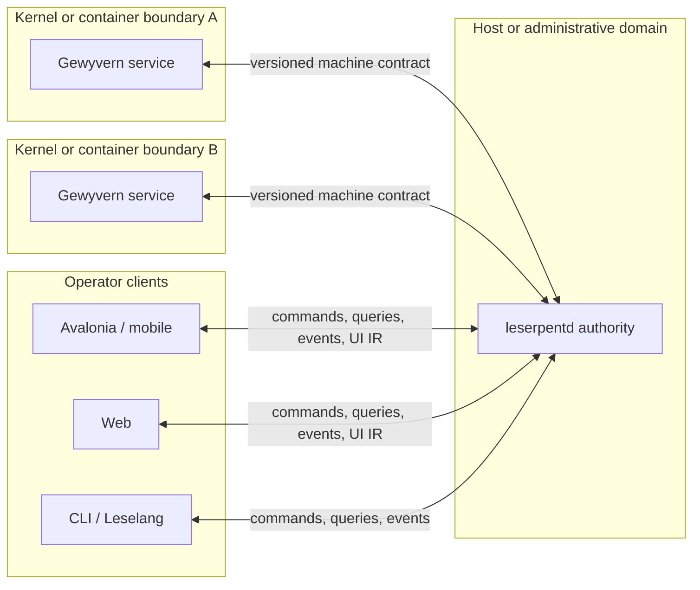

# Architecture Blueprint

This is the canonical system-level architecture for the active `2.0.x` line.
It describes Gewyvern, GewyLang, Leserpent, and Leselang as one system while
preserving their independent product and process boundaries.

Use the deeper pages only after this one:

- [Gewyvern runtime internals](architecture.md)
- [Gewyvern source modules](architecture-blueprint-modules.md)
- [Leserpent 2 architecture](leserpent-2-architecture.md)
- [GewyLang system](gewylang-system.md)
- [Leselang language](leselang-language.md)
- [architecture change protocol](architecture-coordination.md)
- [post-2.0 evolution](architecture-evolution.md)

## System Thesis

The project is a **replayable, protocolized network debugging fabric**.

It turns bounded kernel and user-space evidence into deterministic network
program explanations, then exposes the same versioned control semantics to
humans, conventional automation, and models. It is not one large application:
each layer remains independently useful and communicates through explicit
contracts.

The shortest expression of the paradigm is:

```text
declare observation -> collect evidence -> reconstruct behavior
-> decide through durable authority -> perform bounded effects
-> project the same truth to GUI, CLI, and code -> replay
```

This is the project's advantage zone. Protocol coverage, eBPF, orchestration,
and GUI automation matter because they reinforce this loop, not as unrelated
feature counts.

## Four Planes

### Evidence Plane

Owned by Gewyvern and GewyLang.

```text
GewyLang package
  -> compiler and typed binding
  -> prebuilt fragment selection and parameters
  -> attach plan
  -> eBPF and user-space facts
  -> transport flows
  -> program flows
  -> conservative reason chains
  -> replayable reports and machine projections
```

Gewyvern owns observed truth. It remains a standalone Linux-first debugger and
must never require Leserpent, a graphical client, an account, or Etragon in
order to collect, explain, export, or replay evidence.

GewyLang selects and parameterizes known capabilities. It does not generate
arbitrary kernel programs. This keeps verifier risk, privilege, and evidence
shape bounded by reviewed fragment templates.

### Authority Plane

Owned by the Rust Leserpent domain, runtime, adapters, and `leserpentd`.

```text
CommandEnvelope / Query
  -> identity, capability, revision, and confirmation checks
  -> durable command plan and journal
  -> bounded adapter effect
  -> receipt and authoritative projection
  -> event stream and deterministic recovery
```

`leserpentd` owns control truth: runtime registration, orchestration,
deployment, effect scheduling, persistence, idempotency, and recovery. A
frontend may request an operation, but it cannot define or bypass its policy.

### Intent Plane

Owned by Leselang and the shared Leserpent command/query domain.

Leselang is a narrow, hostable Rust automation language for control and GUI
semantics. Its source model is synchronous. External work suspends as a typed,
journaled effect and resumes through an explicit continuation instead of
exposing ambient `async` state to the program.

The intent plane accepts three equivalent origins:

- a Leselang program, including a model-proposed program
- the native Leserpent CLI
- a typed action emitted by a graphical frontend

All three lower into the same command/query contract. No origin receives a
private authority path.

### Presentation Plane

Owned by replaceable clients and renderer adapters.

- Avalonia desktop
- native mobile hosts
- the TypeScript Web console
- future renderers implementing the same adapter contract

Rust produces renderer-neutral `UiDocument`, event, patch, and presentation
operations. Frontends own native controls, layout, focus, accessibility,
animation, and secret storage integration. They do not own orchestration,
authorization, revision, or effect semantics.

A GUI framework is compatible only after a developer-owned adapter or a
schema-driven generator implements the declared `UiAdapterManifest`. There is
no magical automatic compatibility claim.

### Advisory Sideplane

Etragon is deliberately outside the four-plane authority chain.

It may consume sanitized Gewyvern analysis, learn, rank, or append advice. It
cannot replace evidence, rewrite the base diagnosis, authorize an effect, or
become required for ordinary operation. Until its reproducible deep-learning
stack exists, it remains a deferred optional sidecar.

### Shared Native Foundation

Three narrow crates sit below product semantics rather than forming another
authority plane:

- `silvortex-bounded-io` owns security-sensitive bounded file and transport
  mechanics without depending on any product crate.
- `silvortex-identity` owns validated runtime, provisioning, retirement, and
  credential identities plus their stable scalar wire representation.
- `gewyvern-install-contract` owns the strict installation and retirement wire
  exchanged between a Gewyvern binary and Leserpent deployment adapters.

These crates may be reused by several planes, but they cannot decide policy or
own durable truth. Their purpose is to remove duplicated mechanism without
creating a new semantic center.

### Language-Owned Boundaries

Two leaf contracts plus independent GewyLang frontend and compiler crates
establish future repository boundaries without creating a shared business
layer:

- `gewylang-contract` owns GewyLang language identity, compiler-stage versions,
  package filename, and bounded source-graph limits. It has no product
  dependency; `gewyvern::dsl` is a compatibility re-export.
- `leselang-host-contract` owns Leselang's product-independent host ABI values:
  principal, revision, capabilities, runtime selector, and bounded effect-input
  validation. `leserpent-domain` preserves its existing imports as compatibility
  re-exports.
- `gewylang-syntax` owns bounded source loading, package/include graphs, the
  canonical syntax AST and parser, and frontend summaries. Its normal dependency
  closure contains only `gewylang-contract`.
- `gewylang-compiler` owns function expansion, parameter binding, canonical
  assignment lowering, and the explicit `SemanticHost` interface. Its normal
  dependency closure stops at `gewylang-syntax` and `gewylang-contract`.

`leselang-syntax -> leselang-host-contract + leselang-hir` is now a standalone
frontend closure. `leselang-command` remains the explicit Leserpent binding,
while VM/UI product result extraction remains staged work. Likewise,
`gewylang-contract -> gewylang-syntax -> gewylang-compiler` is a standalone
compiler closure. `gewyvern::dsl` remains its source-compatible facade and
implements the semantic host that maps canonical assignments into runtime
bindings and analysis reports. `gewyc` still links Gewyvern only for that final
product-facing binding and reporting layer.

## End-To-End Topology



The default cardinality is intentional:

```text
one kernel/container boundary -> one Gewyvern service
one leserpentd authority      -> many Gewyvern services
one Leserpent client          -> many independent leserpentd authorities
```

This keeps capture and privilege local to the observed boundary, control
authority local to an administrative domain, and operator presentation free to
span several domains without silently merging their authority.

Reverse deployment follows the same direction:

```text
client bootstrap credential
  -> install and bind leserpentd
  -> connect to that new authority
  -> authority-scoped deployment credential
  -> install, attest, and register Gewyvern
```

Bootstrap credentials do not become permanent runtime authority, and runtime
credentials do not leak into renderer state.

## Two Languages, Two Jobs

| Language | Declares | Lowers Into | Must Not Own |
| --- | --- | --- | --- |
| GewyLang | what evidence and protocol behavior to observe | fragment/template bindings and runtime IR | arbitrary eBPF generation, fleet authority, UI behavior |
| Leselang | what control operation or UI presentation to perform | typed command plans, UI IR, and effect continuations | packet interpretation, ambient host access, general application runtime |

They meet through versioned machine contracts, not shared hidden state.
GewyLang makes network behavior programmable; Leselang makes operation and
presentation programmable.

## Authority Ledger

Every important truth has exactly one owner:

| Truth | Owner | Read By |
| --- | --- | --- |
| observed facts and reconstructed network behavior | Gewyvern | reports, Leserpent, Etragon |
| protocol package meaning and fragment requirements | GewyLang compiler and registry | Gewyvern |
| commands, revisions, effects, receipts, and durable fleet state | Leserpent Rust authority | every frontend |
| automation execution and continuation state | Leselang VM plus Leserpent journal | CLI and GUI projections |
| native layout, focus, animation, and platform secret handles | each renderer | that renderer only |
| advisory ranking or learned suggestions | Etragon | operators and policy as untrusted advice |

If two modules can both mutate the same truth independently, the architecture
is wrong. Compatibility bridges may translate, but they may not establish a
second authority.

## Atomic Replaceability

GUI, CLI, and Leselang are equivalent at the semantic boundary, not visually
identical.

For the same principal, capabilities, expected revision, and input state:

- equivalent operations lower to equivalent command plans
- authorization and confirmation decisions are identical
- external effects are journaled and recovered identically
- queries and events expose the same domain truth
- only presentation-local behavior may differ

This makes model-driven automation inspectable. A model proposes bounded
Leselang or typed intent; it does not click through an invisible privileged
back door.

## Stable Boundary Contracts

The current architecture depends on these contracts staying explicit:

1. GewyLang source -> expanded syntax, binding IR, analysis IR, and
   `TemplateBinding`.
2. Fragment registry -> attach plan and declared fact capability.
3. Gewyvern facts -> flows, reasons, reports, API projections, and replay.
4. Leserpent domain -> versioned commands, queries, events, revisions, and
   capabilities.
5. Leselang -> typed effects, command plans, UI IR, and continuations.
6. `leserpentd` -> authenticated IPC/HTTPS/WebSocket transport and durable
   authority.
7. Renderer adapter -> complete `UiAdapterManifest` conformance.
8. Etragon -> append-only advisory augmentation.

Transport is not authority. Serialization is not policy. A C#, TypeScript, or
future FFI client may carry a contract without owning its meaning.

## Dependency Direction

The intended source direction is:

```text
renderer hosts
  -> generated/strict client codecs
  -> leserpent-protocol
  -> leserpent-domain

leselang-syntax -> leselang-host-contract -> leselang-hir
                                             |
                                             v
                          Leserpent command/UI adapters -> VM/observe
                                      |
                                      v
leserpent-domain -> runtime -> adapters -> leserpentd
                                      |
                                      v
                           Gewyvern machine contract

silvortex-bounded-io -> Gewyvern / protocol / adapters / CLI / daemon
silvortex-identity -> Gewyvern install contract / leserpent-domain
gewyvern-install-contract -> Gewyvern installer / protocol / adapters
gewylang-contract -> gewylang-syntax -> gewylang-compiler -> external tooling
                                                           |
                                                           v
                                         Gewyvern semantic host -> gewyc

GewyLang -> gewylang-compiler -> fragment registry -> Gewyvern runtime -> export/replay
                                                      |
                                                      v
                                         optional Etragon advice
```

The logical Gewyvern runtime remains independent. Generic bounded file, HTTP
token, connection-deadline, and absolute-I/O-deadline behavior now lives in the
zero-business-dependency `silvortex-bounded-io` crate. Shared validated
identities live in the zero-product-dependency `silvortex-identity` crate.
Strict Gewyvern installation and retirement messages live in
`gewyvern-install-contract`, which depends only on that neutral identity layer
plus codec and cryptographic primitives. `leserpent-domain` and
`leserpent-protocol` preserve their old public import paths as re-exports of the
same Rust types and modules. The Gewyvern production graph therefore imports no
Leserpent or Leselang product crate while retaining identical identifier wire
bytes.

## The Advantage Zone

The project should compete where all four planes reinforce each other:

1. **Evidence-native debugging**: kernel facts become protocol and program
   explanations rather than an undifferentiated packet stream.
2. **Verifier-safe programmability**: a DSL composes reviewed capture
   capabilities instead of generating arbitrary privileged code.
3. **Replay before automation**: evidence, decisions, effects, and UI intent
   can be inspected and compared after the live incident.
4. **Interface equivalence**: GUI, CLI, and model-driven code share one
   command/query and UI protocol.
5. **Deterministic effect re-entry**: synchronous source semantics survive
   external waits, crashes, retries, and daemon restarts through durable typed
   continuations.
6. **Topology-aware self-hosting**: capture stays near kernels while one client
   can safely coordinate many independent authorities.
7. **Local sovereignty**: the free core remains useful without a hosted
   account, cloud policy engine, or proprietary control service.

Wireshark remains a stronger general packet microscope, proxy tools remain
stronger for interception workflows, and observability platforms remain
stronger for long-horizon telemetry. Gewyvern's distinct category is the
bounded debugging loop that connects protocol-aware evidence, durable control,
and replaceable automation surfaces.

## Scope Guardrails

Do not dilute the advantage zone by turning the project into:

- a general packet analyzer clone
- a transparent interception proxy clone
- a general-purpose eBPF compiler
- a general-purpose programming language or application VM
- a frontend-led control plane
- an ML-led diagnosis authority
- a mandatory cloud service
- a long-horizon metrics warehouse

Integrations with those categories are useful only when they preserve the
authority ledger and feed the debugging loop.

## Current Pressure Map

The status tensor and source map identify four maintenance priorities:

1. Keep the shipped Rust authority and renderer parity proofs green; do not
   confuse a 100% delivery score with permanent maturity.
2. Freeze the ASP.NET/TypeScript implementation as a compatibility bridge and
   add no new semantic authority there.
3. Preserve the completed neutral I/O, identity, install-contract, and
   language-contract extractions; no product semantics or reverse product
   dependencies may leak back into those crates.
4. Finish the language seams: preserve the extracted GewyLang frontend and
   host-generic compiler, then extract product-neutral Binding/Analysis IR so
   `gewyc` no longer links the runtime; split Leselang VM/UI product bindings
   behind the host contract without changing wire behavior.
5. Split other internal monoliths along existing contracts when touched. In
   particular, Leserpent runtime/persistence modules should become smaller
   implementation units without changing their public protocol.

Etragon remains explicit deferred work, not a hidden weakness in the core
release.

## Change Routing

- New protocol observation belongs in protocol packages, GewyLang lowering,
  fragment capability, and evidence proof.
- New diagnosis semantics belong in Gewyvern runtime IR and replay tests.
- New fleet operation starts in `leserpent-domain`, then runtime policy,
  adapter effect, transport, Leselang lowering, and frontend projection.
- New GUI behavior starts as renderer-neutral UI IR unless it is strictly
  local layout, focus, accessibility, animation, or secret storage.
- New model behavior must enter through the same Leselang parser, HIR,
  capability, confirmation, and effect limits as human-authored automation.
- New advisory logic belongs in Etragon and stays append-only.

The detailed sequencing rules live in
[Architecture Coordination](architecture-coordination.md). Current maturity,
independence, dependencies, and evidence remain authoritative in the
[project status tensor](project-status-system.md).
