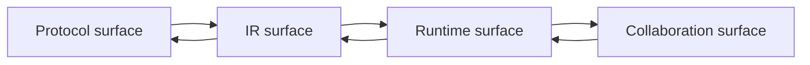

# Architecture Coordination

Use this page when you need the coordination sheet across the four main
evolution lines in `gewyvern`:

- protocol surface
- IR surface
- runtime surface
- nearby collaboration surface

This page is meant to answer:

- how do these lines constrain each other?
- where should new work land first?
- what has to be true before a later line can grow safely?

Read this alongside:

- [docs/architecture-blueprint.md](/Users/Shared/chroot/dev/gewyvern/docs/architecture-blueprint.md)
- [docs/architecture-evolution.md](/Users/Shared/chroot/dev/gewyvern/docs/architecture-evolution.md)
- [docs/book/reference-protocol-surface.md](/Users/Shared/chroot/dev/gewyvern/docs/book/reference-protocol-surface.md)
- [docs/book/reference-ir-lowering.md](/Users/Shared/chroot/dev/gewyvern/docs/book/reference-ir-lowering.md)
- [docs/sidecar-collaboration.md](/Users/Shared/chroot/dev/gewyvern/docs/sidecar-collaboration.md)

## Role In The Shelf

Treat this page as the sequencing sheet across architecture lines.

Use it after you already understand the basic stack and now want to answer:

- which line should change first?
- what does protocol work owe IR work?
- when is collaboration safe to expose?

If you still need the broad architecture picture first, step back to:

- [docs/architecture-blueprint.md](/Users/Shared/chroot/dev/gewyvern/docs/architecture-blueprint.md)
- [docs/system.md](/Users/Shared/chroot/dev/gewyvern/docs/system.md)

## The Four-Line Model



The important point is that these are not independent tracks.

They are one system viewed from four different leverage points.

## Line 1: Protocol Surface

This line covers:

- `protocols/`
- `protocol_profiles`
- family shelves
- aliases
- packaged entry layout

Its job is to answer:

- what network-module paths are supported?
- how are they named and resolved?
- which entrypoint should a user or validator run?

This line should move first when:

- a protocol family is incomplete
- an entry split is unclear
- package organization is drifting

But protocol work is not finished when the package exists.
It is only finished when the rest of the lines can understand it too.

## Line 2: IR Surface

This line covers:

- lowered `program_model`
- lowered `reason_model`
- `ir_lowering_delta`
- explain/report envelopes

Its job is to answer:

- what did the author intent lower into?
- which modules and phases exist explicitly now?
- which rule shapes are supported or unsupported?

This line should move next after protocol work when:

- a new protocol path is hard to review
- supportability is unclear
- the lowered model is too opaque to compare across versions

Protocol depth without readable IR becomes expensive quickly.

## Line 3: Runtime Surface

This line covers:

- fact gating
- transport flows
- program flows
- reasons
- diagnosis spine
- operator guidance
- export and replay surfaces

Its job is to answer:

- what evidence actually materialized?
- what network function does the runtime think happened?
- what conservative action should an operator take next?

This line should move after IR work when:

- the lowered model is clear, but runtime posture is weak
- mixed-flow scenarios are still too ambiguous
- exported runtime truth is hard to trust or replay

Runtime work should remain evidence-first rather than narrative-first.

## Line 4: Collaboration Surface

This line covers:

- external-engine contracts
- `etragon` collaboration
- `leserpent` control-plane integration
- additive context and orchestration boundaries

Its job is to answer:

- how can nearby tools help without becoming the truth source?
- what can be appended, ranked, or orchestrated safely?
- what remains owned by standalone `gewyvern`?

This line should move last in the chain when:

- protocol coverage exists
- IR shape is explainable
- runtime outputs are trustworthy enough to share

Collaboration is strongest when the earlier three lines are already clear.

## Dependency Order

The safest design order is:

```text
protocol clarity
  -> IR clarity
  -> runtime clarity
  -> collaboration clarity
```

The reverse order is usually a smell.

If collaboration pressure starts forcing hidden runtime semantics or hidden IR
assumptions, the architecture is drifting.

## What Each Line Owes The Next One

### Protocol -> IR

The protocol line owes the IR line:

- stable canonical names
- explicit package boundaries
- clear entrypoint splits

### IR -> Runtime

The IR line owes the runtime line:

- explicit modules and phases
- reviewable rule shapes
- supportability clarity

### Runtime -> Collaboration

The runtime line owes the collaboration line:

- trustworthy base diagnosis
- bounded machine-facing contracts
- replayable and inspectable runtime truth

### Collaboration -> Runtime

The collaboration line owes the runtime line:

- append-only posture
- explicit trust levels
- no hidden sovereignty over diagnosis

## Example Coordination Paths

### Example A: New Protocol Entry

Work order:

1. add packaged protocol entry
2. add shelf and alias coverage
3. confirm lowered IR remains legible
4. confirm runtime guidance is still conservative
5. only then expose it to nearby tools

### Example B: IR Improvement

Work order:

1. improve lowered report clarity
2. confirm supportability diagnostics improve
3. use that clarity to sharpen runtime review
4. only later let sidecars or orchestration rely on it

### Example C: Sidecar/Control-Plane Feature

Work order:

1. confirm base runtime truth is already sufficient
2. define the additive contract
3. expose collaboration hints
4. avoid rewriting built-in guidance semantics

## Coordination Rules

When deciding where a change belongs, use these routing rules:

1. If naming, package layout, or family resolution is unclear, start at the protocol line.
2. If author intent is hard to compare or explain, start at the IR line.
3. If evidence exists but guidance is weak or misleading, start at the runtime line.
4. If the change is about multi-tool value on top of already-good runtime truth, start at the collaboration line.

## Anti-Patterns

Avoid these coordination mistakes:

- adding protocol entries without IR review surfaces
- adding IR complexity before a real protocol or operator need exists
- making runtime narratives stronger than the evidence warrants
- letting sidecars become unofficial diagnosis owners
- letting orchestration concerns distort standalone debugger boundaries

## Current 0.15.x Coordination Thesis

For the current line, the intended balance is:

- protocol expansion is welcome
- IR growth should stay structured and explainable
- runtime behavior should stay conservative and reviewable
- collaboration should remain additive and clearly bounded

That means the most valuable work is usually work that strengthens the handoff
between two neighboring lines, not work that tries to jump over them.
