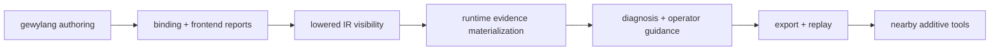
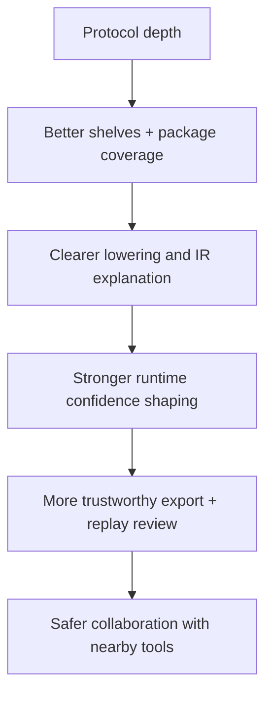

# Architecture Evolution

Use this page when you need the design-evolution sheet for `gewyvern`.

This page is the bridge between:

- the static blueprints in
  [docs/architecture-blueprint.md](docs/architecture-blueprint.md)
- the current release posture in
  [docs/v0.14-posture.md](docs/v0.14-posture.md)
- the historical minor-line notes in
  [docs/history/index.md](docs/history/index.md)

Its job is not to promise exact version contents.

Its job is to explain how the architecture is meant to mature, and what kind of
change belongs in which layer.

## The Main Evolution Spine

The project should keep evolving along one primary chain:

This order matters.

If the earlier stages stay blurry, the later stages become expensive and
fragile.

## What v0.13.x Solved

`v0.13.x` was the convergence line.

Architecturally, that line did three important things:

1. made the compiler/runtime/report split legible
2. made IR inspection and protocol registry surfaces first-class
3. made documentation and boundary wording part of the release surface

That line mostly answered:

- what is this project really trying to be?

## What v0.15.x Is Solving

`v0.15.x` is the maturity line.

Architecturally, this line is about:

1. deepening protocol coverage without collapsing organization
2. making `gewylang` and `gewyc` reusable and reviewable
3. making runtime/report/API behavior stable enough for real use
4. making collaboration with `etragon` and `leserpent` additive instead of
   invasive

That line mostly asks:

- can the clearer architecture now deepen without dissolving its own
  boundaries?

## The Intended Pace Of Change

Not every layer should evolve at the same speed.

### Fast-Moving Layers

These can keep expanding actively:

- protocol package coverage
- protocol shelves and aliases
- docs/reference detail
- compiler-facing explain/report ergonomics
- local validation workflows

### Medium-Moving Layers

These should evolve carefully but continuously:

- lowered IR representation
- program-flow and reason-flow narration quality
- export metadata richness
- additive external-engine contracts

### Slow-Moving Layers

These should change only with high confidence:

- core diagnosis spine semantics
- machine-facing contract shape
- fragment capability model direction
- runtime truth ownership model

## Evolution By Layer

### 1. gewylang

Near-term goal:

- become a clearer selector/parameterizer for existing runtime capability

Desired evolution:

- stronger package ergonomics
- better diagnostics
- lightweight inference where it improves safety and clarity

Avoid:

- turning `gewylang` into an unconstrained general language
- hiding runtime requirements behind too much inference

### 2. IR

Near-term goal:

- stay inspectable and structurally explicit

Desired evolution:

- clearer lowered views
- better deltas and archival snapshots
- more structured links between author intent and runtime evidence needs

Avoid:

- adding opaque intermediate layers that frontends cannot explain

### 3. Runtime

Near-term goal:

- stay conservative, bounded, and evidence-driven

Desired evolution:

- better mixed-flow reasoning
- richer high-frequency protocol posture
- stronger degraded-mode clarity

Avoid:

- speculative over-interpretation
- hidden fallback heuristics that drift away from declared evidence

### 4. Export And Replay

Near-term goal:

- remain deterministic enough for offline review and comparison

Desired evolution:

- clearer archival use
- sharper machine-facing summaries
- better cross-version review anchors

Avoid:

- turning export into an unstable dump of incidental internals

### 5. Nearby Tools

Near-term goal:

- make collaboration useful without making `gewyvern` dependent on it

Desired evolution:

- `etragon` as diagnosis partner
- `leserpent` as orchestration/control-plane view
- local memory/training helpers around, not inside, runtime truth

Avoid:

- moving core runtime ownership out of `gewyvern`
- making sidecars authoritative for base diagnosis

## Evolution Blueprint

That means protocol work is not isolated from IR work, and IR work is not
isolated from operator experience. They are one pipeline.

## Architecture Rules For Future Work

When choosing a change, prefer work that:

1. improves a common operator workflow
2. makes author intent more legible in compiler/IR surfaces
3. strengthens runtime conservatism instead of weakening it
4. reduces organizational entropy in the source tree
5. makes collaboration more modular rather than more entangled

Defer work that:

1. adds broad new surface without stronger validation
2. introduces another implicit truth source
3. hides evidence requirements behind magic
4. widens the language faster than the runtime can justify

## Reading Order For Reviewers

If you want to review the architecture as a moving system, use this order:

1. [docs/architecture-blueprint.md](docs/architecture-blueprint.md)
2. [docs/architecture-blueprint-modules.md](docs/architecture-blueprint-modules.md)
3. [docs/architecture-evolution.md](docs/architecture-evolution.md)
4. [docs/history/v0.13.x.md](docs/history/v0.13.x.md)
5. [docs/history/v0.15.x.md](docs/history/v0.15.x.md)
6. [docs/field-validation.md](docs/field-validation.md)

## Current Thesis

For the current line, the architecture thesis is:

- keep the standalone debugger core narrow
- deepen protocol and IR quality without broad architectural churn
- let nearby tools collaborate through explicit contracts
- make every layer easier to inspect than it was in the previous minor line

If a change does not help one of those outcomes, it probably does not belong on
the main architectural spine right now.
