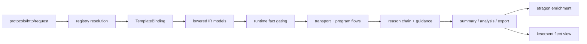

# Architecture Walkthrough: HTTP Request Path

Use this page when you want one concrete, end-to-end architecture walkthrough
instead of several separate theory pages.

This walkthrough follows one built-in packaged path:

- [protocols/http/request/gewy.pkg](/Users/Shared/chroot/dev/gewyvern/protocols/http/request/gewy.pkg)
- [protocols/http/request/main.gewy](/Users/Shared/chroot/dev/gewyvern/protocols/http/request/main.gewy)

It is the shortest representative path that touches all four main lines:

- protocol surface
- IR surface
- runtime surface
- collaboration surface

Read this alongside:

- [docs/architecture-blueprint.md](/Users/Shared/chroot/dev/gewyvern/docs/architecture-blueprint.md)
- [docs/architecture-coordination.md](/Users/Shared/chroot/dev/gewyvern/docs/architecture-coordination.md)
- [docs/book/reference-protocol-surface.md](/Users/Shared/chroot/dev/gewyvern/docs/book/reference-protocol-surface.md)
- [docs/book/reference-ir-lowering.md](/Users/Shared/chroot/dev/gewyvern/docs/book/reference-ir-lowering.md)
- [docs/sidecar-collaboration.md](/Users/Shared/chroot/dev/gewyvern/docs/sidecar-collaboration.md)

## Why This Path

`http request` is useful as an architecture sample because it has:

- a real packaged registry entry
- canonical family/entry naming
- explicit module and phase structure
- transport and application-facing stages
- a believable path for sidecar enrichment and control-plane summarization

It is therefore a better “full-stack diagram path” than a tiny synthetic demo.

## One View Of The Whole Path

## Step 1: Protocol Surface

The packaged manifest declares:

- protocol family: `http`
- entry: `request`
- default: `true`
- family aliases:
  - `http-request`
  - `http_request`
- entry alias:
  - `client`

Architecturally, this means the protocol line is responsible for:

- canonical naming
- alias compatibility
- default-entry behavior
- path resolution into a package root

This is not just a folder convention.
It is the stable shelf that CLI resolution, validators, and docs all share.

## Step 2: gewylang Author Intent

The package entry expresses intent through:

- fragment selection
- operation selection
- rule and reason declarations
- module and phase labels
- fragment parameters

What it does not express:

- generated eBPF bytecode
- an unbounded execution graph
- arbitrary runtime authority outside the selected fragment surface

That is a core architectural boundary.

`gewylang` here is selecting a runtime shape, not inventing a kernel program.

## Step 3: Lowered IR Shape

This path lowers into a rule-bearing model with explicit phases such as:

- `bind`
- `resolve_upstream`
- `connect`
- `establish`
- `send_request`
- `receive_response`

This is where the IR line takes over.

The IR surface makes these questions answerable:

- what exact phase story did the package lower into?
- which rules are supportable by the chosen fragments?
- how does author intent become explicit runtime structure?

Without this layer, the runtime would have to interpret the package as a blur.

## Step 4: Runtime Evidence Materialization

Once lowered and validated, the runtime uses the selected fragments to collect
and gate facts such as:

- TCP state transitions
- packet metadata
- route metadata
- socket lineage

Those facts then materialize into:

- transport flows
- program flows
- reason chains

For this HTTP request path, the runtime should be able to tell a bounded story:

1. which process was bound
2. which route was selected
3. whether the remote socket transitioned
4. whether request payload was sent
5. whether response payload was observed

This is where the runtime line earns operator trust.

## Step 5: Diagnosis And Guidance

The next architectural responsibility is not only “materialize facts”, but also
“compress them conservatively”.

For this path, that usually means the runtime is shaping:

- `primary_failure_*`
- `operator_guidance_*`
- `ambiguous`
- `competing_hypotheses`

The important architectural rule here is:

- guidance is downstream of evidence
- guidance is not allowed to outrun evidence

That is why `gewyvern` is more valuable as a conservative debugger than as a
prematurely certain narrator.

## Step 6: Export And Replay

After runtime materialization, the path becomes:

- `summary.json`
- `analysis.json`
- full export bundle
- replayable offline runtime state

That means this HTTP request path is not only a live diagnosis path.
It is also a review artifact path.

Architecturally, this is what allows:

- offline inspection
- version-to-version comparisons
- sidecar consumption without re-running the original session

## Step 7: Sidecar Collaboration

Once the runtime truth exists, a nearby tool such as `etragon` may contribute:

- evidence-chain enrichment
- diagnostic opinion
- additive augmentations

For this path, that might look like:

- the base runtime says “missing transition after connect”
- the sidecar says “this resembles a known upstream TLS handshake stall”

But the boundary remains:

- `gewyvern` owns the base diagnosis spine
- `etragon` appends context

The sidecar line is therefore downstream of runtime truth, not parallel truth.

## Step 8: Control-Plane Consumption

At the next layer up, `leserpent` may consume the resulting snapshot as:

- runtime capability state
- protocol-flow posture
- sidecar presence or trust hints
- operator drill-down detail

In this architecture, `leserpent` should never need to guess what the runtime
meant. It should be able to consume:

- canonical protocol/entry identity
- stable diagnosis spine fields
- additive sidecar context

That is the control-plane value of keeping the earlier lines explicit.

## Coordination View

This one path shows how the four lines depend on each other:

### Protocol line

- decides family, entry, aliases, package identity

### IR line

- decides explicit module/phase structure and supportability visibility

### Runtime line

- decides what evidence really materialized and how conservatively to compress it

### Collaboration line

- decides how nearby tools enrich or orchestrate the already-materialized truth

If any earlier line is weak, the later one gets weaker too.

## What To Change First When This Path Feels Weak

Use this routing table:

- naming, entry split, or package confusion:
  fix the protocol line first
- unclear phase story or supportability:
  fix the IR line first
- misleading guidance or poor mixed-flow posture:
  fix the runtime line first
- better fleet display or additive explanation:
  fix the collaboration line first

## Why This Walkthrough Matters

This HTTP request path is not special because HTTP itself is special.

It matters because it shows the intended architecture contract in one place:

- packaged protocol path
- explicit lowered model
- bounded runtime materialization
- conservative diagnosis
- replayable export
- additive sidecar enrichment
- control-plane consumption above that

If future work cannot be explained through a path like this, it is a sign that
the architecture has probably become less legible than it should be.
