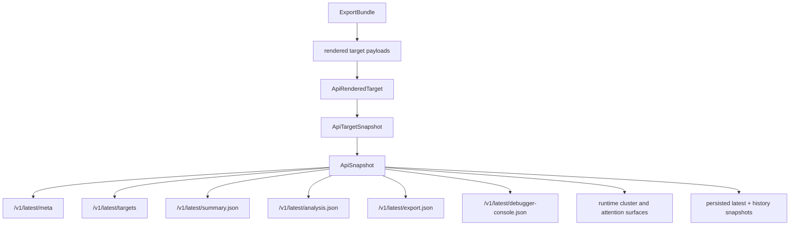
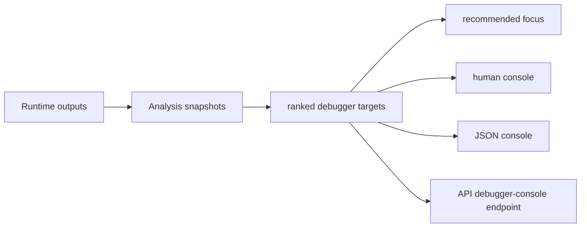

# Explanation: Dataflow Topology

This chapter explains how data moves through the `gewyvern` monorepo stack.

Use it when the question is:

- where does runtime truth enter the system?
- where does authored intent become reviewable IR?
- which layer owns each output surface?
- how do `etragon`, `leserpent`, and orchestration fit without taking over the
  core debugger?

Read this alongside:

- [docs/architecture-blueprint.md](docs/architecture-blueprint.md)
- [docs/book/explanation-gewylang-to-ir.md](docs/book/explanation-gewylang-to-ir.md)
- [docs/book/explanation-gewy-to-runtime.md](docs/book/explanation-gewy-to-runtime.md)
- [docs/book/explanation-stack-topology.md](docs/book/explanation-stack-topology.md)
- [docs/sidecar-collaboration.md](docs/sidecar-collaboration.md)

## Book Path

This chapter lives in Part V: The Broader Stack.

Read it after:

- [docs/architecture-blueprint.md](docs/architecture-blueprint.md)
- [docs/book/explanation-gewy-to-runtime.md](docs/book/explanation-gewy-to-runtime.md)

Then continue with:

- [docs/book/explanation-stack-topology.md](docs/book/explanation-stack-topology.md)
- [docs/architecture-coordination.md](docs/architecture-coordination.md)

## Short Version

The project has four dataflow lanes:

- authoring lane
  `gewylang`, protocol packages, compiler validation, and lowered review
  surfaces
- runtime lane
  selected fragments, attach planning, fact ingest, flows, reasons, and
  conservative diagnosis
- publication lane
  reports, exports, API snapshots, persistence, and local debugger console
  views
- collaboration lane
  additive `etragon` enrichment, `leserpent` fleet orchestration, and external
  consumers

The important invariant is:

```text
author intent selects capability
observed facts create runtime truth
outputs publish truth
collaborators enrich or orchestrate truth
```

The reverse direction should never silently rewrite the base diagnosis spine.

## Whole-System Map

```mermaid
flowchart LR
    A["Protocol packages<br/>protocols/*/gewy.pkg + main.gewy"] --> B["gewylang parser<br/>src/dsl.rs + src/dsl/*"]
    B --> C["gewyc review surfaces<br/>src/gewyc.rs + crates/gewyc"]
    C --> D["TemplateBinding / IR shape<br/>src/template.rs + src/ir.rs"]
    D --> E["Fragment and protocol registry<br/>src/fragment.rs + src/protocol_profiles.rs"]
    E --> F["Runtime session<br/>src/runtime.rs"]
    F --> G["Fact ingest and gating<br/>src/ledger.rs + socket_input"]
    G --> H["Transport flows<br/>src/flow.rs"]
    H --> I["Program flows<br/>src/program.rs"]
    I --> J["Reasons and diagnosis<br/>src/reason.rs + diagnosis_runtime"]
    J --> K["Export bundle<br/>src/export.rs"]
    K --> L["Human reports<br/>src/report_runtime.rs"]
    K --> M["Machine API snapshot<br/>src/data_api.rs"]
    K --> N["Persistent history<br/>src/data_api/persistence.rs"]
    M --> O["leserpent control plane<br/>apps/leserpent"]
    K --> P["etragon sidecar input<br/>apps/etragon"]
    P --> Q["Additive enrichment"]
    Q --> L
    Q --> M
```



This map intentionally separates the runtime core from the applications around
it. `gewyvern` can still run by itself. The rest of the stack makes it easier
to understand, learn from, and coordinate.

## Lane 1: Authoring And Compile Data

Authoring input starts in:

- [protocols](protocols)
- [dsl](dsl)
- [docs/book/reference-gewylang-package.md](docs/book/reference-gewylang-package.md)

Primary code owners:

- [src/dsl.rs](src/dsl.rs)
- [src/dsl](src/dsl)
- [src/gewyc.rs](src/gewyc.rs)
- [crates/gewyc](crates/gewyc)

The authoring lane produces:

- parsed package intent
- validation diagnostics
- frontend graphs and summaries
- lowered IR review surfaces
- `TemplateBinding`-shaped runtime input

This lane is not allowed to produce arbitrary kernel behavior. It selects and
parameterizes known capabilities.

## Lane 2: Runtime Evidence Data

Runtime input comes from two places:

- compiled authoring intent
- observed facts from socket, scan, or eBPF-oriented collection paths

Primary code owners:

- [src/template.rs](src/template.rs)
- [src/fragment.rs](src/fragment.rs)
- [src/loader.rs](src/loader.rs)
- [src/runtime.rs](src/runtime.rs)
- [src/ledger.rs](src/ledger.rs)
- [src/flow.rs](src/flow.rs)
- [src/program.rs](src/program.rs)
- [src/reason.rs](src/reason.rs)
- [src/diagnosis_runtime.rs](src/diagnosis_runtime.rs)

The runtime lane transforms data like this:

```text
TemplateBinding
  -> selected fragment capability
  -> attach / ingest plan
  -> accepted and rejected facts
  -> transport flows
  -> program flows
  -> reasons
  -> conservative operator guidance
```

The runtime lane owns baseline truth. If evidence is missing, ambiguous, or
degraded, the data should stay explicit rather than being hidden behind a
confident narrative.

## Lane 3: Publication Data

Publication starts with an `ExportBundle` and branches into human, machine, and
history surfaces.

Primary code owners:

- [src/export.rs](src/export.rs)
- [src/report_runtime.rs](src/report_runtime.rs)
- [src/report_runtime](src/report_runtime)
- [src/data_api.rs](src/data_api.rs)
- [src/data_api](src/data_api)
- [src/serve_runtime.rs](src/serve_runtime.rs)

The publication lane produces:

- text summaries
- JSON summaries
- findings
- analysis snapshots
- training examples and datasets
- export bundles
- HTML reports
- local debugger console views
- API snapshots and target snapshots
- history snapshots

This is where a single runtime becomes consumable by humans, scripts,
`leserpent`, and future replay tooling.

## Lane 4: Collaboration Data

Collaboration data is allowed to help, but not to take ownership of runtime
truth.

Primary code owners:

- [apps/etragon](apps/etragon)
- [apps/leserpent](apps/leserpent)
- [src/external_analysis.rs](src/external_analysis.rs)
- [docs/external-engine-contract.md](docs/external-engine-contract.md)
- [docs/sidecar-collaboration.md](docs/sidecar-collaboration.md)

`etragon` consumes runtime/export context and returns additive learning or
diagnostic context.

`leserpent` consumes stable API surfaces from many `gewyvern` runtimes and
turns them into fleet-level workflows.

Orchestration can reach remote-equivalent operating shapes, but the remote
dimension belongs above the local runtime. The core debugger should first make
local capability reliable, inspectable, and safe to publish.

## API Snapshot Topology

The API snapshot is the most important machine-facing handoff point.



Use the API snapshot when a consumer needs a stable read model. Do not make a
consumer scrape local text output if an API or export surface exists.

## Debugger Console Topology

The local debugger console is a publication view, not a separate runtime.



This makes the debugger feel more operator-native without creating a second
truth source.

## Ownership Rules

### `gewylang` Owns Intent

It owns what the operator asked for, which packages exist, and which
parameters are valid.

### `gewyc` Owns Reviewability

It owns parse/validation diagnostics, explain output, frontend summaries, and
IR-facing review surfaces.

### Runtime Owns Truth

It owns accepted facts, flows, reasons, diagnosis, degraded state, and
operator guidance.

### Publication Owns Shape

It owns how truth is rendered, exported, snapshotted, served, and persisted.

### `etragon` Owns Enrichment

It owns learned or nearby diagnostic context, but remains append-only relative
to baseline diagnosis.

### `leserpent` Owns Coordination

It owns registration, fleet browsing, UI workflow, and multi-runtime control
plane state.

## Drift Warnings

The topology is drifting if:

- a UI starts inferring runtime truth that is not in API/export data
- a sidecar result overwrites `primary_failure_*` or `operator_guidance_*`
- a protocol package requires hidden runtime assumptions to make sense
- local debugger output and API debugger output rank targets differently
- `leserpent` has to understand compiler internals to render a fleet view
- history snapshots cannot explain which runtime surface produced them

When one of these happens, move the missing field or contract into the earlier
lane that actually owns it.

## Practical Reading

When adding a feature, ask which lane owns the first real data mutation:

- new protocol shape:
  start in protocol packages and `protocol_profiles`
- new authoring rule:
  start in `dsl` and `gewyc`
- new runtime diagnosis:
  start in runtime, flow, program, reason, or diagnosis modules
- new output field:
  start in export/report/API publication code
- new learning or ranking hint:
  start in sidecar/external analysis and keep it additive
- new fleet workflow:
  start in `leserpent`, consuming stable machine surfaces

That keeps the project integrated without turning it into one giant
undifferentiated debugger blob.
