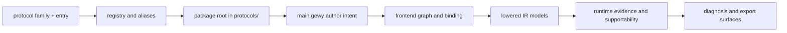

# Explanation: Protocol Package To Runtime Spine

This chapter explains how a built-in protocol package joins the main
`gewyvern` system spine.

It is broader than one concrete HTTP example and narrower than the full
project architecture.

Use it when you want the general rule for this path:

```text
protocol family + entry
  -> registry resolution
  -> gewylang package
  -> frontend and binding
  -> lowered IR
  -> runtime evidence planning
  -> diagnosis and export
```

Read this alongside:

- [docs/book/reference-protocol-surface.md](/Users/Shared/chroot/dev/gewyvern/docs/book/reference-protocol-surface.md)
- [docs/book/explanation-gewylang-to-ir.md](/Users/Shared/chroot/dev/gewyvern/docs/book/explanation-gewylang-to-ir.md)
- [docs/book/explanation-gewy-to-runtime.md](/Users/Shared/chroot/dev/gewyvern/docs/book/explanation-gewy-to-runtime.md)
- [docs/architecture-walkthrough-http-request.md](/Users/Shared/chroot/dev/gewyvern/docs/architecture-walkthrough-http-request.md)

## Book Path

This chapter lives in Part IV: Protocol Packages As A System.

Read it after:

- [docs/book/reference-protocol-surface.md](/Users/Shared/chroot/dev/gewyvern/docs/book/reference-protocol-surface.md)
- [docs/book/explanation-gewy-to-runtime.md](/Users/Shared/chroot/dev/gewyvern/docs/book/explanation-gewy-to-runtime.md)

Then continue with:

- [docs/architecture-walkthrough-http-request.md](/Users/Shared/chroot/dev/gewyvern/docs/architecture-walkthrough-http-request.md)
- [docs/book/explanation-stack-topology.md](/Users/Shared/chroot/dev/gewyvern/docs/book/explanation-stack-topology.md)

## Why This Page Exists

The project now has three separate truths that need to stay aligned:

- the protocol shelf and registry
- the `gewylang` package and compiler path
- the runtime and diagnosis path

If those are documented separately but not as one system, two bad things
happen:

- protocol additions start feeling like folder churn
- language and runtime changes stop being reviewed against real packaged use

This page keeps those three truths connected.

## The Main Package Spine

The intended system path is:



This is the normal path for a built-in packaged protocol entry.

## Step 1: Start With Canonical Protocol Identity

A protocol package begins as a canonical pair:

- protocol family
- entry name

Examples:

- `http request`
- `redis zadd`
- `smtp data`
- `kerberos tgs`
- `sip invite`

At this stage, the important project rule is:

- aliases may help users
- canonical family and entry names define the real shelf

That keeps the protocol surface stable enough for:

- CLI resolution
- validation scripts
- docs
- future tooling

## Step 2: Resolve Through The Registry

The registry turns protocol identity into a concrete package root.

That means the protocol shelf is not just a directory tree.
It is a lookup contract.

Its responsibilities are:

- discover available packaged entries
- normalize aliases
- choose default entries when one is omitted
- point the system at one concrete `gewy.pkg` and `main.gewy`

This is where the project says “which package are we actually talking about?”

## Step 3: Enter The gewylang Package

Once the registry resolves a package, the next truth source is the
`gewylang` package itself.

That package expresses:

- fragment selection
- operation selection
- reusable helper composition
- parameters
- module and phase intent
- reason-profile intent

This is the first place where protocol identity becomes authored behavior.

The protocol shelf says “which package”.
The package says “what behavior shape”.

## Step 4: Preserve Package Structure In The Frontend

Before lowering, the compiler should still be able to explain the package as
assembled source.

That is why the frontend graph matters.

For a packaged protocol entry, it should remain possible to inspect:

- which helper modules were included
- which function units were used
- how the entry-level pipeline was composed

This is especially important for protocol work because the long-term protocol
shelf is too large to review only by reading raw source files one by one.

The compiler has to help reviewers see package structure clearly.

## Step 5: Cross Into Binding And Lowered IR

After the package/frontend layer, the system narrows into:

- `TemplateBinding`
- lowered `program_model`
- lowered `reason_model`

This is where protocol packages stop being just authored DSL and become
explicit runtime-shaping models.

Now the important questions are:

- what operation did this package lower into?
- what rules and phases were materialized?
- which parts are supportable from the chosen fragments?

This is the point where protocol work, language work, and runtime work become
the same review surface.

## Step 6: Enter Runtime Supportability

Once a protocol package has lowered into explicit models, the runtime decides
what can actually be supported from real fragment capability.

This is where the project protects itself from wishful protocol modeling.

The package may ask for:

- route visibility
- packet visibility
- process lineage
- request/response stage transitions
- auth/session milestones

But the runtime still has to answer:

- which of those are truly supported?
- which are degraded?
- which are missing?

That supportability boundary is what keeps protocol depth honest.

## Step 7: Materialize Diagnosis And Export

Only after runtime supportability and evidence gating does the system produce:

- transport flows
- program flows
- reason chains
- operator guidance
- summary/export surfaces

So a protocol package is never the diagnosis itself.

It is a packaged request for one diagnostic/runtime shape.

That distinction matters because it keeps:

- the protocol shelf extensible
- the language small
- the runtime authoritative

## What This Means For Protocol Additions

Adding a new protocol entry is not just “adding one more file”.

A serious protocol addition should integrate across all layers:

1. canonical family and entry identity
2. registry/default/alias behavior
3. packaged `gewylang` author intent
4. frontend explainability
5. lowered IR legibility
6. runtime supportability honesty
7. export and history usefulness

If one of those layers is weak, the package is not really integrated yet.

## Good Protocol Work Versus Weak Protocol Work

Good protocol work tends to have:

- clear canonical naming
- one believable package story
- phases and operations that match runtime evidence reality
- compiler surfaces that are easy to inspect
- runtime results that degrade conservatively

Weak protocol work tends to have:

- alias-heavy but identity-light naming
- packages that only “kind of” match runtime support
- lowered models that are hard to narrate
- review that depends on intuition instead of surfaced structure

## Review Sequence

When reviewing a protocol package as a system, a strong order is:

1. protocol surface
   Check canonical family, entry, aliases, and default behavior.
2. package/frontend surface
   Check package composition and helper expansion.
3. IR surface
   Check lowered models, phases, and supportability summaries.
4. runtime surface
   Check whether the chosen fragments and rules produce honest diagnosis.

In page form, that means:

1. [docs/book/reference-protocol-surface.md](/Users/Shared/chroot/dev/gewyvern/docs/book/reference-protocol-surface.md)
2. [docs/book/explanation-gewylang-to-ir.md](/Users/Shared/chroot/dev/gewyvern/docs/book/explanation-gewylang-to-ir.md)
3. [docs/book/reference-ir-lowering.md](/Users/Shared/chroot/dev/gewyvern/docs/book/reference-ir-lowering.md)
4. [docs/book/explanation-gewy-to-runtime.md](/Users/Shared/chroot/dev/gewyvern/docs/book/explanation-gewy-to-runtime.md)

## Relationship To The HTTP Walkthrough

The HTTP request walkthrough is still the best single concrete example:

- [docs/architecture-walkthrough-http-request.md](/Users/Shared/chroot/dev/gewyvern/docs/architecture-walkthrough-http-request.md)

This page does something different.

It gives the general rule that should hold for:

- HTTP
- Redis
- SMTP
- LDAP
- QUIC
- SIP
- Kerberos
- and future packaged families

## Current Thesis

For the current line, a protocol package should be understood as:

- a registry-resolved packaged entrypoint
- authored in `gewylang`
- explainable in frontend and IR surfaces
- constrained by real runtime supportability
- finished only when diagnosis/export surfaces stay trustworthy

That is the core integration rule for protocol depth in `gewyvern`.

## Continue With

If you want one concrete packaged example next, go to:

- [docs/architecture-walkthrough-http-request.md](/Users/Shared/chroot/dev/gewyvern/docs/architecture-walkthrough-http-request.md)

If you want to zoom out from one protocol package to the broader stack, go to:

- [docs/book/explanation-stack-topology.md](/Users/Shared/chroot/dev/gewyvern/docs/book/explanation-stack-topology.md)
