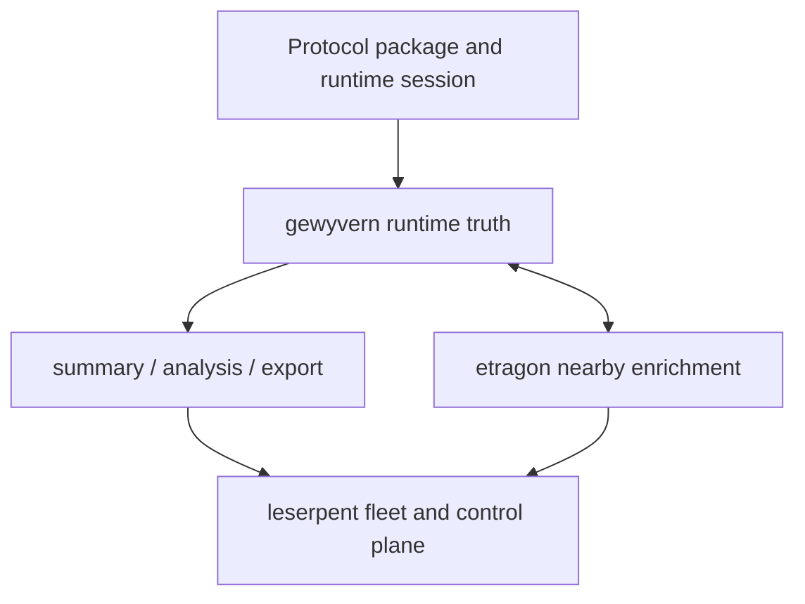

# Explanation: gewyvern, etragon, And leserpent

This chapter explains the broader three-part stack around `gewyvern`.

It is the system-level answer to:

- what belongs inside `gewyvern` itself?
- what should remain a nearby diagnosis partner?
- what should live in the multi-instance control plane?

Use this page when you want the collaboration topology explained as a whole,
not only as additive sidecar hints or one concrete runtime path.

Read this alongside:

- [docs/sidecar-collaboration.md](/Users/Shared/chroot/dev/gewyvern/docs/sidecar-collaboration.md)
- [docs/external-engine-contract.md](/Users/Shared/chroot/dev/gewyvern/docs/external-engine-contract.md)
- [docs/architecture-coordination.md](/Users/Shared/chroot/dev/gewyvern/docs/architecture-coordination.md)
- [docs/book/explanation-protocol-package-spine.md](/Users/Shared/chroot/dev/gewyvern/docs/book/explanation-protocol-package-spine.md)

## Book Path

This chapter lives in Part V: The Broader Stack.

Read it after:

- [docs/book/explanation-protocol-package-spine.md](/Users/Shared/chroot/dev/gewyvern/docs/book/explanation-protocol-package-spine.md)
- [docs/sidecar-collaboration.md](/Users/Shared/chroot/dev/gewyvern/docs/sidecar-collaboration.md)

Then continue with:

- [docs/architecture-coordination.md](/Users/Shared/chroot/dev/gewyvern/docs/architecture-coordination.md)
- [docs/book/how-to-validate-runtime-surface.md](/Users/Shared/chroot/dev/gewyvern/docs/book/how-to-validate-runtime-surface.md)

## The Short Version

The intended stack is:

```text
etragon <-> one nearby gewyvern
leserpent -> many gewyvern instances
leserpent -> optional etragon services
```

Or as responsibilities:

- `gewyvern` owns runtime truth
- `etragon` adds nearby diagnosis context
- `leserpent` owns orchestration, fleet view, and control-plane policy

That boundary is deliberate.

## Why This Split Exists

If all three roles collapse into one process or one codebase responsibility,
the system becomes harder to trust.

You start losing:

- clear runtime truth ownership
- conservative diagnosis boundaries
- modular orchestration
- freedom to run the debugger without the rest of the stack

The three-part split keeps each layer honest.

## Layer 1: gewyvern

`gewyvern` is the base runtime and diagnosis authority.

It owns:

- facts
- fragment/runtime analysis
- protocol/runtime interpretation
- the conservative diagnosis spine
- summary, analysis, and export surfaces

It should remain useful:

- without `etragon`
- without `leserpent`
- without any orchestration layer at all

That is why `gewyvern` stays the center of the stack.

## Layer 2: etragon

`etragon` is the nearby diagnosis partner.

It is allowed to contribute:

- evidence-chain enrichment
- diagnostic opinion
- higher-level or learned hints
- additive collaboration context

It is not supposed to become:

- the base fact owner
- the authoritative diagnosis spine
- the orchestrator for many runtimes

Its strength comes from being nearby and additive.

## Layer 3: leserpent

`leserpent` is the control plane above the runtime layer.

It is responsible for:

- multi-instance registration
- fleet browsing
- orchestration and policy
- control-plane UI
- cross-runtime drill-down

It should consume stable outputs from `gewyvern`, and optional richer context
from `etragon`, without having to reinterpret raw runtime semantics on its own.

## One View Of The Whole Stack



This is the intended order of authority:

1. runtime truth first
2. nearby enrichment second
3. orchestration and fleet view last

## Why etragon Stays Nearby

`etragon` works best when it is close enough to one runtime to understand the
current evidence posture, but not so central that the rest of the system
depends on it to function.

That gives us the best compromise:

- richer interpretation when available
- no loss of baseline debuggability when absent

This is also why sidecar collaboration is documented as additive-only.

## Why leserpent Stays Above

`leserpent` solves a different problem.

It is not trying to become a second debugger.
It is trying to make many debuggers manageable together.

That means it should operate on:

- canonical runtime identity
- stable diagnosis fields
- capability summaries
- trust hints
- optional sidecar posture

It should not need to own the internals of:

- lowering
- fragment supportability
- fact gating
- program/reason modeling

## Authority Rules

The simplest rule set is:

### gewyvern may

- determine the base diagnosis
- publish conservative guidance
- define stable machine-facing truth

### etragon may

- enrich
- advise
- reinforce
- suggest stronger interpretations nearby

### leserpent may

- register
- summarize
- orchestrate
- present
- compare

### None of them should

- blur who owns baseline runtime truth
- silently replace another layer's job

## What Good Integration Looks Like

The stack is healthy when:

- `gewyvern` still makes sense by itself
- `etragon` clearly improves nearby understanding when present
- `leserpent` can browse and coordinate many runtimes cleanly
- every layer uses explicit contracts instead of hidden shared assumptions

In practice, that means:

- `gewyvern` exports additive sidecar fields rather than mutating core ones
- `etragon` speaks through the external-engine and collaboration contracts
- `leserpent` consumes stable surfaces rather than scraping internals

## What Bad Integration Looks Like

The stack is drifting when:

- `gewyvern` only feels complete with sidecars attached
- `etragon` becomes an unofficial diagnosis owner
- `leserpent` has to guess runtime semantics that should have been explicit
- collaboration pressure starts changing the base diagnosis spine implicitly

Those are exactly the failure modes this architecture is designed to avoid.

## Relationship To The Book

This chapter sits late in the explanation track on purpose.

A reader should usually understand:

1. how a package is authored
2. how it lowers
3. how the runtime behaves
4. only then how the surrounding stack collaborates

That preserves the correct order of dependency in the reader's head too.

## Recommended Reading Order

If you want the stack as one coherent story, use:

1. [docs/book/tutorial-first-run.md](/Users/Shared/chroot/dev/gewyvern/docs/book/tutorial-first-run.md)
2. [docs/book/explanation-gewylang-to-ir.md](/Users/Shared/chroot/dev/gewyvern/docs/book/explanation-gewylang-to-ir.md)
3. [docs/book/explanation-gewy-to-runtime.md](/Users/Shared/chroot/dev/gewyvern/docs/book/explanation-gewy-to-runtime.md)
4. [docs/book/explanation-protocol-package-spine.md](/Users/Shared/chroot/dev/gewyvern/docs/book/explanation-protocol-package-spine.md)
5. [docs/book/explanation-stack-topology.md](/Users/Shared/chroot/dev/gewyvern/docs/book/explanation-stack-topology.md)

## Current Thesis

For the current line, the system thesis is:

- `gewyvern` should be a strong standalone debugger core
- `etragon` should be a strong nearby partner, not a sovereign replacement
- `leserpent` should be the orchestration and fleet layer, not a hidden second
  runtime

If that separation stays clear, the whole stack can grow without becoming
confused.

## Continue With

If you want the formal coordination view across protocol, IR, runtime, and
collaboration lines, go to:

- [docs/architecture-coordination.md](/Users/Shared/chroot/dev/gewyvern/docs/architecture-coordination.md)

If you want to return to operational stewardship after the stack overview, go
to:

- [docs/book/how-to-validate-runtime-surface.md](/Users/Shared/chroot/dev/gewyvern/docs/book/how-to-validate-runtime-surface.md)
