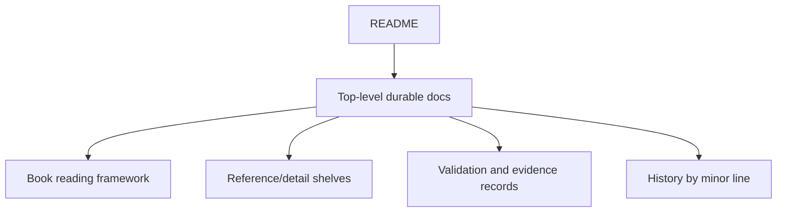

# Documentation System

Use this page when you need the design sheet for the `gewyvern` documentation
set itself.

This page treats the docs as a real subsystem, not as a loose folder of notes.

Its goal is to answer:

- what kinds of documentation exist here?
- how are they layered?
- where should new material land?
- how do the docs stay coherent across minor lines?

Read this alongside:

- [docs/index.md](docs/index.md)
- [docs/book/index.md](docs/book/index.md)
- [docs/script-entrypoints.md](docs/script-entrypoints.md)
- [docs/cli-recipes.md](docs/cli-recipes.md)
- [docs/book/conventions.md](docs/book/conventions.md)
- [docs/book/structure.md](docs/book/structure.md)
- [docs/development.md](docs/development.md)

Use:

- [docs/index.md](docs/index.md)
  when you want the global doc map
- [docs/book/index.md](docs/book/index.md)
  when you want the reading-order spine
- [docs/script-entrypoints.md](docs/script-entrypoints.md)
  when you want a goal-based operator script map
- [docs/cli-recipes.md](docs/cli-recipes.md)
  when you want practical CLI/API/demo commands without the full storyline
- [docs/documentation-system.md](docs/documentation-system.md)
  when you want the design rules for the docs themselves

## Why This Page Exists

`gewyvern` now has enough surface area that the docs cannot be treated as
incidental commentary anymore.

The documentation set has to do five jobs at once:

1. onboard new readers
2. support operators
3. support contributors
4. preserve architecture and contract clarity
5. record minor-line evolution honestly

Without an explicit docs system, the repo drifts toward:

- duplicate pages
- mixed page types
- missing reading order
- stale release-line claims

## Documentation Stack

The current documentation system is best understood as five shelves:

These shelves are related, but they do different jobs.

## Shelf 1: README

`README.md` is the repo-front door.

Its job is to answer:

- what is this project?
- what can I run right now?
- what release line am I looking at?
- where should I go next?

It should stay:

- short enough to scan
- concrete enough to trust
- linked into the deeper docs instead of trying to replace them

## Shelf 2: Top-Level Durable Docs

Top-level `docs/` pages are the durable subject shelves.

Examples:

- system
- architecture
- DSL
- fragments
- security
- machine contract
- packaging
- service behavior
- operator script map
- CLI recipe shelf

Their job is to preserve long-lived project knowledge.

These pages should answer:

- what is the current design?
- what boundary is being defended?
- what contract or posture is intended to last across patch releases?

Two special top-level durable pages now intentionally sit between "subject
shelf" and "operator helper":

- [docs/script-entrypoints.md](docs/script-entrypoints.md)
  Goal-based script routing for validation, packaging, demos, Linux smoke,
  perf, and history helpers.
- [docs/cli-recipes.md](docs/cli-recipes.md)
  Compact command shelf for runtime CLI, `gewyc`, socket ingest, API routes,
  and narrow roundtrip demos.

These are not book chapters. They are durable operator-facing lookup shelves.

## Shelf 3: Book Reading Framework

`docs/book/` is the reading framework.

Its job is not to duplicate every subject page.
Its job is to organize the reading experience into four modes:

- tutorials
- how-to guides
- reference
- explanation

This shelf should answer:

- how should a reader enter the material?
- in what order should they read?
- what kind of page are they looking at?
- which part of the whole-system storyline are they in?

## Shelf 4: Validation And Evidence

These pages answer whether the current line has actually earned its claims.

Examples:

- `docs/v0.15-posture.md`
- `docs/field-validation.md`
- `docs/field-findings.md`
- `docs/release-checklist.md`
- `docs/security-posture.md`

Their job is to connect the architecture story to real validation evidence.

These pages should stay close to what the code and scripts can actually prove.

## Shelf 5: History By Minor Line

`docs/history/` is the durable minor-line memory.

Its job is to answer:

- what did `v0.13.x` mean?
- what did `v0.14.x` change in posture?
- what does `v0.15.x` add in operational discipline and upgrade shape?
- what was already whole enough?
- what was still intentionally incomplete?

This shelf keeps the project from pretending each new line is a total reset.

When one line's validation posture depends on a small durable artifact bundle,
the compact companion rule sheet now lives at:

- [docs/history/minor-line-evidence-bundle.md](docs/history/minor-line-evidence-bundle.md)

## Reading Paths By Reader Type

The documentation system should support at least these reader types:

### Operator

Needs:

- runnable path
- output interpretation
- validation checklist

Start with:

- `README.md`
- [docs/book/tutorial-first-run.md](docs/book/tutorial-first-run.md)
- [docs/book/how-to-validate-runtime-surface.md](docs/book/how-to-validate-runtime-surface.md)

### Contributor

Needs:

- code ownership map
- architecture boundaries
- test workflow

Start with:

- [docs/index.md](docs/index.md)
- [docs/system.md](docs/system.md)
- [docs/development.md](docs/development.md)

### Reviewer

Needs:

- architecture clarity
- contract clarity
- evidence of maturity

Start with:

- [docs/architecture-blueprint.md](docs/architecture-blueprint.md)
- [docs/architecture-evolution.md](docs/architecture-evolution.md)
- [docs/field-validation.md](docs/field-validation.md)

### DSL Or Protocol Author

Needs:

- package shape
- protocol shelf lookup
- lowered IR visibility

Start with:

- [docs/gewylang-system.md](docs/gewylang-system.md)
- [docs/book/tutorial-gewylang-package.md](docs/book/tutorial-gewylang-package.md)
- [docs/book/reference-protocol-surface.md](docs/book/reference-protocol-surface.md)
- [docs/book/reference-ir-lowering.md](docs/book/reference-ir-lowering.md)

## Page Placement Rules

When adding new documentation, use this routing table:

### Put it in `README.md` when

- it is repo-front-door material
- it answers the shortest “what is this?” question
- it should be seen before any deep dive

### Put it in top-level `docs/` when

- it is a durable subject page
- it explains a long-lived system boundary or contract
- it should remain meaningful outside one reading mode
- it is a compact operator lookup shelf that should not be stretched into a
  tutorial, how-to, or full reference chapter

### Put it in `docs/book/` when

- it is primarily about reading flow
- it is tutorial, how-to, reference, or explanation material
- it helps a reader navigate rather than only store facts
- it benefits from the four reading modes more than from top-level subject
  lookup

### Put it in `docs/history/` when

- it records the meaning of one minor line
- it explains release-line posture, not day-to-day behavior

## Maintenance Rules

The documentation system should obey these rules:

1. No second page should exist only because the first page became long.
2. New pages should declare what kind of page they are.
3. Stable claims should point to evidence or validation pages.
4. Architecture pages should point to module or source ownership pages.
5. Minor-line pages should record meaning, not every patch note.

## What “Systematic” Means Here

For this repo, systematic documentation means:

- every major topic has one obvious home
- every audience has one obvious starting path
- every stable claim has one obvious contract page
- every active release line has one obvious historical note
- new contributors do not have to reverse-engineer the doc structure from filenames

## Anti-Patterns

Avoid:

- adding a page that mixes tutorial, contract, and release-note roles
- copying the same navigation list into many unrelated pages
- letting release posture live only in README prose
- adding future-facing design promises without a clear current-line boundary
- letting protocol detail pages become the only place where system architecture is discoverable

## Current Thesis

The current docs system should make `0.15.x` feel:

- legible
- bounded
- teachable
- reviewable
- historically grounded

If a new page does not help one of those outcomes, it probably belongs in a
different page or does not need to exist yet.
