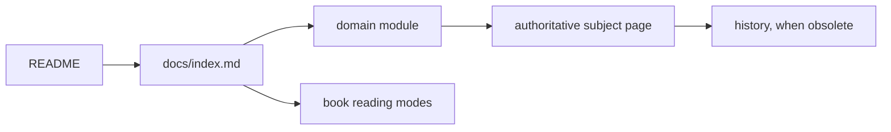

# Documentation System

This page defines how the documentation stays small, modular, and testable.
For content, start at the [documentation index](index.md).

## Architecture

There are four layers:

1. `README.md` states the product and links to one documentation entry.
2. `docs/index.md` routes readers by domain or document type.
3. `docs/modules/*.md` are short domain manifests.
4. Subject pages contain the actual tutorial, procedure, contract, or rationale.

History is an archive, not another current-documentation layer.

## Modules

Every current page has one primary owner:

| Module | Manifest |
| --- | --- |
| Runtime | [modules/runtime.md](modules/runtime.md) |
| GewyLang | [modules/gewylang.md](modules/gewylang.md) |
| Leselang | [modules/leselang.md](modules/leselang.md) |
| Protocols | [modules/protocols.md](modules/protocols.md) |
| Operations | [modules/operations.md](modules/operations.md) |
| Project | [modules/project.md](modules/project.md) |

Cross-links are encouraged, but a page appears as a primary entry in only one
module. Module manifests route; they do not restate subject content.

## Document Types

Use one type per page:

- **Tutorial:** a learning path with a successful end state.
- **How-to:** steps for one concrete task.
- **Reference:** exact syntax, schema, CLI, or compatibility contract.
- **Explanation:** architecture, rationale, and tradeoffs.
- **History:** release-specific evidence that is no longer the current contract.

The [book index](book/index.md) exposes these types as reading modes. It does
not maintain a second domain map.

## Placement

- Put durable subject pages directly under `docs/` when they define a major
  project contract or subsystem.
- Put typed chapters under `docs/book/` using `tutorial-`, `how-to-`,
  `reference-`, or `explanation-` prefixes.
- Put release-specific records under `docs/history/`.
- Add a new module only when no existing module can own the topic without
  mixing unrelated responsibilities.

Before creating a page, prefer editing the existing authority for that topic.

## Link Discipline

Each subject page should normally have:

1. one module or upstream link
2. zero to three close companion links
3. no copied global table of contents

Use standard paths relative to the current file in new documentation. The test
suite still resolves historical repository-root-style links while old pages
are gradually normalized.

## Change Checklist

When documentation changes:

1. update the authoritative subject page
2. update its owning module only when discoverability changed
3. move obsolete release claims to history instead of duplicating them
4. run `cargo test --test documentation_system_tdd`
5. run domain-specific documentation tests when available

The target is one obvious entry, one owner per topic, and the smallest context
needed to answer a question.
