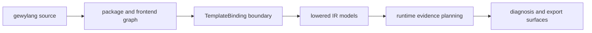

# gewylang Evolution Spine

Use this page when you need the long-lived implementation roadmap for the
`gewylang -> IR -> runtime` chain.

This page is not a syntax guide and not an exact lowering reference.

Its job is to answer:

- what role `gewylang` is supposed to play in the whole system
- how the frontend, lowering, and runtime layers should evolve together
- what kinds of changes belong in each layer
- what should stay deliberately narrow even as the project deepens

Read this alongside:

- [docs/gewylang-system.md](/Users/Shared/chroot/dev/gewyvern/docs/gewylang-system.md)
- [docs/dsl.md](/Users/Shared/chroot/dev/gewyvern/docs/dsl.md)
- [docs/book/explanation-gewylang-to-ir.md](/Users/Shared/chroot/dev/gewyvern/docs/book/explanation-gewylang-to-ir.md)
- [docs/book/explanation-protocol-package-spine.md](/Users/Shared/chroot/dev/gewyvern/docs/book/explanation-protocol-package-spine.md)
- [docs/book/reference-ir-lowering.md](/Users/Shared/chroot/dev/gewyvern/docs/book/reference-ir-lowering.md)
- [docs/book/explanation-gewy-to-runtime.md](/Users/Shared/chroot/dev/gewyvern/docs/book/explanation-gewy-to-runtime.md)
- [docs/architecture-evolution.md](/Users/Shared/chroot/dev/gewyvern/docs/architecture-evolution.md)

## Why This Page Exists

`gewylang` now sits on the main architectural spine, not on the side.

That means language work cannot be discussed only as:

- syntax additions
- package ergonomics
- isolated compiler features

It has to be discussed as one joined pipeline:

- author intent
- package composition
- frontend structure
- lowered IR structure
- runtime evidence planning
- diagnosis and export visibility

## The Main Language Spine

The intended implementation chain is:

This order matters.

If the earlier layers become vague, later layers become harder to inspect and
easier to mistrust.

## The Role Of gewylang

`gewylang` should remain a structured binding language.

It is for:

- selecting existing fragment/runtime capability
- parameterizing that capability clearly
- expressing reusable package-level composition
- surfacing author intent in a way the compiler and runtime can still explain

It is not for:

- becoming a general-purpose programming language
- hiding runtime requirements behind heavy magic
- replacing the runtime truth model with source-level abstraction

## Layer Responsibilities

### 1. Source Layer

This is the human-authored `.gewy` surface.

Its job is to make these things obvious:

- package root and entry
- included helper shelves
- function reuse points
- stable argument boundaries
- the intended operation/program story

Good changes here:

- better package ergonomics
- better errors
- safer reusable composition
- small functional features that improve clarity

Bad changes here:

- widening the language faster than the compiler can explain
- adding implicit behavior that does not show up cleanly later

### 2. Frontend Layer

This is the expanded package/module graph surface.

Its job is to preserve structure:

- include provenance
- function nodes
- use edges
- expansion boundaries
- entry/file/function identity

Good changes here:

- stronger provenance
- better graph inspection
- clearer author-intent reporting

Bad changes here:

- silently collapsing structure that reviewers still need to see

### 3. TemplateBinding Boundary

This is the narrow compile target of the language.

Its job is to freeze the essentials:

- template id
- fragment set
- window profile
- reason profile
- operation/program model
- parameter bindings
- evidence-tier overrides

This boundary is important because it keeps the language honest.

It prevents the source layer from pretending it owns runtime truth directly.

### 4. Lowered IR Layer

This is where package/frontend structure becomes explicit rule-bearing models.

Its job is to make these things inspectable:

- what lowered model shape was selected
- what rules exist
- what modules and phases were materialized
- whether the reason and program surfaces still align

Good changes here:

- clearer per-model summaries
- better deltas
- more archival-friendly snapshots
- tighter links from source intent to lowered structure

Bad changes here:

- opaque intermediate representations
- lowering steps that cannot be narrated back to authors or reviewers

### 5. Runtime Evidence Layer

This is where lowered intent meets attach, ingest, and supportability reality.

Its job is to answer:

- can the declared rules actually be supported?
- what evidence was available?
- what remained degraded or missing?

Good changes here:

- stronger supportability clarity
- sharper degraded-mode reporting
- more deterministic evidence planning

Bad changes here:

- hidden fallbacks that make IR claims look truer than runtime evidence allows

### 6. Diagnosis And Export Layer

This is where operators and nearby tools consume the result.

Its job is to make the whole spine reviewable:

- what the language asked for
- what the compiler lowered
- what the runtime could really support
- what final diagnosis and export claims were justified

Good changes here:

- clearer summaries
- better replay anchors
- more stable history snapshots

Bad changes here:

- export surfaces that bury the source-to-runtime story

## What v0.14.x Should Keep Improving

For the current line, the best `gewylang`-adjacent work is:

1. package and module clarity
2. frontend graph visibility
3. lightweight safety-biased inference
4. stronger IR summaries and snapshots
5. sharper runtime supportability reporting

These deepen the language without changing its identity.

## What Future Richer Features Must Prove

Possible future features, such as stronger type inference or more structured
package metadata, should only land if they improve at least one of these:

1. safety of reusable composition
2. clarity of lowered IR
3. runtime supportability review
4. operator-facing diagnosis trust

If a feature mostly makes the language feel more “complete” in the abstract,
but does not improve one of those outcomes, it probably does not belong yet.

## Type Inference Posture

The project already leans toward lightweight inferred parameter kinds rather
than a full type system.

That posture should continue unless there is a strong safety case.

The intended path is:

1. infer only where use is local and explainable
2. validate only where miscalls are genuinely risky
3. keep the error surface simple enough for package authors
4. avoid turning `gewylang` into a second large compiler project

In other words: inference should serve runtime honesty, not language vanity.

## IR Evolution Posture

The IR should keep getting clearer, but not blurrier.

The desired direction is:

- more structured model summaries
- better minor-line snapshots
- better cross-version diffs
- better mapping from frontend graph to lowered rules

The undesired direction is:

- more hidden machinery between source and runtime
- more layers that only compiler implementers can understand

## Runtime Alignment Rule

Every substantial `gewylang` feature should be checked against this rule:

1. can the frontend explain it?
2. can the lowering report preserve it?
3. can the runtime supportability model judge it honestly?
4. can export/history surfaces record it durably?

If the answer breaks at any stage, the feature is not fully integrated yet.

## Review Order

When reviewing language evolution as a system, use this order:

1. [docs/gewylang-system.md](/Users/Shared/chroot/dev/gewyvern/docs/gewylang-system.md)
2. [docs/dsl.md](/Users/Shared/chroot/dev/gewyvern/docs/dsl.md)
3. [docs/gewylang-evolution.md](/Users/Shared/chroot/dev/gewyvern/docs/gewylang-evolution.md)
4. [docs/book/explanation-gewylang-to-ir.md](/Users/Shared/chroot/dev/gewyvern/docs/book/explanation-gewylang-to-ir.md)
5. [docs/book/reference-gewylang-package.md](/Users/Shared/chroot/dev/gewyvern/docs/book/reference-gewylang-package.md)
6. [docs/book/reference-ir-lowering.md](/Users/Shared/chroot/dev/gewyvern/docs/book/reference-ir-lowering.md)
7. [docs/book/explanation-gewy-to-runtime.md](/Users/Shared/chroot/dev/gewyvern/docs/book/explanation-gewy-to-runtime.md)

## Current Thesis

For the current active line, the `gewylang` thesis is:

- keep the source language small
- make package composition more legible
- make the frontend graph more reviewable
- make lowered IR more archival and comparable
- keep runtime truth stricter than source ambition

If a language change weakens one of those properties, it is probably moving in
the wrong direction for this stage of the project.
