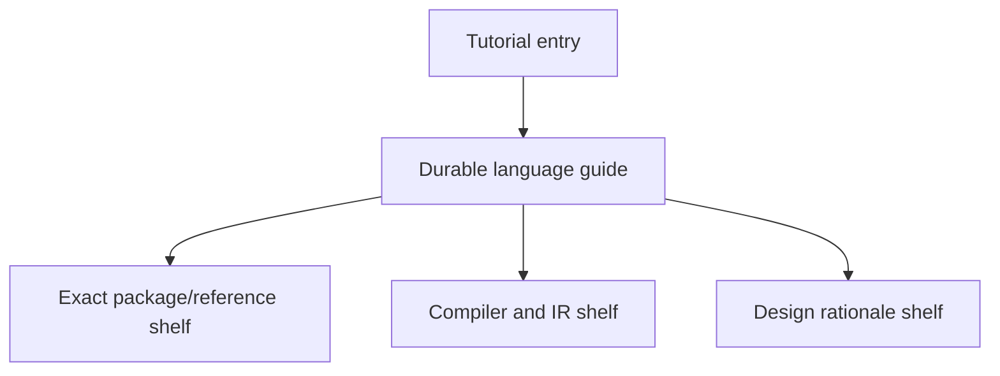

# gewylang Documentation System

Use this page when you need the system map for `gewylang` itself.

The repository already has language guide pages, tutorials, reference shelves,
compiler JSON notes, and design-rationale pages. What was missing was one
durable page that says how those pieces fit together.

This page answers:

- what `gewylang` documentation exists?
- what job does each page do?
- in what order should a reader approach the language?
- where should future language material land?

Read this alongside:

- [docs/dsl.md](docs/dsl.md)
- [docs/dsl-syntax.md](docs/dsl-syntax.md)
- [docs/dsl-reference.md](docs/dsl-reference.md)
- [docs/gewylang-evolution.md](docs/gewylang-evolution.md)
- [docs/book/tutorial-gewylang-package.md](docs/book/tutorial-gewylang-package.md)
- [docs/book/reference-gewylang-package.md](docs/book/reference-gewylang-package.md)
- [docs/book/reference-ir-lowering.md](docs/book/reference-ir-lowering.md)

## Why This Page Exists

`gewylang` is no longer just a thin syntax note.

It now has a real subsystem shape:

- package layout
- `include(...)` expansion
- function-unit reuse
- lightweight parameter boundaries
- frontend graph/report surfaces
- lowered IR and compiler-facing JSON

That means language docs need to be treated as a system, not as scattered
pages.

## The gewylang Doc Stack

The current `gewylang` documentation system has five layers:

Each layer answers a different question.

## Layer 1: Tutorial Entry

Start here when the reader wants to author a package, not study the whole
language first.

Primary page:

- [docs/book/tutorial-gewylang-package.md](docs/book/tutorial-gewylang-package.md)

Its job is to teach:

- what `gewy.pkg` is for
- how `main.gewy` works
- how `include(...)` and `use(...)` are used in practice
- how to compile and inspect a package

This page should stay short, runnable, and confidence-building.

## Layer 2: Durable Language Guide

This is now a small stable language shelf rather than one giant page.

Primary entry page:

- [docs/dsl.md](docs/dsl.md)

Companion pages:

- [docs/dsl-syntax.md](docs/dsl-syntax.md)
- [docs/dsl-reference.md](docs/dsl-reference.md)

Together their jobs are:

- `docs/dsl.md`
  stable language map and reading routes
- `docs/dsl-syntax.md`
  current preferred syntax, package shape, and CLI-oriented authoring flow
- `docs/dsl-reference.md`
  exact compatibility and vocabulary lookup for the DSL surface

If a reader asks “what is `gewylang` right now?”, this is the main answer.

## Layer 3: Exact Package And Module Reference

This is the package/reference lookup shelf.

Primary page:

- [docs/book/reference-gewylang-package.md](docs/book/reference-gewylang-package.md)

Its job is to answer exact questions such as:

- what files are required in a package?
- how does `include(...)` resolve?
- what call forms does `use(...)` accept?
- what parameter-boundary rules are actually enforced?

This page should stay precise and lookup-oriented.

## Layer 4: Compiler And IR Shelf

These pages explain what the language lowers into and what the compiler emits.

Primary pages:

- [docs/gewyc-json.md](docs/gewyc-json.md)
- [docs/book/reference-ir-lowering.md](docs/book/reference-ir-lowering.md)
- [docs/gewylang.ebnf](docs/gewylang.ebnf)

Their job is to answer:

- what `frontend --json` and `explain --json` actually contain?
- what is the lowering contract candidate?
- what grammar shape is currently intended?

This shelf is where compiler-facing truth should live.

## Layer 5: Design Rationale Shelf

These pages explain why the language is shaped the way it is.

Primary pages:

- [docs/book/explanation-gewylang-lightweight-types.md](docs/book/explanation-gewylang-lightweight-types.md)
- [docs/book/explanation-gewylang-to-ir.md](docs/book/explanation-gewylang-to-ir.md)
- [docs/book/explanation-gewy-to-runtime.md](docs/book/explanation-gewy-to-runtime.md)

Their job is to answer:

- why the language is intentionally narrow
- why safety features are selective
- how `.gewy` relates to the runtime/export story

This shelf prevents the guide and reference pages from carrying too much
design philosophy inline.

## Recommended Reading Paths

### First-Time Package Author

Read in this order:

1. [docs/book/tutorial-gewylang-package.md](docs/book/tutorial-gewylang-package.md)
2. [docs/dsl.md](docs/dsl.md)
3. [docs/dsl-syntax.md](docs/dsl-syntax.md)
3. [docs/book/reference-gewylang-package.md](docs/book/reference-gewylang-package.md)

### Compiler-Oriented Contributor

Read in this order:

1. [docs/dsl.md](docs/dsl.md)
2. [docs/dsl-reference.md](docs/dsl-reference.md)
3. [docs/gewylang-evolution.md](docs/gewylang-evolution.md)
4. [docs/book/explanation-gewylang-to-ir.md](docs/book/explanation-gewylang-to-ir.md)
5. [docs/book/reference-ir-lowering.md](docs/book/reference-ir-lowering.md)
6. [docs/gewyc-json.md](docs/gewyc-json.md)
7. [docs/book/explanation-gewy-to-runtime.md](docs/book/explanation-gewy-to-runtime.md)

### Safety-Oriented Reviewer

Read in this order:

1. [docs/dsl.md](docs/dsl.md)
2. [docs/dsl-reference.md](docs/dsl-reference.md)
3. [docs/book/reference-gewylang-package.md](docs/book/reference-gewylang-package.md)
4. [docs/book/explanation-gewylang-lightweight-types.md](docs/book/explanation-gewylang-lightweight-types.md)

## Placement Rules For Future gewylang Docs

When adding new `gewylang` material, use this routing table.

### Put it in `docs/dsl.md` when

- it defines the stable language map broadly
- it routes readers between syntax, reference, compiler, and tutorial shelves
- most readers should learn it as the language front door

### Put it in `docs/dsl-syntax.md` when

- it belongs to the current preferred syntax subset
- it explains authoring shape or package shape
- it is best taught as stable source-level structure

### Put it in `docs/dsl-reference.md` when

- it is exact DSL vocabulary or compatibility lookup
- it defines predicates, narratives, stages, or key-surface details
- it is too exact or too list-shaped for the overview page

### Put it in `docs/book/tutorial-gewylang-package.md` when

- it improves the first package-authoring path
- it is best taught as a sequence of steps
- it helps new users get something running

### Put it in `docs/book/reference-gewylang-package.md` when

- it is exact package/module lookup
- it defines accepted syntax variants or call rules
- it documents precise validation behavior

### Put it in `docs/book/reference-ir-lowering.md` or `docs/gewyc-json.md` when

- it describes compiler output structure
- it defines lowering/report fields
- it belongs to machine-facing or compiler-facing truth

### Put it in `docs/book/explanation-*.md` when

- it explains why the language works a certain way
- it defends a safety or simplicity tradeoff
- it is design rationale rather than syntax or procedure

## Practical Rule

When you add a new `gewylang` feature, the docs should usually be updated in
three places:

1. one language-facing page
2. one reference or compiler-facing page
3. one rationale/tutorial page if the feature changes how people should think
   about the language

That keeps the language documentation balanced:

- teachable
- searchable
- precise
- explainable

## Current Posture

For the active `0.19.x` line, `gewylang` should be documented as:

- a structured binding language
- package-oriented
- functional in composition style
- intentionally narrow
- safety-biased where reuse would otherwise become misleading

That description should stay stable unless the language identity itself
changes, not merely because another protocol family or helper surface is added.
