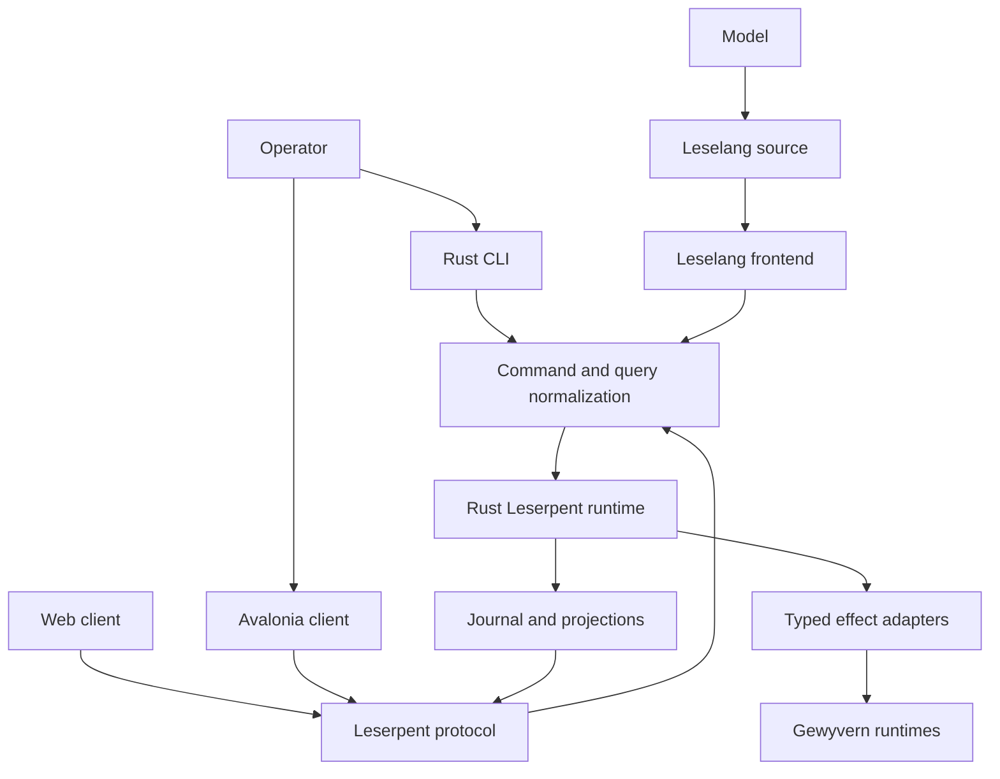
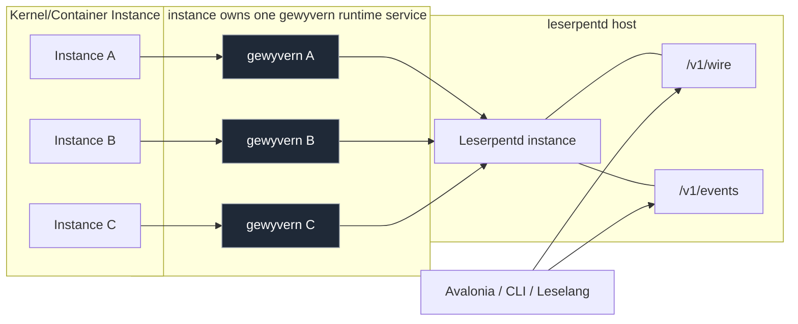

# Leserpent 2.0 Architecture

This document is the authoritative target architecture for the
`1.0.0 -> 2.0.0` Leserpent line. It describes intended behavior, not the
current 1.x implementation. Delivery order and exit gates live in the
[Leserpent 2.0 roadmap](leserpent-2-roadmap.md).

The current implementation checkpoint is the shared `v1.14.0` release. This
document remains the `2.0.0` target contract rather than a claim that every
target capability is already complete.

## Decision

Leserpent 2.0 is a Rust control runtime with three equivalent operator
frontends:

- Leselang programs, including model-generated programs
- the native `leserpent` CLI
- graphical clients, beginning with Avalonia
- browser clients written in TypeScript

The platform stack constraint is explicit:

- Rust owns all control-plane, policy, and semantic decisions.
- C# and TypeScript frontends consume protocol projections and emit typed user
  actions but do not own control-plane decisions.
- No Node.js, Python, shell, or other additional runtime language is allowed to
  carry new control-plane authority.

The current ASP.NET and TypeScript application remains the 1.x implementation
and migration bridge. It is not the semantic center of the 2.0 system.

## 2.0 Scope Boundary

The 2.0 target scope is frozen. The release may complete the declared
Leserpent/Gewyvern/Leselang/Avalonia control loop, but it may not add new core
capability families before `2.0.0`. Finishing work is limited to closure,
reliability, performance, security, conformance, packaging, release evidence,
and documentation for the already-declared architecture.

This boundary keeps Etragon advisory, Windows native parity, additional runtime
languages, automatic GUI framework compatibility, and full mobile parity outside
the 2.0 release gate. Those can evolve later only as independent post-2.0
tracks, not as prerequisites for the 2.0 seal.

Leselang is not a general-purpose VM, application runtime, or DartVM-style
language platform. Its target is a protocolized GUI/control automation runtime:
the "JavaScript" of Leserpent automation only in the narrow sense that GUI
interaction and code control share one inspectable, serializable program
contract. The product form is a Rust crate that owns parsing, HIR, effect
typing, stackless VM execution, and the renderer-neutral UI presentation
protocol. No GUI framework becomes compatible automatically. A framework is
compatible only after a developer-owned adapter implements the Leselang UI
protocol standard, or after a dedicated generator emits that framework's
generated binding from the same schema in the style of protobuf-like interface
generation. That compatibility is expressed by an explicit
`UiAdapterManifest`: the host must declare document, event, patch, and complete
presentation-atom support before it is treated as a Leselang UI adapter.
Rust-native GUI frameworks may use the crate as their source of truth; C#,
TypeScript, mobile, and future non-Rust hosts should cross only the generated
protocol or narrow FFI boundary. The crate must not grow a GC, JIT, host object
heap, ambient thread pool, or general app runtime just to look like a larger VM.

## Non-Negotiable Invariants

1. GUI, CLI, and Leselang submit the same versioned `CommandEnvelope` and read
   the same versioned `Query` projections.
2. No frontend owns a control-plane capability that the other frontends cannot
   express.
3. Equivalent requests under the same identity, capability set, revision, and
   input state have equivalent effects regardless of their origin.
4. Avalonia view models contain presentation logic only. They cannot reach
   Gewyvern, persistence, deployment, or orchestration adapters directly.
5. Leselang has synchronous source semantics. Asynchrony remains an internal
   runtime implementation detail.
6. External effects are typed, journaled, bounded, cancellable, and resumable.
7. A model may propose Leselang but cannot bypass parsing, type checking,
   capabilities, confirmation policy, or effect limits.
8. UI-local state such as geometry, focus, and animation may remain
   frontend-specific. Domain state and operator actions may not.
9. No control-plane decision path may be introduced in a frontend language.
   Rust owns policy, authorization, idempotency, revision, and effect
   semantics.
10. Frontends may request a canonical Leselang representation only by sending
    a bounded semantic intent to Rust. They cannot own quoting, formatting, or
    fallback source templates.

These rules define atomic replaceability. Replacing GUI interaction with CLI or
Leselang may change presentation and transport, but not control semantics.

The executable proof for this rule is
`gewyvern_validate leserpent-parity-recovery`. It compares the current
CLI and Leselang command/query lowering against the same domain contract, then
exercises capability, confirmation, revision, principal-scoped idempotency,
continuation restart, lease fencing, snapshot fallback, worker-crash
settlement, outbox repair, Avalonia reconnect/cache state, and the real
Rust-to-.NET WebSocket path. Each Cargo suite must report a nonzero minimum test
count, the xUnit suite must emit one internally consistent nonzero success
summary, and external conformance runners must emit exactly one declared
success marker, preventing cfg, filter, or adapter drift from turning the proof
into a vacuous pass. Each summary binds the result to bounded kernel and
toolchain provenance and removes stale success metadata before execution.

## System Shape



The Rust runtime is authoritative. Frontends are replaceable projections and
intent producers.

## Instance Topology

Leserpent 2.0 controls instances with a strict three-level topology:

- each Linux kernel/container instance maps to exactly one `gewyvern` service
- each `gewyvern` instance is registered under one `leserpentd` instance
- each `leserpentd` instance is exposed as one authenticated web service



The model implies identity is two-dimensional at minimum:

- `daemon_id`: owner of execution, storage lease, and security posture
- `runtime_id`: immutable target identity inside that daemon

The effective control key is the ordered pair `(daemon_id, runtime_id)`. In the
current 2.0 protocol, `daemon_id` is implicit in the authenticated transport
session (service endpoint), while `runtime_id` remains explicit in the command/query
payload.
A command touching a runtime is always bound to one pair and one expected
revision; commands with a malformed `runtime_id` or mismatched session identity are
rejected before policy checks.

This is not multi-tenancy by namespace alone. It is explicit composition:
one daemon can safely host many runtimes, but commands can never fan out to
unknown runtimes because no wildcard path exists in the domain contract.

## Client As Hub / Per-Daemon Multi-Window Model

The native client entry is a daemon hub, not a single direct remote target form:

- startup presents saved `leserpentd` connection profiles;
- each profile opens a logical **daemon session**;
- each daemon session exposes fleet cards from its own `runtime` projection;
- each runtime card can open a child workspace in the same process;
- child workspaces route through that daemon session only.

A single Avalonia window can thus operate several daemon sessions in parallel,
without collapsing trust, event stream, or revision history across sessions.

In this model:

- `desktop setup` and `setup window` are process-wide shell tasks;
- `runtime list`, `runtime refresh`, `runtime inspect`, deployment, and log
  queries are session-scoped;
- session closure cancels only that session's subscriptions and leaves other
  daemon sessions running.

## Topology Error Boundaries

Topology transition rules are simple and explicit:

1. `Unmanaged` -> `Registered`: durable `RuntimeRegister` with bounded identity and origin
2. `Registered` -> `Connected`: successful `runtime health`/adapter refresh
3. `Connected` -> `BoundedError`: adapter faults, credential error, or probe timeout
4. `BoundedError` -> `Ready`: successful refresh after explicit user/plan confirmation
5. `Connected` -> `Removed`: explicit removal command with idempotent identity and dry-run

Every transition writes an event. Every transition failure keeps the old projection
and returns a typed ambiguous outcome when recovery depends on freshness.
No transition writes hidden side effects before command persistence.

## Reverse Deployment Model

The intended deployment control loop is reverse-first:

1. `operator credential` reaches a target host with bootstrap rights.
2. Leserpent uses that credential to deploy/refresh `leserpentd` on the target.
3. Leserpent connects to the target's `leserpentd` service endpoint (`/v1/wire`, `/v1/events`) using the target-issued session token or certificate chain.
4. The `leserpentd` session exposes a fleet panel and accepted runtime identities.
5. A confirmed `runtime.provision` intent installs or reconciles `gewyvern`, proves its authenticated service identity, and registers that runtime with the daemon.
6. Later `runtime.deploy` intents submit debugging pipelines to that already registered Gewyvern runtime; they never install a runtime or mutate host service configuration.

This makes `leserpent` responsible for control-plane bootstrap and orchestration,
while `leserpentd` remains the per-host control gate for later state and actions.

```text
Leserpent (operator)
  --bootstrap token--> host bootstrap endpoint
  --leserpentd-token/ca--> leserpentd@host (panel + wire session)
  --runtime.provision--> install + attest + register gewyvern
  --runtime.deploy--> submit pipelines to registered gewyvern
```

Four credential layers are therefore explicit:

- **bootstrap credential**: creates/reconciles a managed `leserpentd` on the target
- **session credential**: binds the `leserpentd` session and all mutation/effect calls
- **runtime installation credential**: creates/reconciles Gewyvern and is retired as soon as the authenticated service is ready
- **runtime API/trust handles**: bind later adapter calls to the attested Gewyvern endpoint without putting secrets in runtime metadata

The bootstrap credential must never become implicit session authority. A `leserpentd`
session token is checked for every mutation and workspace command, and a failed
session check must block both control and deployment operations before adapter dispatch.

The host and runtime deployment state machines are deliberately separate.
`leserpent-domain::provisioning` owns the first runtime-provisioning contract:
`Planned -> Installing -> ServiceReady -> RuntimeRegistered`, with a terminal
`Failed` branch. `ServiceReady` retires the installation credential before
registration. `RuntimeRegistered` requires a proof bound to the provisioning ID,
runtime ID, HTTPS endpoint, API/trust handles, authority ownership, and protocol
version. `leserpent-protocol::provisioning` carries this state in an independent,
strict, 64 KiB-bounded envelope that rejects unknown and raw credential fields.
`leserpentd` now accepts this envelope only through authenticated
`POST /v1/provisioning` or the explicit `provisioning_v1` IPC route, and only when
the dedicated `gewyvern.runtime.provision` adapter is registered. The adapter
resolves the installation credential locally, returns only `ServiceReady` or
`Failed`, and daemon settlement rejects identity drift before atomically advancing
the checkpoint. The separate `leserpent-protocol::gewyvern_installer` wire now
binds the internal installer exchange to provisioning/runtime identity, HTTPS
endpoint, artifact generation, API/trust handles, a zeroizing API token, and a
digest-verified public CA. Its readiness validator refuses merely `Installed`
services and all request/response identity drift. The native
`gewyvern-install-v1` target entrypoint verifies its own artifact digest, creates
a private immutable runtime generation, writes secret-bearing files with mode
`0600`, generates the endpoint TLS identity, replay-checks every retained
manifest and service-plan identity, and atomically advances a non-symlink
`current` pointer. It deliberately returns only `Installed`.
`gewyvern-activate-v1` additionally publishes and activates the retained native
launchd/systemd descriptor, while `gewyvern-service-v1` starts the managed
rustls API from generation-confined paths. `Ready` is emitted only after a
bounded loopback probe validates the requested endpoint name, generated CA,
private API token, JSON health response, and active service. Activation or
health failure restores the previous `current` pointer and descriptor, removes
the failed new generation, and restarts the previous service. Native SSH
transport now reuses the same host-key-pinned Rust substrate as daemon bootstrap:
exclusive private SFTP staging, bounded command output, timeout cleanup, and no
shell script or secret argument. A strict mode-`0600` daemon origin configuration
binds each target to its artifact, endpoint, API/trust handles, and platform
secret service. A valid `Installed` response persists no trust and yields no
service receipt; a valid `Ready` response must persist its endpoint-bound CA in
the namespaced controller trust store before returning a receipt. Daemon
settlement derives the registration proof itself and commits effect completion,
the runtime registration journal entry, and revision-3 `RuntimeRegistered`
checkpoint in one immediate SQLite transaction. It updates the in-memory
projection only after commit. A lost lease rolls all three durable writes back,
and an existing revision-2 `ServiceReady` checkpoint is promoted safely after
restart. The native CLI now exposes a separate `runtime provision` command with
explicit confirmation, opaque SSH handles, operator-supplied idempotent
provisioning IDs, authenticated IPC/HTTPS transport, bounded phase polling, and
distinct protocol-failure, provisioning-failure, and wait-exhaustion exit codes.
It never aliases this operation to `runtime.deploy`, and repeated polling reuses
the exact provisioning identity rather than creating a second install attempt.
The Avalonia Hub exposes the same route through an authority-scoped native
workspace. It requires explicit confirmation, accepts only a `vault:ssh:*`
installation handle, locks provisioning/runtime/target identity after submit,
and performs at most 30 automatic observations before yielding to an explicit
same-attempt refresh. Terminal failure directs the operator to correct the cause
and choose a new provisioning ID, preserving the failed identity for audit.
Desktop Local Orchestra is offered as an owning authority only when the private
`LESERPENT_GEWYVERN_PROVISIONING_CONFIG` path is present at app startup; otherwise
only saved authenticated daemon authorities are listed.
Remote compensation/retirement for an already registered service remains to be
productized. Its first independent contract now lives in
`leserpent-domain::retirement` and `leserpent-protocol::retirement`; it does not
extend `runtime.deploy` or reuse the provisioning ID as an operation identity.
`runtime.retire` binds a new retirement ID to the original provisioning ID,
runtime ID, SSH target, operator principal, explicit confirmation, and a newly
supplied opaque `vault:ssh:*` handle. Its state machine is
`Planned -> RetiringService -> ServiceRetired -> RuntimeUnregistered`, with a
terminal `Failed` branch. Runtime unregistration is forbidden until a fully
identity-bound receipt proves service retirement. External failure retires the
submitted SSH handle but deliberately preserves the runtime registration,
preventing a still-running service from becoming an untracked orphan. The strict
64 KiB wire rejects unknown/raw-secret fields and validates this ordering on all
responses. Runtime SQLite schema 13 now stores retirement authority alongside
the other kind-scoped checkpoints. After `ServiceRetired`, one immediate
transaction completes the leased effect, journals runtime unregistration, and
commits revision-3 `RuntimeUnregistered`; restart replays the removal, while a
lost lease rolls back all three and leaves the runtime registered. The daemon
now accepts retirement only when its adapter registry owns the dedicated effect
kind, rechecks live registration before dispatch, and rejects malformed,
non-terminal, or identity-confused adapter output before invoking that
transaction. The adapter resolves the opaque SSH handle only at its transport
boundary and emits no secret material. The production origin now registers a
second host-key-pinned native SSH adapter using the same runtime-scoped policy
and validated artifact. Its strict internal wire invokes
`gewyvern-retire-v1`, whose manifest check binds provisioning/runtime/profile
before mutation. A private `retiring -> service_retired -> retired` marker makes
power-loss recovery identity-fenced; stop/disable precedes descriptor and
runtime-root removal, neighboring runtimes are untouched, and relaxed authority
permissions fail before service mutation. Authenticated operator routes now
begin at an explicit `retirement_v1` Unix IPC route and authenticated
`POST /v1/retirement`. Both retain the retirement protocol's independent 64 KiB
bound and typed error envelope; bad authentication is rejected before
submission, and a daemon without the production retirement effect adapter
returns `retirement_unavailable` without creating a checkpoint. The main process
enables these submission gates only after registry ownership of
`gewyvern.runtime.retire` is established. The native CLI now exposes this
contract as a confirmed `runtime retire` command over both authenticated
transports. It requires stable retirement and provisioning IDs, reuses the exact
request during bounded polling, emits no credential handle, distinguishes
protocol rejection, terminal failure, and wait exhaustion, and proves that a
failed retirement preserves an inspectable runtime registration. The Avalonia
Hub now exposes the same provisioning-bound identity through an explicitly
confirmed destructive workspace. Its strict 64 KiB client, locked fields,
bounded replay, credential-free status, and failure guidance preserve the same
state invariants. The physical Linux proof now runs the real pinned-host-key
native SSH transport against an isolated systemd-user runtime: a forged
provisioning identity is rejected without preventing the corrected request,
the bound service is stopped and disabled, its descriptor and runtime root are
removed, the API port and staging area are clear, and an identical retirement
replay succeeds. The private final marker remains `0600` in `retired` phase;
the redacted evidence is retained in
`docs/fixtures/leserpent_real_ssh_retirement_20260723.json`.

Leserpentd installation now also has a distinct target-side retirement
contract. `bootstrap-retirement-v1` is a strict 64 KiB wire that binds a unique
retirement ID to the original bootstrap ID, daemon ID, immutable generation,
and install profile. The native `bootstrap-retire-v1` process entry verifies
the private current pointer, retained manifest, and byte-identical published
service descriptor before stopping anything. Its private
`retiring -> service_retired -> retired` marker supports crash re-entry and
identity-bound replay. Successful cleanup removes the descriptor, current
pointer, and selected executable generation but deliberately preserves state
and logs. The macOS process proof executes both native entries against an
isolated user home. Cleanup rechecks generation, manifest, current pointer, and
descriptor ownership after service stop, fencing a stale crashed retirement
from deleting a replacement generation. Controller-side retirement now reuses
the pinned Rust SSH/SFTP transport with an operation-specific staging path and a
separate bounded stdin/stdout frame. The native deployment outcome returns the
validated immutable generation to this transport; retirement accepts only a fully identity-bound
terminal response. A physical Linux systemd-user vertical rejects a forged
generation, retires the correct daemon, replays the exact request, and verifies
that the unit, process, listener, descriptor, current pointer, generation, and
staging artifact are absent while private state, logs, and the mode-`0600`
terminal marker remain. Installer admission scans a bounded private retirement
index and rejects any matching retired generation, preventing an exact old
deployment identity from resurrecting after uninstall. Terminal retirement
replay also rechecks that the generation, current pointer, and descriptor remain
absent before reporting success.

The runtime persistence layer now supplies that contract with shared durable
ground. Schema 12 migrated schema-11 `bootstrap_handoffs` rows into the
kind-scoped `authority_checkpoints` table, where daemon bootstrap and Gewyvern
provisioning reuse one transaction/CAS implementation without sharing identities
or phase vocabularies. Provisioning submission atomically stores its revision-1
`Planned` checkpoint with the effect and rejects an already registered runtime ID
before adapter dispatch. A failed adapter outcome advances to `Failed`; a
successful Ready receipt is identity-checked and atomically materializes effect
completion, runtime registration, and the revision-3 `RuntimeRegistered`
checkpoint. Restart restores the resulting projection and never restores the
retired installation credential. Legacy revision-2 Ready checkpoints are
promoted through the same registration transaction. Schema-11 daemon checkpoints
migrate losslessly. Schema 13 extends the same table and journal vocabulary for
retirement without changing existing bootstrap or provisioning records.

The first native contract now lives in `leserpent-domain::bootstrap` and
`leserpent-protocol::bootstrap`. It models
`Planned -> Deploying -> Bootstrapped -> SessionBound` independently from the
ordinary daemon command envelope. Only `SessionBound` authorizes later runtime
mutation. Bootstrap credentials cross the domain as validated
`vault:<provider>:<key>` handles, are retired after session binding, and cannot
be substituted for the daemon-issued session handle. The separate 64 KiB
bootstrap wire-v1 envelope rejects raw credential fields and unknown fields.
Host adapters and client workflows remain outside this semantic kernel.

The first host adapter now lives in `leserpent-adapters::bootstrap`. Its
`NativeSshBootstrapTransport` uses Rust SSH and SFTP libraries directly rather
than launching `ssh`, a shell script, Node, or Python. Each host is admitted by
an exact target policy containing a pinned SHA-256 host-key fingerprint,
expected daemon identity, HTTPS origin, install profile, and a separate
`vault:leserpentd:*` session handle. The adapter resolves the SSH bootstrap
password and daemon session token independently, uploads a bounded native
installer as mode `0700`, reads it back to verify SHA-256, and sends the install
request over a bounded zeroized stdin buffer. The typed response must echo the
bootstrap, daemon, and endpoint identities before the domain may enter
`Bootstrapped`; it still cannot authorize mutation until session proof binds.
The network driver is isolated behind the `leserpent-adapters/native-ssh`
feature so ordinary `leserpentd` builds retain the policy adapter without
linking an unused SSH client stack.

The policy admits exactly `user` or `system` install profiles. User-profile
installers execute directly; system-profile activation and retirement use only
the fixed `/usr/bin/sudo -n -- <validated-staging-path> <fixed-action>` form.
No password is sent to sudo, no secret enters argv, and unavailable target-side
authorization fails closed instead of prompting. A physical Ubuntu proof used
a temporary NOPASSWD rule restricted to the bootstrap staging prefix and the
two native actions, then removed that rule and verified noninteractive sudo was
again denied.

The target-side `bootstrap-install-v1` executable contract now shares a strict
64 KiB installer wire with the SSH adapter. It verifies the running artifact's
SHA-256, writes an immutable private generation containing the executable,
session token, and non-secret manifest, then atomically commits a `current`
generation marker. Existing generations are verified before replay; token or
identity conflicts preserve the old marker. The native process test executes
the actual `leserpentd` entry point in an isolated home and proves private,
idempotent installation without token output.

Installer responses distinguish `installed` from `ready`. The SSH adapter
rejects `installed`, so copied files can never be mistaken for a live daemon.
Native launchd/systemd publication, activation, authenticated endpoint health,
and pinned-SSH proofs now cover both systemd-user and privileged systemd-system
profiles. This closes the 2.0 reverse-bootstrap scope on macOS and Linux; WinRM
is optional post-2.0 work when Windows becomes an active native target.

The generation now also owns a target-generated self-signed TLS identity for
the requested endpoint SAN. Both certificate and private key remain in the
private generation, while the installer response returns only the public CA PEM
and its SHA-256. The installer protocol verifies that digest against the PEM
contents. `leserpentd` accepts the session secret through
`--remote-token-file`; the file must be bounded, regular, non-symlink, and deny
group/other access, so platform service descriptors do not need to expose the
token in arguments or environment variables. Each immutable generation now
retains a mode `0600` launchd plist on macOS or systemd unit on Linux. It points
at generation-owned executable, certificate, key, and token files plus private
state/log directories; replay verifies the complete descriptor before accepting
the generation. The installer atomically publishes the verified descriptor to
the target profile's LaunchAgents/LaunchDaemons or systemd unit directory before
advancing `current`; symlinked service directories fail closed. It does not load
or start that descriptor yet. Controller-side CA persistence is also still
required before the service can become authoritative.

The target code also owns a native activation primitive. Before invoking a
service manager it rebinds the request-derived generation to `current` and
requires the retained and published descriptors to match byte-for-byte. It then
uses absolute launchctl/systemctl paths and argument arrays without a shell or
secret-bearing arguments. `bootstrap-install-v1` remains the side-effect-bounded
prepare/publish path. The SSH transport invokes `bootstrap-activate-v1`, which
composes preparation, platform activation, and a bounded health probe. The probe
connects to the target loopback port while validating TLS against the requested
endpoint host name and generated CA, authenticates with the private session
token, strictly decodes wire v1, and requires `ready` plus daemon-owned authority.
Only then may the installer response claim `ready`.

The controller persists the returned CA before accepting that ready outcome.
`FileBootstrapTrustStore` validates the endpoint, parses the CA as a rustls root,
rechecks its SHA-256, and writes an endpoint-bound record through a private
`0700` directory and atomic `0600` file replacement. Unix reads and writes use
`O_NOFOLLOW` and opened-file metadata. Domain snapshots carry only a
`vault:leserpent-ca:*` trust handle; PEM never enters the bootstrap response
state. Trust persistence failure converts the operation to `Failed` and withholds
both session and trust authority handles.

The native CLI connection path now consumes that handle directly through
`--remote-trust-root` and `--remote-trust-handle`. It loads and revalidates the
private record, rejects any endpoint mismatch, and feeds the retained PEM to the
same rustls client used by `--remote-ca`. File and handle trust sources are
mutually exclusive. Avalonia profiles implement the same choice with either a
managed CA path or `bootstrap_trust_root` plus `bootstrap_trust_handle`. The
renderer-independent remote client strictly decodes the Rust trust record,
requires private directory/file modes, rechecks endpoint and PEM digest, and
passes the retained PEM into the existing content-addressed desktop CA store.
The profile retains the opaque handle rather than replacing it with a cached CA
path, so every connection and topology refresh re-enters the authority binding.

The first physical-host vertical now exercises this complete path against an
x86_64 Linux host through `NativeSshBootstrapTransport`: pinned host key,
password authentication, SFTP upload/readback, systemd-user activation,
endpoint-name TLS, token authentication, private controller trust persistence,
and the Bootstrapped-to-SessionBound mutation fence. A trust-store rejection
withholds all authority handles. A one-millisecond transport deadline also
withholds authority and reconnects through the same pinned SSH/SFTP boundary to
remove the partial staging artifact.

The controller-side handoff is now part of the production daemon/runtime path,
not a test-only reconstruction. `DaemonHost` strictly decodes completed host
bootstrap effects and rejects malformed, mismatched, or non-terminal outcomes.
Runtime SQLite schema 13 then commits the scheduler outcome and a validated
private authority checkpoint atomically under the existing owner
lease. A restarted `ControlRuntime` restores `Bootstrapped` without mutation
authority. Session promotion re-enters the domain state machine, compares the
bootstrap, daemon, session, trust, authority, and protocol identities, and uses a
checkpoint revision CAS before publishing `SessionBound`. The bootstrap vault
handle is removed from the current checkpoint at that boundary; raw passwords,
tokens, CA PEM, and private keys never enter the journal.

New ready outcomes also carry the installer's validated 64-character generation
and the controller policy's fixed install profile into both `Bootstrapped` and
`SessionBound` checkpoints. Worker settlement rejects a newly completed
deployment that omits either value, and the adapter rejects profile drift before
persisting trust. The public snapshot extension defaults both fields when the
current decoder reads legacy wire or journal payloads: checkpoints with neither
value remain readable and usable for existing session control, but are explicitly
ineligible for generation-fenced bootstrap retirement. This is one-way
backward-read compatibility; strict older clients correctly reject the expanded
new response instead of silently discarding authority. Avalonia's AOT decoder
preserves the same pair and rejects partial, malformed, or unsupported metadata.

The product-level daemon retirement kernel is now separate from both the target
`bootstrap-retire-v1` wire and Gewyvern runtime retirement. Its public intent
contains only retirement/bootstrap IDs, an opaque `vault:ssh:*` handle,
principal binding, capability, and confirmation. Planning requires the matching
deployment checkpoint to be `SessionBound`, then derives target, daemon,
generation, and install profile exclusively from that checkpoint. A separate
private effect envelope carries the resulting revision-1 authority checkpoint
to the SSH adapter. The adapter rechecks the configured host policy before
secret resolution and independently revalidates the low-level response binding
even when the transport implementation already did so. Legacy deployments,
client-injected authority fields, policy drift, and forged transport responses
therefore fail before a successful retirement state can be published.

Runtime journal schema 20 gives that operation its own `daemon_retirement`
authority namespace rather than reusing Gewyvern runtime retirement. Submission
reads the `SessionBound` deployment and commits the private planned effect plus
revision-1 checkpoint in one SQLite transaction. Worker settlement decodes the
private effect, rebinds every derived authority field to the adapter response,
and atomically commits the terminal scheduler outcome with a revision-2
`ServiceRetired` or `Failed` checkpoint. Schema 19 migration rebuilds only the
authority constraint and preserves existing bootstrap, provisioning, and
runtime-retirement rows. The configured native bootstrap origin now registers
both deployment and daemon-retirement adapters.

The product entry is now independently authenticated on both local and remote
transports. Unix IPC uses the explicit `daemon_retirement_v1` route and HTTPS
uses `POST /v1/daemon-retirement`; neither aliases the existing runtime
retirement route. Both return the strict daemon-retirement response envelope,
remain disabled unless the daemon-retirement adapter is registered, and enforce
the codec's 64 KiB body limit. Authentication failures preserve the
operation-specific error envelope and create no checkpoint. A shared
retirement ID may exist in daemon and Gewyvern runtime retirement namespaces
without collision because authority lookup always includes the operation kind.

The native CLI exposes this product operation as `bootstrap retire`. It accepts
only the bootstrap ID, a caller-stable retirement ID, an opaque `vault:ssh:*`
credential handle, and explicit `--yes` confirmation. Target, daemon,
generation, and install profile cannot be supplied by the caller and remain
checkpoint-derived authority. Local IPC and authenticated HTTPS use the same
request, renderer, bounded polling loop, and terminal exit codes. Human progress
never renders the credential handle; `--wait` reports terminal failure as exit
code 4 and bounded observation exhaustion as exit code 5.

The Avalonia Hub exposes the same operation through a separate `Retire daemon`
workspace rather than overloading `Retire gewyvern`. Its AOT source-generated
codec rejects unknown fields and verifies the checkpoint-derived daemon,
target, generation, and install profile returned by the controller while its
request model has no fields capable of supplying them. The native form requires
explicit confirmation, locks the authority/bootstrap/retirement/credential
identity after submission, and performs at most 30 automatic observations by
replaying the exact request. Human status omits the credential handle. A
successful service retirement refreshes topology but does not implicitly remove
an independently persisted Hub connection or platform credential.

Separately, the authenticated IPC/HTTPS handoff wire supports checkpoint query
and confirmed session bind by bootstrap ID. Bind deliberately accepts no proof
fields. A server-owned `BootstrapSessionVerifier` must resolve the retained
session token and CA record, require exact endpoint binding, and prove the
target's TLS, token, wire schema, readiness, and daemon authority before creating
the internal proof. Without a verifier the operation fails closed. The packaged
daemon can enable the native implementation with `--bootstrap-trust-root`; the
Rust CLI consumes the operations through `bootstrap inspect` and
`bootstrap bind ... --yes`.

The packaged daemon now includes the feature-gated native SSH origin and can
register it through `--bootstrap-config` plus `--bootstrap-trust-root`. The
strict schema-v1 JSON contains only pinned host policy, opaque credential
handles, an absolute bounded artifact path, and a platform secret-service name;
unknown fields, raw passwords, unsafe paths, duplicate authority identities,
non-private configuration, and writable or non-executable artifacts fail
closed. The same secret provider and trust root back deployment and subsequent
session verification. The independent submission boundary is now live at HTTPS
`POST /v1/bootstrap` and the explicit Unix IPC `bootstrap_v1` route; it is not
accepted by ordinary `/v1/wire` and remains disabled without a registered
bootstrap adapter. Submission commits the effect and revision-1 `Planned`
checkpoint atomically, then worker settlement advances it to revision 2 before
session binding can advance it again. Both the Rust CLI and Avalonia Hub own the
full deploy/inspect/bind sequence. The Hub selects an existing authenticated
daemon authority, submits only a `vault:ssh:*` handle, polls the public handoff,
and keeps session binding disabled until the server publishes `Bootstrapped`.
Each operation re-resolves the authority from the connection catalog so a
replaced profile cannot inherit an open window's trust. Connection promotion
is now implemented for the locally managed authority: an explicit bootstrap
config enables its private trust root, `SessionBound` unlocks `Add to Hub`, and
the desktop resolves the Rust-compatible session handle, validates the
endpoint-bound CA record, proves target TLS/token health, and only then writes
the platform credential and secret-free catalog profile. A conflicting existing
credential fails before mutation, while catalog failure removes a newly written
token. Remote-source binding remains valid but intentionally cannot invent local
CA or session state from an inaccessible remote trust root.

The checked shape is
`docs/fixtures/leserpent-bootstrap-origin-v1.example.json`. Operators must copy
it to a canonical absolute path, replace the pinned fingerprint and identities,
set mode `0600`, provision the referenced SSH/session accounts in the named OS
secret service, and start the native-SSH daemon with both options. The artifact
may target another operating system or architecture and therefore is selected
explicitly rather than assuming that the controller executable can run on the
managed host.

Target activation is transactional around `current`, the published service
descriptor, and a newly created generation. Activation or authenticated health
failure restores the previous private files atomically, removes the failed
generation, and asks launchd/systemd to stop the failed unit and resume the
previous one when present. The physical-host negative proof occupies the target
port with the healthy primary daemon, deploys a second daemon with a different
token, observes installer rejection, and confirms that the failed unit and
generation are absent while the primary remains healthy with zero restarts.

The contract requires the operator to confirm deployment actions that cross from
host bootstrap into runtime mutation. The command graph is still single-source:
all panel actions and `runtime.deploy` intents share the same `CommandEnvelope` and
revision identity rules.

This topology contract is the intended semantic source for the statement you just
described:

- one kernel/container per `gewyvern`;
- one `leserpentd` managing many of them;
- one `leserpentd` service endpoint per host.

## Rust Workspace

The intended source ownership is:

| Crate | Responsibility |
| --- | --- |
| `leselang-syntax` | lexer, parser, lossless syntax tree, diagnostics |
| `leselang-hir` | names, types, effect declarations, validated functions |
| `leselang-vm` | stackless evaluator, continuation images, deterministic query/command/presentation steps |
| `leselang-observe` | validated, sanitized VM/runtime projections for UI consumers |
| `leselang-command` | control-plane DSL lowering into `CommandPlan` and explicit rejection of frontend-local effects |
| `leselang-ui` | pure UI DSL lowering into `UiDocument` and `UiPatch`, semantic event/effect round trips, typed presentation operations, and bounded canonical export intents |
| `leserpent-domain` | validated IDs, commands, queries, events, revisions, capabilities, bootstrap state, and plan authorization |
| `leserpent-runtime` | transactions, scheduling, policy, replay, projections |
| `leserpent-protocol` | IPC, HTTP, WebSocket, bootstrap wire, schema, compatibility, and shared transport safety |
| `leserpent-adapters` | typed Gewyvern health, status, deployment, discovery, and native secret-store integrations |
| `leserpent-cli` | native CLI parsing and rendering |
| `leserpentd` | local and remote runtime host |

The remote desktop uses authenticated `POST /v1/leselang-export` for pure
code-equivalence previews. This route does not dispatch commands or queries. It
strictly decodes a versioned semantic intent, delegates validation and canonical
round-trip generation to `leselang-ui` and `leselang-hir`, and returns either
source or a bounded typed failure. Avalonia disables export on failure rather
than recreating Leselang syntax in C#.

Form automation follows the same replaceable-adapter rule. The shared Rust
contract names a semantic action node and field; each renderer registers its
currently open native field controls for that scope. Leselang set/assert/wait
therefore addresses the same control as manual GUI interaction without exposing
Avalonia objects through the IR, and closing the form invalidates the scope.

Crates may initially be introduced behind one workspace package, but these
ownership boundaries must exist before frontend migration begins.

## Unified Intent Contract

All mutating entrypoints lower into one envelope:

```rust
pub struct CommandEnvelope {
    pub schema_version: u32,
    pub command_id: CommandId,
    pub idempotency_key: IdempotencyKey,
    pub expected_revision: Option<Revision>,
    pub principal: Principal,
    pub capabilities: CapabilitySet,
    pub origin: CommandOrigin,
    pub confirmation: Confirmation,
    pub dry_run: bool,
    pub command: Command,
}
```

`origin` is audit metadata. It must not select a different implementation.
Identity, capabilities, confirmation, and revision may change authorization,
but GUI origin alone may not grant authority.

Every command follows:

```text
decode -> validate -> authorize -> plan -> preview/confirm -> commit
       -> emit events -> update projections -> publish result
```

Queries read immutable projections. They never trigger hidden refreshes or
mutations. Explicit refresh is a command.

Runtime registration now has typed create and update authority slices.
`RuntimeRegister` requires `runtime.register`, explicit confirmation for an
applied command, a secret-free bounded name/endpoint/tag payload, no expected
runtime revision, and a principal-scoped idempotency key.
`RuntimeRegistrationUpdate` uses the same capability and payload bounds but
requires the exact current runtime revision. It changes registration metadata,
preserves operational status, advances the projection revision, and emits a
distinct update event. Neither command schedules a network effect. The durable
runtime journals both commands, restores them after restart, and exposes them
through authenticated IPC and HTTPS wire dispatch. The domain also enforces a
canonical endpoint identity compatible with 1.x: scheme and host case plus
default HTTP(S) ports are normalized, path and query remain significant, and a
conflict reports only the owning runtime ID.

`RuntimeDiscoveryIntake` is a separate revision-fenced command rather than an
additive field on either stable registration variant. It accepts validated
successful capability/status observations and a typed sidecar posture, rejects
an empty intake, updates the supplied projections atomically, records the
capability observation's input revision, and emits a typed event without
scheduling network effects. Sidecar failures use only the stable
`sidecar_fetch_failed` posture; raw transport errors are rejected. The 1.x
adapter retains arbitrary boolean capability extensions from the original
Gewyvern document, derives its legacy display capabilities separately, inspects
the daemon revision before update, reconciles a managed-only runtime through
create, and commits managed compatibility state only after the daemon accepts
registration plus discovery. Pairing tokens, admin tokens, raw discovery
errors, and raw adapter payloads do not cross the authority boundary. The
managed path remains only when daemon configuration is absent.

That migration now covers the public runtime list, detail, and status reads.
The compatibility adapter strictly decodes daemon projections and rejects
unknown or incomplete nested fields. For reconciled runtimes, daemon identity,
endpoint, sidecar endpoint, tags, status, and observed capability facts replace
their managed copies. The optional sidecar endpoint now travels as secret-free
registration metadata through the typed create/update commands, durable replay,
and strict Web read projection. Runtime registration and update timestamps now
come from the journal record that durably represents each accepted mutation. They
survive snapshots and replay, remain unchanged on idempotent replay, and never
enter frozen command outcomes. Legacy snapshots without authority timestamps
retain a per-field managed fallback instead of inventing epoch history.
Managed-only legacy entries remain readable; daemon-only entries fail closed
rather than receiving fabricated compatibility metadata. Attention, cleanup,
protocol-reading, and recovery reads now use the shared read projection for
authoritative identity, endpoints, timestamps, tags, status, and capabilities.
Sidecar status, including its bounded memory-slot summary, now follows the same
revision-fenced journal and strict read projection. Registration, individual
refresh, recovery, Fleet refresh, and Orchestra recovery all compose available
capability, runtime-status, and sidecar observations into daemon discovery
intake before updating the managed compatibility response. Runtime-status
transport failures become only `runtime_status_fetch_failed`; sidecar failures
become only `sidecar_fetch_failed`. The same runtime-status validator protects
direct intake and scheduler effect completion. Legacy projections without
sidecar status retain the managed fallback. Local token-presence and
compatibility-only fetch telemetry intentionally remain at the local boundary.
Cleanup and generic deletion now use a separate confirmed `runtime_unregister`
result because successful deletion cannot carry a live runtime projection. The
daemon revision-fences every target and atomically journals their removal,
deletes Orchestra history, and stores an idempotent replay record in schema
v14. The compatibility service reserves the selected runtimes across the
daemon call, preventing new sessions or Orchestra runs before it removes local
compatibility state. Its control-plane state schema v7 durably records the
deletion intent before daemon mutation and clears it only after local cleanup is
strictly persisted. Schema v4 binds each intent to one deterministic
unregistration command ID; schema v5 additionally records the replay-horizon
floor before any mutation may begin. Schema v6 adds a bounded reconciliation
audit committed in the same strict state generation as local runtime/session
compatibility projections and intent cleanup. Schema v7 adds the last trusted
cleanup horizon, hysteretic pressure, checkpoint retry schedule, sanitized
failure code, alert generation, and generation-bound operator acknowledgement.
Schema v8 adds a bounded checkpoint-alert delivery outbox whose stable event
identity is derived from the alert generation. Schema v1-v7 snapshots upgrade
without inventing monitor health, alert state, or pending delivery.
All state writes run the complete semantic validator before atomic replacement.
Schema v1-v5 snapshots upgrade
conservatively: old pending mutations are marked as potentially started but
receive no invented floor, while malformed current snapshots fail semantic
validation. Control-plane schema v3 extends each intent with a bounded attempt
counter, last/next attempt timestamps, and a closed safe failure-code set.
Legacy snapshots upgrade without inventing retry history. Failed
authority calls use durable 1/2/4/8/16/30-second capped backoff; deferred
intents are filtered before the 32-item claim limit, so a poison target cannot
consume a ready target's slot. The loopback-or-token-fenced read-only
`GET /v1/persistence/runtime-deletions` surface exposes this schedule without
persisting exception messages or credentials. A guarded retry-now command
requires the current intent revision, a request ID unique within the retained
audit window, and a
bounded identifier-safe operator identity. It atomically advances the revision,
makes the intent eligible, appends one of at most 256 durable audit records,
and signals the sleeping recovery worker. Matching request-ID replay is
idempotent even after convergence; conflicting reuse and stale revisions fail
closed. `GET /v1/persistence/runtime-deletion-retry-audit` retains the
post-convergence trail.

A replay-ambiguous deletion is never guessed away. The read-only
`GET /v1/persistence/runtime-deletions/{intentId}/reconciliation-plan`
returns the current intent revision, one typed full-daemon snapshot revision,
the original targets, and any identity that has reappeared. The guarded
`POST /v1/persistence/runtime-deletions/{intentId}/reconcile` requires both
observed revisions, a bounded operator identity, a unique request ID, and
explicit confirmation. It claims the intent against the recovery worker and
takes a fresh full snapshot. Daemon revision drift or any matching live runtime
returns a conflict while preserving compatibility state. Only an exact-revision
snapshot with every original identity absent may atomically remove local
compatibility projections and the intent while appending the bounded audit.
Orchestra cleanup remains under the same deletion claim but retains its
existing idempotent persistence-authority boundary. Matching request replay is
idempotent after restart and convergence; conflicting reuse fails closed.
`GET /v1/persistence/runtime-deletion-reconciliation-audit` exposes the
credential-free retained trail.

The JSON reconciliation commit has an explicit cross-process crash proof rather
than a production fault-injection switch. Its test baseline includes the target
runtime, an associated session, a replay-ambiguous intent, and a full 256-record
retry-audit window. The parent process force-kills the compatibility host before
save, on observation of the real state temporary file, and after commit. The
production loader may recover only the complete previous generation or the
complete replacement generation; mixed runtime/session/intent/audit state is a
test failure. Previous generations execute the guarded reconciliation again,
while replacement generations replay the same request identity. A second disk
reload must retain one audit and no target projection. Arm64 and physical Linux
x86_64 evidence is retained under
`docs/fixtures/leserpent_runtime_deletion_reconciliation_commit_20260726.json`
and
`docs/fixtures/leserpent_runtime_deletion_reconciliation_commit_linux_x86_64_20260726.json`.
This proof deliberately stops at the JSON authority boundary. SQLite Orchestra
cleanup is idempotent but separately committed. A second cross-process campaign
now exercises that boundary directly. A test-only wrapper delegates deletion to
the real daemon-backed store and writes its durable marker only after the Rust
SQLite transaction commits. The parent force-kills at that marker, during the
following JSON temporary-file write, or after JSON commit. Before every
termination, target run/event history is absent and an unrelated run/event pair
is still readable. Restart may restore the previous or replacement JSON
generation. Reconciliation derives one stable Orchestra cleanup command ID
from the intent ID and revision. Schema v16 persists the canonical target set,
nonzero operation generation, exact deletion counts, and commit timestamp in
the same immediate SQLite transaction as the set-based deletion. Schema v17
adds a fixed 4096-receipt replay horizon with contiguous generation metadata,
an eviction high-water mark, and the earliest generation protected by
reconciliation audit. New receipts enter protection in their delete
transaction. Only an authenticated, monotonic checkpoint derived from already
persisted audits may move that boundary; advancing it validates the covered
generation range and compacts only the preceding prefix. A crash before the
control-state commit therefore retains extra proof, while startup fails closed
if a restored audit reaches below the durable horizon. The same typed horizon
and checkpoint contract is implemented by the Rust daemon authority and local
C# SQLite store, and daemon health plus explicit authenticated IPC make the
window queryable. The projection includes available capacity, saturation, a
typed `ready` or `blocked_by_reconciliation_audit` admission state, and
`healthy`, `warning`, `critical`, or `blocked` admission pressure. A protected
window enters warning at 512 remaining receipts and critical at 128; an
unprotected rolling window remains healthy even when full. Every non-healthy
pressure state exposes the `persist_audit_and_advance_checkpoint` operator
action. Saturated command admission returns its own stable wire error instead
of a generic storage failure, while a successful checkpoint immediately
restores admission.
Schema-v16 receipts migrate without changing their command identity,
generation, counts, or timestamp. Schema v18 adds a durable
`checkpointed_through_generation` high-water mark; v17 migration initializes
it only from the already protected generation. The C# SQLite authority mirrors
this in schema v5. Checkpoint lag is exact, and pressure uses hysteresis:
warning enters at 512 available receipts and clears above 768, while critical
enters at 128, clears above 256, and then remains warning until recovery crosses
768. Registry advances the checkpoint only after strict audit persistence, on
request replay, or while restoring audited state at startup.

A previous JSON generation replays its durable command and receives the
original receipt with `replayed=true`; a replacement generation replays the
audit request and recovers the same command identity from its persisted audit.
Reusing a command ID with another target set fails closed. Both paths converge
to one audit without touching unrelated history, and the audit binds the
command ID to its generation. Arm64 and physical Linux x86_64 cleanup-receipt
evidence is retained in
`docs/fixtures/leserpent_runtime_deletion_cross_authority_20260726.json` and
`docs/fixtures/leserpent_runtime_deletion_cross_authority_linux_x86_64_20260726.json`.
Both schema-v3 fixtures prove nine forced-termination reloads checkpoint and
protect the current audit generation while compacting older receipts. They also
fill the protected window to 4095 of 4096 receipts, observe critical pressure,
and exercise both cleanup-first and checkpoint-first linearization. In either
order cleanup receives the unique next generation, checkpoint removes only its
audited prefix, and the final two-receipt window is contiguous with 4094 slots
available. They additionally persist an audit with lag `2`, restart a real
daemon on the same journal, and prove startup checkpoint convergence to lag
`0` on Arm64 and physical Linux x86_64. The source-generated Web status route
exposes the audited range, high-water, exact lag, recovery thresholds, and last
automatic advancement. The Linux campaign also proved that a client
`BrokenPipe` must remain connection-local; Unix IPC now isolates accepted-peer
failures instead of terminating the authority. The physical Linux x86_64 proof
was refreshed on 2026-07-27 using a native Rust daemon and .NET harness on the
retained host. This remains idempotent cross-authority convergence rather than
an implied distributed transaction.

Automatic checkpoint failure is now an explicit durable incident. Startup,
strict audit persistence, replay, and status observation attempt synchronization
only when its persisted `next_retry_at` is due; failures use a
1/2/4/8/16/30-second capped schedule and retain only the sanitized
`orchestra_checkpoint_unavailable` code. A daemon-backed history read failure
starts in degraded mode without treating an unavailable authority as an empty
database. The status route continues to expose the last trusted horizon,
pressure, and lag with `observation_stale=true`, plus attempt, retry, alert, and
acknowledgement metadata. The mutate-intent-fenced acknowledgement route binds
one operator to the current alert generation; recovery closes the incident and
a later outage creates a fresh unacknowledged generation. A deterministic
restart test drives the retry ceiling, durable acknowledgement, recovery, and
new-incident invalidation while the daemon store remains unavailable.

A dedicated hosted checkpoint worker now runs the same Registry-owned state
machine independently of status reads. It wakes on the persisted checkpoint or
delivery due time, with a 30-second healthy safety interval, so daemon recovery
converges without operator polling. A new incident atomically enqueues one
schema-v8 delivery before the state generation commits. The worker persists the
attempt and its capped 1/2/4/8/16/30-second retry before invoking the sink, then
removes the item only after sink success. A crash between those writes may
redeliver, but always with the same generation-derived event ID; it cannot lose
the alert. The default sink emits a structured critical service log, while the
interface remains replaceable for authenticated notification transports.
Complete state validation bounds the outbox to 256 entries and rejects
duplicate, malformed, or future-monitor generations. A real hosted-service
restart test holds both daemon and sink unavailable, reloads the persisted
attempt, restores them, and proves checkpoint health plus outbox drainage
without calling the status endpoint.

Checkpoint and outbox execution now require one process-lifetime worker lease
derived from the canonical control-state path. A named mutex serializes only
lease acquisition and release; an owner-private, non-symlink owner record is
published with `CreateNew` and binds the PID, process start time, and a random
release token. The owner revalidates that token from disk before maintenance
and external alert delivery, and stops safely if the record is missing,
replaced, malformed, or unsafe. A live duplicate host remains standby and every
Registry checkpoint entry point checks ownership, including request/replay and
status paths. A process killed while owning the lease leaves a record that a
freshly loaded process may reclaim only after proving that exact PID/start pair
is no longer alive. Runtime takeover is deliberately forbidden for an
already-loaded standby Registry because its wider compatibility projection may
be stale.
This fence owns checkpoint work only; it does not declare the JSON control plane
safe for general active-active writes. In-process dual-host and real child-process
tests prove one authority mutation, one alert delivery, live-owner exclusion,
runtime token-loss fencing, token-bound release, and force-kill recovery.
Linux process identity uses the stable start-time field from
`/proc/<pid>/stat`; positive wall-clock identities remain readable for rolling
compatibility. A physical Ubuntu x86_64 campaign exposed and closed the unsafe
exact-`Process.StartTime` comparison, then proved one owner, one standby,
non-reentry by the already-loaded standby after owner termination, and
stale-owner takeover by a freshly loaded process. Its retained fixture is
`docs/fixtures/leserpent_checkpoint_worker_duplicate_host_linux_x86_64_20260727.json`.

The sink boundary now has an optional authenticated HTTP implementation.
`LESERPENT_CHECKPOINT_ALERT_ENDPOINT` must be HTTPS and is configured together
with an absolute `LESERPENT_CHECKPOINT_ALERT_TOKEN_FILE`; inline token
configuration, symlinked files, unsafe Unix modes, redirects, malformed tokens,
and partial configuration fail closed. Delivery uses a five-second client
budget, Bearer authentication, source-generated wire-v1 JSON, the durable event
ID as `Idempotency-Key`, and an explicit alert-generation header. The logging
sink remains the credential-free default.

Authenticated operators can query
`/v1/persistence/orchestra-cleanup-worker-health` for source-generated wire-v1
runtime state. It reports `owner`, `standby`, `lease_lost`, or lifecycle state,
lease ownership, sink mode, and sanitized delivery timestamps, counters, and
fixed failure codes. It never returns the lease path, alert URL, token, or raw
exception text. The next gate inventories every JSON control-plane mutation
entry point and evaluates a process-wide single-writer fence without claiming
general active-active support prematurely.

That gate is now complete. The same hardened process-lease substrate also owns
the process-wide JSON control-plane writer lease. Startup admission happens
before Registry construction, so a standby cannot perform legacy Orchestra
event backfill or SQLite migration as a constructor side effect. Every
non-read `/v1` method fails closed unless explicitly allowlisted as a read-only
POST; the only current exception is runtime registration planning. HTTP
middleware rejects a standby before discovery or external authority effects,
Registry mutation entry points revalidate ownership before changing memory,
JSON, or SQLite, and persistence methods repeat the check as a final backstop.
Runtime-deletion recovery and checkpoint workers remain idle on standby and
stop if writer ownership is lost.

`/v1/persistence/control-writer-health` exposes sanitized `owner`, `standby`,
`lease_lost`, and lifecycle state. Standby mutation returns fixed
`409/control_plane_writer_standby`. An already-loaded standby never promotes:
only a fresh process may validate a stale owner record, reload all projections,
and take over. The canonical inventory lives in
`docs/contracts/leserpent-control-plane-mutations-v1.json`; the operational
contract is documented in `docs/leserpent-control-plane-writer.md`. Real
three-process tests prove owner writes, standby rejection, non-reentry after
owner termination, and fresh-process takeover. This is cold single-writer
failover, not active-active consensus.

The durable-authority generation fence now covers runtime registration,
discovery intake, status and capability refresh, unregistration, deployment
effects, bootstrap session binding, and Orchestra writes. A fresh C# owner
claims an idempotent random writer identity before entering
`owner` state. leserpentd allocates the monotonic generation in SQLite runtime
journal schema v19 and requires the exact generation/identity ticket on covered
IPC mutations after fencing has first been activated. Daemon dispatch is
serialized under the single `ControlRuntime` owner, so a takeover claim and
each covered mutation have one linearization order. Missing and stale tickets
return fixed protocol errors before runtime projection, effect enqueue,
unregistration receipts, or Orchestra SQLite state can change. Registration,
deployment, and Orchestra bridges share one managed ticket-frame codec.

The explicit local bootstrap, provisioning, runtime-retirement, and
daemon-retirement routes now validate that same ticket before decoding their
independent protocol envelopes. The Rust CLI transport can forward an
owner-issued ticket through paired environment fields but never claims or
takes over authority on its own. Missing and stale tickets therefore cannot
create any of these authority checkpoints. Authenticated HTTPS now carries the
same identity and generation in two paired canonical headers. Header shape is
validated after Bearer authentication; `/v1/wire` reuses command-level mutation
classification, while the four dedicated mutation routes gate before protocol
decode. Wire reads and `/v1/leselang-export` stay unfenced. Every inventoried
external authority mutation now shares the Rust-issued ticket, but this does
not change the cold-takeover-only contract or imply consensus, hot failover, or
active-active writes.

The fence policy is compile-time exhaustive over every Rust protocol request
and nested command variant. The C# non-read endpoint set and Rust HTTPS route
table are also source-scanned against contract version 1.14.0, so a new route
cannot silently bypass inventory review. A real three-daemon-process test
proves live-owner exclusion, clean fresh-process reopening, durable generation
advance, stale refresh rejection, current refresh application, and idempotent
writer replay after a second restart.

The writer-claim SQLite transaction now has deterministic pre-commit and
post-commit crash proof. The test-only parent process uses a real reader lock to
hold the production `BEGIN IMMEDIATE` claim at its FULL-synchronous commit, then
`SIGKILL`s the claimant. Hot-journal recovery preserves generation `1`, owner
admission remains closed until the natural 30-second lease expiry, and the
replacement commits generation `2`. A second claimant commits generation `3`
and is killed before owner cleanup; SQLite integrity and the authority row both
retain generation `3`. No runtime fault-injection flag or alternate claim path
is introduced.

Claim response loss is linearized by the same production transaction and does
not need a request ID or claim-response journal. After an initial committed
writer A response is left unread, simultaneous same-A and competing-B IPC
clients can produce only two serial histories: replay A/`1` then claim B/`2`,
or claim B/`2` then claim A/`3`. In the latter history A is deliberately not
reported as a replay because B became authoritative first. The maximal
generation is the sole valid ticket; the preceding ticket is rejected before a
real registration mutation, and replaying the final identity remains stable.

Durability extends through a fresh-process boundary. A claim response left
unread after writer B generation `2` commits is replayed as B/`2` by a new
daemon opening the same database. A queued writer C claim then advances exactly
once to generation `3`; B/`2` loses mutation authority, C/`3` can mutate, and a
third cold daemon replays C/`3`. The test uses the real serial IPC accept queue
and verifies old-socket removal plus connectable-listener readiness, rather
than adding a daemon startup gate or persistence fault switch.

An unclean daemon no longer makes its configured Unix socket permanently
unusable. Startup inspects an existing path without following symlinks, requires
Unix-socket type, exact `0600` mode, and effective-UID ownership, rejects a
connectable listener, and accepts only `ConnectionRefused` as stale. It then
re-reads type, owner, mode, device, and inode before unlinking. This cleanup runs only after the runtime
owner lease is acquired, so a pre-expiry replacement cannot remove the dead
owner's socket. Physical Linux proof combines an unread B/`2` response,
`SIGKILL`, pre-expiry rejection, natural lease expiry, same-path listener
rebind, B/`2` replay, and one C/`3` competitor advance.

Repeated unclean recovery uses the same production path for two complete
cycles. The durable row moves contiguously through A/`1`, unread B/`2`, C/`3`,
unread A/`4`, and B/`5`. Each `SIGKILL` leaves a private stale socket and active
owner lease; each pre-expiry process fails before socket cleanup; each natural
expiry admits one same-path replacement. Replays retain generations `2` and
`4`, competitors allocate only `3` and `5`, and all non-maximal tickets are
fenced from mutation.

The recovered authority is then saturated at the production IPC batch limit.
Sixty-four independent claimants start together after B/`2` has replayed on the
same recovered socket. Arrival order is deliberately unspecified, but the
transactional result must contain each generation from `3` through `66`
exactly once, contain no false replay, and complete inside a 5000 ms budget.
Generation `2` and the penultimate generation are stale; only generation `66`
can apply a real mutation and its same-ID retry remains a replay. This proves
bounded post-recovery admission, not automatic promotion or multi-writer
authority.

Saturated duplicate retries preserve the same linearization boundary. Sixteen
groups each place a complete new claim on a connection with its client read
half closed, then queue three readable claims for that same ID. The primary
claim commits even when response delivery fails; the three followers prove it
by replaying the exact generation. Across all 64 claims, only the 16 primaries
advance generations `3` through `18`, all 48 followers replay, and processing
stays inside 5000 ms even though the accept gate forces the tail across a daemon
tick. Peer response failure therefore cannot poison later authority admission.

Batch frame intake no longer serializes peer read timeouts. Up to 64 accepted
Unix streams are read concurrently, each under the existing 2000 ms bound;
their reader handles are joined against the single mutable `ControlRuntime` in
accept order. Each ready accepted prefix is dispatched immediately rather than
waiting for later reader handles, while no later frame can overtake an earlier
one. This retains deterministic writer generation allocation, prevents N
slowloris peers from multiplying head-of-line delay by N, and removes avoidable
delay from hostile peers behind a ready request. Linux evidence mixes 16
malformed, 16 unauthorized, 16 full-timeout
slow, and 16 valid peers across two waves. Invalid peers allocate no generation,
valid claims advance contiguously from `3` through `18`, and final mutation
authority remains singular.

Frame intake is also cooperative with process shutdown. Each reader retains a
hard 2000 ms wall-clock deadline, including while bytes trickle in, but uses a
100 ms read interval to observe the daemon stop flag; completed frames remain
serial and accept-ordered only while
that flag is clear. Two consecutive 64-peer mixed batches prove owner heartbeat
refresh after each bounded admission wave without allocating a generation for
same-writer replays. During a third wave of 64 incomplete peers, `SIGTERM`
cancels the readers inside a 1000 ms contract, suppresses further mutation
dispatch, removes the SQLite owner row and Unix socket, and admits an immediate
fresh process on the same database and path. This is bounded graceful shutdown,
not in-process promotion or hot failover. Physical Linux x86_64 retains the
same result with 2234 ms and 2209 ms hostile batches and 165 ms signal-driven
shutdown. Repeated-cycle resource retention is now physically bounded too:
three Linux processes return to 5 FDs/1 task after completed hostile admission,
rise to 69 FDs/65 tasks only while all 64 scoped readers are active, then remove
their proc directory, owner row, and socket after 216/207/208 ms shutdowns.
Burst reconnect fairness is now physical too. Each of three consecutive
64-connection waves contains 60 full-timeout slow peers and four valid writer
reconnects. All 12 reconnects preserve generation 1 and complete within 2224
ms, each wave drains within 2225 ms, and the same owner heartbeat advances
after every wave. A separate ready-prefix test completes in 70 ms with a later
slow reader still active.

Cross-transport scheduling now makes maintenance independent of transport
pressure. Every daemon turn first runs one bounded host maintenance step, then
alternates Unix IPC-first and HTTPS-first polling; this prevents a fixed
transport order from becoming a starvation policy while preserving each
transport's own framing and authority order. Three physical Linux waves each
queue 64 full-timeout Unix IPC peers beside one real authenticated TLS/HTTP
runtime-list query. HTTPS completes within 2264 ms, every wave within 2265 ms,
the same owner lease advances after each wave, and writer generation 1 remains
stable.

The symmetric boundary is physical too. Each of three Linux TLS clients sends
a valid bearer-authenticated `/v1/wire` header declaring one body byte and then
withholds that byte for the complete 3-second remote read budget. Four Unix IPC
runtime-list queries are queued only after the TLS header is flushed, so all 12
local requests genuinely wait behind an active remote read. They complete
within 3199 ms, each slow HTTPS failure within 3156 ms, owner heartbeat advances
after every wave, and writer generation 1 remains unchanged.

Remote request reads now share the IPC lifecycle boundary. The accepted socket
uses a 100 ms read poll interval while one monotonic deadline retains the
3-second total TLS/header/body budget. Every retry checks the process stop flag;
the handler checks it again before authority dispatch and before response write,
so cancellation cannot create a late mutation or application response. Physical
Linux `SIGTERM` during an authenticated incomplete body exits in 10 ms, releases
the owner row and Unix socket, then immediately reopens the same database and
socket with generation 1 replayed. That boundary is now repeated across
incomplete TLS-handshake, authenticated HTTP-header, and authenticated-body
reads. Four consecutive Linux processes retain the same 6-FD/1-task idle
baseline; every active stalled read adds exactly one FD and no task. Phase
shutdowns remain within 104-115 ms across three consecutive physical runs,
remove the proc entry, owner row, and socket, and preserve generation 1 through
every restart. The cancellation wrapper sits below rustls on nonblocking TCP,
absorbs `WouldBlock`, and returns non-retryable `ConnectionAborted`; idle
baselines are sampled outside transient SQLite journal windows. That boundary
now also holds under listener-backlog pressure: each active TLS, HTTP-header,
or authenticated-body read is followed by 64 incomplete TLS peers queued in
the kernel. Physical Linux remains at 7 FDs/1 task before and after backlog
admission, stops in 93-110 ms, releases proc/owner/socket state, and immediately
restarts with generation 1 replayed. The backlog therefore adds zero daemon FDs,
zero tasks, and zero authority generations. The maximum-capacity event boundary
now passes on physical Linux: the daemon moves from 6 FDs/1 task to
38 FDs/1 task for 32 bearer-authenticated `leserpent.events.v1` sessions, then
to 39 FDs/1 task for one additional authenticated stalled body read. All 32
initial snapshots are consumed and the event queue is drained after the stalled
request takes over. `SIGTERM` then completes in 111 ms with zero later
application events or stalled response, releases every process and ownership
resource, and immediately returns to 6 FDs/1 task with generation 1 replayed.
The next boundary repeats maximum-capacity connect, fanout, and
disconnect cycles while proving slot reclamation and IPC/HTTPS progress.
Read timeout compatibility remains intact: the first immediate HTTP error write
is allowed after the read deadline, but a blocked write cannot retry beyond it.

On restart, targets in pending intents remain unavailable
for sessions and Orchestra; a background recovery worker replays the idempotent
daemon command and local cleanup until both authorities converge. Schema v1
snapshots migrate with no pending intent, and state import rejects destructive
intent payloads. The cross-process crash harness proves this boundary without a
production fault-injection switch: it pauses only after the real Rust daemon
commits, is force-killed by the parent test, and then restarts the formal
Registry/recovery path from the same state file. The retained Arm64 Unix result
lives in `docs/fixtures/leserpent_runtime_deletion_crash_20260723.json`; the
physical Ubuntu x86_64 replay is retained separately in
`docs/fixtures/leserpent_runtime_deletion_crash_linux_x86_64_20260723.json`.
The repeatable campaign extends that proof across all three durable transitions:
intent persisted before daemon mutation, daemon mutation committed before local
cleanup, and local cleanup persisted before intent release. Every phase is
force-terminated repeatedly against the production Rust daemon and recovered
through the same startup worker. Its Arm64 Unix and physical Ubuntu x86_64
aggregates are retained in
`docs/fixtures/leserpent_runtime_deletion_fault_campaign_20260723.json` and
`docs/fixtures/leserpent_runtime_deletion_fault_campaign_linux_x86_64_20260723.json`;
`scripts/validation/leserpent_runtime_deletion_fault_campaign.sh` reproduces
the platform-specific result.
The concurrency extension coordinates only through a test authority wrapper,
without production fault-injection switches. It holds recovery before and
after the real daemon commit while unrelated registrations and explicit state
saves execute, then releases a final batch to race local cleanup. Successful
recovery must preserve every unrelated runtime in live compatibility state, a
fresh disk reconstruction, and daemon authority. The platform aggregates are
reproduced by
`scripts/validation/leserpent_runtime_deletion_concurrency_campaign.sh`.
The daemon-restart extension deliberately respects SQLite ownership fencing.
`leserpentd` receives `SIGTERM`, exits through its signal loop, and drops the
owner lease before the same database is reopened. Recovery must first attempt
the command while daemon IPC is offline and release its deletion claim after
that failure; the post-restart attempt then reclaims the intent and converges.
The unclean-takeover extension force-kills `leserpentd` at every durable
deletion boundary. Each replacement is rejected while the stale owner lease is
live, then reopens the same database only after its natural 30-second expiry.
Recovery, concurrent registration, disk reload, and daemon inspection must all
converge without deleting unrelated runtimes. Retained Arm64 Unix and physical
Ubuntu x86_64 evidence records the observed takeover latency rather than
shortening or bypassing the production lease.
The overlapping-intent extension leaves three independent deletion intents in
one compatibility state image: intent-only, daemon-committed, and
local-cleanup-persisted. A single host termination and unclean daemon takeover
must restore all three, observe one real offline failure per intent, release
each claim independently, and converge every retry after lease-safe takeover.
Concurrent unrelated registrations must remain present in memory, a fresh
state reconstruction, and daemon authority.
The repeated-takeover extension interrupts that recovery after one intent has
committed its daemon mutation but before its local cleanup. The replacement
daemon is killed again, the first intent completes its local durable transition,
and the remaining intents must observe the second outage and release their
claims. A second natural owner-lease takeover then resumes only the remaining
work. This proves partial progress is monotonic across repeated authority loss
rather than restarting or rolling back the deletion batch.
The poison-isolation extension makes the oldest pending intent fail repeatedly
at the authority boundary while later intents continue against the production
daemon. Healthy intents must converge in the same recovery pass, while the
poison runtime remains reserved against new work and survives a fresh state
reconstruction. Removing the scoped failure must then converge that original
intent without manual state mutation. Recovery fairness therefore does not
depend on every target being healthy.
The high-cardinality extension expands this queue to 32 independently durable
intents with four evenly spaced poison targets. The first pass must converge
all 28 healthy intents in deterministic queue order, leave only the four poison
reservations pending, and preserve them across reload before repair. Retained
Arm64 and x86_64 timings first established serial baselines of 6460 ms and
7628 ms. Production recovery now claims at most 32 intents per pass, runs at
most eight independent authority mutations concurrently, drains at most 64
queued daemon IPC connections per worker tick, and commits all successful local
convergence with one strict state save. A target-scoped failure remains isolated
from the other reservations. The same evidence now measures 158 ms on Arm64 and
248 ms on physical x86_64 Linux while retaining poison isolation, retry pacing,
disk reconstruction, and unrelated concurrent traffic.
The strict-batch failure extension commits both daemon unregistrations before
making the local state backup path unwritable. The failed save restores runtime,
session, Orchestra, recovery-activity, deletion-intent, and reservation
projections in memory; the previous durable state independently reconstructs
the protected pending work. Recovery does not attempt to roll back daemon
authority. Instead, its next paced pass repeats daemon unregistration and
Orchestra cleanup idempotently before committing local convergence. Retained
Arm64 and physical x86_64 Linux evidence converges in 1271 ms and 1289 ms,
respectively, with exactly two authority attempts per intent.
The saturated-queue extension fills all 128 durable intent slots, blocks all
eight authority workers, then requests shutdown. Cooperative cancellation
reaches every worker, preserves every intent, and releases all claims in 1 ms
on Arm64 and 2 ms on physical x86_64 Linux. A second run mixes 17 slow targets
with eight evenly spaced poison intents. Deferred poison is skipped before the
claim limit, so pending counts fall through 98, 68, 38, and 8 across four
bounded passes; all 120 healthy intents converge while every poison target
spends exactly one initial attempt. Reload preserves attempt count, safe
failure code, and retry deadline, rejects a premature claim, and a repaired
authority receives eight revision-fenced retry-now requests. Revision `3`,
eight audit records, and idempotent replay survive reload and convergence.
Repair starts without waiting for the old deadline and completes in 55 ms on
Arm64 and 162 ms on physical x86_64 Linux.
The retry/claim race extension makes the shared claim lock a retained
linearizability contract rather than an implementation assumption. It runs
eight forced worker-first rounds, eight forced operator-first rounds, and 32
simultaneous-start rounds with eight operator contenders each. A blocking
authority keeps the winning claim active until every retry result is observed.
Across Arm64 and physical x86_64 Linux, each of the 48 runtimes receives exactly
one authority mutation and converges after disk reload. At most one retry
request per round advances the revision and produces a durable audit record;
all losing requests return only the closed in-progress or revision-changed
conflicts. The retained fixtures are
`docs/fixtures/leserpent_runtime_deletion_retry_claim_race_20260723.json` and
`docs/fixtures/leserpent_runtime_deletion_retry_claim_race_linux_x86_64_20260723.json`;
`scripts/validation/leserpent_runtime_deletion_retry_claim_race.sh` reproduces
the host-specific result.
The retry crash extension covers the uncertain interval after command
acknowledgement. In `retry_acknowledged`, revision `3` and its audit record are
strictly persisted before any worker claim. In `retry_daemon_committed`, the
worker claim has invoked the real Rust daemon and removed the runtime, but
local compatibility cleanup has not committed. The parent force-kills the
harness three times at each boundary. Restart restores the same pending intent
and audit, keeps the runtime unavailable for new sessions, and runs exactly one
recovery authority call per scenario. Post-daemon-commit replay is idempotent;
both authorities converge, the audit survives convergence and disk reload, and
the original request ID still replays without recreating the intent. Arm64 and
physical x86_64 Linux evidence is retained in
`docs/fixtures/leserpent_runtime_deletion_retry_crash_20260723.json` and
`docs/fixtures/leserpent_runtime_deletion_retry_crash_linux_x86_64_20260723.json`.
The rollover extension defines the finite idempotency horizon. Implicit
retry-now timestamps are assigned under the same lock as revision advancement
and made strictly monotonic; startup preserves the persisted queue order rather
than reconstructing it from pre-lock wall-clock observations. Three concurrent
operator/worker waves of 128, 128, and 16 intents generate 272 acknowledged
records. Exactly the latest 256 survive, the oldest 16 are evicted in
linearization order, and every runtime receives one authority mutation without
starvation. A retained request still replays after convergence. An evicted
request resolves as an absent old intent and its ID can become a fresh
idempotency identity for a new intent, which evicts the next-oldest retained
record. The final window survives disk reload. Arm64 completes in 6913 ms and
physical x86_64 Linux in 2310 ms; retained evidence is in
`docs/fixtures/leserpent_runtime_deletion_retry_rollover_20260723.json` and
`docs/fixtures/leserpent_runtime_deletion_retry_rollover_linux_x86_64_20260723.json`.
The atomic rollover extension enlarges each of the 256 retained audit records
to 128 runtime IDs, then coordinates a separate host process around the real
state-store write. The parent force-terminates three runs before the trigger,
three immediately after a `FileSystemWatcher` observes the unique production
temporary file, and three after the committed marker. Every restart compares
all 256 request IDs. Arm64 observes four complete previous windows and five
complete replacement windows; physical x86_64 Linux observes three and six.
Neither platform produces a missing, duplicated, torn, or reordered mixture.
The repeatable proof is
`scripts/validation/leserpent_runtime_deletion_retry_atomic_rollover.sh`, with
fixtures in
`docs/fixtures/leserpent_runtime_deletion_retry_atomic_rollover_20260723.json`
and
`docs/fixtures/leserpent_runtime_deletion_retry_atomic_rollover_linux_x86_64_20260723.json`.
Backup refresh follows the same atomic discipline instead of overwriting
`.bak` directly: the current primary is copied to a unique backup temporary
file, flushed to disk, and atomically moved over the prior backup before the
new primary is installed. The backup crash extension force-terminates before
write, after observing the real `.bak.*.tmp`, and after commit, three times
each. It then deliberately corrupts the primary JSON. All 18 Arm64 and physical
x86_64 Linux restarts fall back to exactly the complete 256-record previous
window; no truncated or mixed backup is accepted. Reproduce this with
`scripts/validation/leserpent_runtime_deletion_retry_atomic_backup.sh`; retained
fixtures are
`docs/fixtures/leserpent_runtime_deletion_retry_atomic_backup_20260723.json`
and
`docs/fixtures/leserpent_runtime_deletion_retry_atomic_backup_linux_x86_64_20260723.json`.
Startup load provenance is now a typed health contract shared by `/health` and
`/v1/capabilities`. It reports one of `empty`, `primary`, `backup`, or `none`
as the source; one of `empty`, `clean`, `recovered`, or `failed` as the
outcome; and only bounded failure codes such as `invalid_json`. Paths,
exception messages, and state contents never enter this nested provenance.
A successful backup fallback remains persistence-ready but is explicitly
degraded and operable. The Arm64 and physical x86_64 Linux fault campaigns each
observe this exact `backup/recovered/invalid_json` result in all nine forced
termination cases.
The first write after backup recovery treats the existing primary as
untrusted. It writes and flushes a new primary temporary file, preserves the
known-good backup unchanged, and only marks the primary generation trusted
after the atomic replacement succeeds. A subsequent normal save may then
rotate that validated primary into the backup slot. The post-recovery crash
campaign force-terminates before write, after observing the real primary
temporary file, and after commit, three times each. Arm64 restores four old and
five new active windows; physical x86_64 Linux restores three old and six new.
All 18 backups retain the complete prior 256-record window, no backup temporary
file is created, and no restart observes a torn generation. Evidence is in
`docs/fixtures/leserpent_runtime_deletion_retry_post_recovery_write_20260723.json`
and
`docs/fixtures/leserpent_runtime_deletion_retry_post_recovery_write_linux_x86_64_20260723.json`.
Generation trust now also requires semantic validation of the durable runtime
deletion and retry-audit slices. StateStore and Registry share one validator
for queue bounds, unique identifiers, retry attempt state, bounded timestamps,
sanitized failure codes, audit actors, and revision transitions. A
schema-compatible primary that violates these rules receives the fixed
`semantic_invalid` code and falls back before any projection is restored or the
generation is marked trusted. The semantic-generation crash campaign repeats
the same nine write boundaries per platform. Arm64 restores five old and four
new active windows; physical x86_64 Linux restores three old and six new. All
18 known-good backups remain complete and the invalid primary is never
promoted. Evidence is in
`docs/fixtures/leserpent_runtime_deletion_retry_semantic_generation_20260723.json`
and
`docs/fixtures/leserpent_runtime_deletion_retry_semantic_generation_linux_x86_64_20260723.json`.
The shared validator also closes the runtime/session identity graph before any
state reaches a projection. Runtime and session identifiers must be stable and
case-insensitively unique, and every session must reference a registered
runtime. Disk load, local save, and explicit state import all use this same
gate; duplicate or orphan records fail with `semantic_invalid`, while import
validation runs before the current registry is cleared.
Legacy JSON Orchestra history participates in the same projection graph.
Run identifiers are stable and case-insensitively unique across the generation,
and each run uses the canonical identifier of a registered runtime. Validation
therefore precedes both the old in-memory restoration filter and SQLite
`ON CONFLICT` migration, so orphan history cannot disappear and duplicate runs
cannot collapse into one record without an explicit failure.
Request identity and retry lineage are validated at that same boundary.
Non-null request IDs are unique within each runtime, matching the SQLite
index and API replay scope while allowing independent runtimes to reuse an
operator token. A first attempt has no parent; a retry has a parent identity
and an incremented attempt. When that parent remains in the retained window,
the validator also proves matching runtime and plan, terminal parent state,
exact attempt succession, and monotonic execution time. A parent omitted by
the 32-run retention window remains legal, so bounded history does not become
a false corruption signal.
Lifecycle payloads are validated before either in-memory normalization or
SQLite migration. Runs accept only known active or terminal outcomes, require
stable plan identities and bounded execution time, reject completion before
execution or in the future, and forbid active runs from carrying completion
timestamps. Step arrays are required, limited to 256 entries, and each entry
has stable step/outcome identities plus a non-null summary. Legacy terminal
runs may omit `completedAt`, preserving the original 1.x wire default without
weakening validation of timestamps that are present.
Runtime and session payloads now cross the same semantic boundary before
projection restoration. Required display, endpoint, pipeline, actor, source,
and status fields must be canonical bounded text; registration, update, and
creation timestamps must be non-future and monotonic. Runtime capabilities and
session requirements are required, limited to 256 entries, use known support
levels, and reject case-insensitive duplicate keys. Runtime tags and status
snapshots are structurally required, while optional sidecar status and memory
snapshots validate non-negative counters, bounded timestamps, and at most 256
case-insensitively unique memory slots. This keeps schema-compatible malformed
or oversized nested state out of both the managed projection and later
authority migrations.
Persisted diagnostics use a closed, secret-free vocabulary. Managed discovery
now collapses arbitrary transport exceptions and remote sidecar errors into
`capability_fetch_failed`, `runtime_status_fetch_failed`,
`sidecar_fetch_failed`, `sidecar_reported_error`, or
`sidecar_memory_fetch_failed` before they can enter registry state. Runtime and
sidecar status sources then prove a coherent posture: successful sources carry
an observation time and no fetch error, `fetch_failed` carries the matching
fixed code and no observation time, and `unobserved` carries neither. Optional
resilience, memory label, and note text is canonical and bounded. State-save
and Orchestra-store health fields likewise expose only stable failure codes;
the logger retains the full local exception without reflecting it through
health, capabilities, persistence import, or restored runtime projections.
Orchestra persistence now has one envelope validator shared by the legacy JSON
generation, the managed SQLite and in-memory stores, the daemon IPC adapter,
and authority readback. Run operator, approval, revision, request, step, and
event text is canonical and bounded; step history is capped at 256 entries and
attempts at 1,000,000. An event must bind the exact run/runtime identity and
outcome, use a known optional source outcome, and occur no earlier than run
execution or terminal completion. Both C# and the Rust compatibility decoder
enforce the same 256-step and metadata limits. A failed authority read aborts
startup before legacy migration instead of treating a malformed database as
empty, and executor exceptions remain in local logs while durable history uses
a fixed non-disclosing summary.
Retained event history is now a validated state-machine sequence rather than a
bag of rows. The first event has no `fromOutcome`; every later event has a
strictly increasing database EventId, non-decreasing record time, an exact
link from the previous `toOutcome`, and a legal queued/running transition. The
last event must match the retained run outcome and terminal completion time.
Old SQLite runs created before atomic event migration are repaired
deterministically with a `legacy_import` origin before any service-restart
recovery event is appended. SQLite validates the candidate sequence inside the
write transaction, all adapters validate history on read, and malformed
history produces a stable unavailable response instead of an empty event list
or reflected database error.
New event admission now crosses the same state-machine boundary inside the
Rust persistence authority's immediate SQLite transaction. The authority
accepts only the minimal source, target, and run outcome fields alongside the
opaque compatibility envelopes; it verifies their closed vocabulary and exact
run/event correspondence without introducing a protocol dependency into the
storage crate. Exact event replay is resolved before append validation, so a
byte-identical retry remains idempotent. A genuinely new event reads the
latest retained predecessor in the same transaction, requires an exact
`fromOutcome` link, rejects illegal active or post-terminal transitions, and
compares parsed RFC 3339 instants rather than timestamp strings. Rejection
therefore rolls back both the run update and event insert. A real authenticated
Unix-socket test proves that a protocol-valid `queued` to `succeeded` skip
returns the stable persistence failure and leaves only the original event.
Retained history now crosses an equivalent read fence inside the Rust
persistence authority. A private minimal JSON projection validates run and
event identities, outcomes, timestamps, bounded summaries, and exact
SQLite-column/envelope correspondence without coupling the runtime crate to
the compatibility protocol. Event history is read under one deferred
transaction, capped by the three-state-transition envelope, and validated as
a complete sequence before offset and limit are applied. Consequently,
corruption in an earlier event cannot be hidden by requesting a later page.
Malformed rows fail closed through the daemon's fixed
`orchestra_history_failed` response; an authenticated Unix-socket regression
test mutates the retained database directly and proves that no storage detail
crosses the IPC boundary.
Run-list reads now validate the same retained event truth without an N+1
query. The authority reads at most 65 run rows including pagination lookahead,
then issues one parameterized batch query for their event rows. The batch is
capped at `65 * 3 + 1`, grouped by run identity, and checked with the same
complete-sequence validator before any run envelope is returned. Missing
events, excess cardinality, identity drift, and last-event/run-outcome
disagreement therefore fail the entire snapshot. The lookahead row is also
validated, so corruption immediately beyond the requested page cannot be
hidden until the next request. Direct SQLite mutation and authenticated IPC
tests cover that boundary while preserving the fixed non-disclosing error.
Append admission now applies the same envelope-to-column truth before SQLite
can retain new data. Once the immediate authority transaction is open, the
runtime decodes the minimal run and event projections and compares every
persisted identity-bearing column input with its envelope: run, runtime,
request, run outcome, event type, source/target outcome, and recording time.
The auto-incremented database EventId is represented by exactly zero in a new
event envelope; any non-zero caller-selected value is rejected rather than
creating a row that would fail a later history read. Run execution/completion
and event recording instants are also checked at admission. This remains a
runtime-local validator with no compatibility-protocol dependency. A native
field-drift matrix confirms all malformed attempts leave both Orchestra
tables empty and that a valid append can immediately follow those rollbacks.
Replay and extension also require the retained side of the transaction to be
healthy. The authority reads the existing run and its complete, three-event
bounded history under the same immediate transaction, verifies the SQL
request identity against the run envelope, and applies the full history
sequence validator before looking up a replay or changing either table. The
validated terminal event becomes the predecessor for extension admission, so
there is no second, weaker last-row query that can ignore corruption in an
earlier event. Direct SQLite fault injection proves an illegal origin cannot
be acknowledged as a byte-identical replay, request-column drift cannot be
replayed, and a column/envelope-mismatched predecessor cannot be extended.
After repair, the same authority extends the run normally. Authenticated IPC
returns only the stable persistence failure for the corrupted replay.
History reads apply the same retained-run request-identity fence. Run detail,
runtime-filtered lists, and global lists select the nullable SQL `request_id`
alongside the opaque envelope and use one shared validator before processing
events. Validation covers the extra pagination lookahead row before
truncation, so a column-only identity drift cannot hide immediately beyond a
page. The bounded run query plus single event-batch query shape remains
unchanged. Native fault injection covers all three read forms, and
authenticated IPC proves the daemon preserves its fixed non-disclosing
history error.
Successful append acknowledgement now comes only from a validated post-write
snapshot. Inside the still-open immediate transaction, the authority reloads
the retained run with its update generation, batch-loads and validates the
complete bounded event chain, then resolves the exact appended or replayed
event identity. The target event must be a member of that validated chain and
its creation generation must match the run generation. Only then are the run
envelope, event envelope, and event count assembled into the persistence
receipt and committed. This replaces the former independent opaque
run/event/count reads without increasing their three-query budget. SQLite
triggers prove both post-write column corruption and generation drift roll
back atomically; authenticated IPC preserves the fixed persistence failure.
Per-runtime retention is part of the same validated snapshot rather than an
unverified cleanup side effect. Every append allocates a generation strictly
newer than the runtime's retained maximum, so a wall-clock rollback or
same-millisecond burst cannot evict the run being acknowledged. The authority
then derives an explicit bounded retention plan, deletes at most one oldest
run, and validates all retained run envelopes plus all of their bounded event
chains in two batched reads. The runtime event total must equal the validated
batch cardinality, and both the evicted run and its cascaded events must be
absent before commit. A trigger that silently ignores the planned deletion
proves the whole append rolls back; authenticated IPC exposes only the fixed
persistence failure and converges after the fault is removed.
Multi-runtime Orchestra deletion uses the same receipt discipline. The
authority derives bounded pre-delete run and cascade counts for up to 128
unique runtime identities, rejects SQL event ownership that disagrees with
its parent run, and executes one set-based delete. Envelope decoding is
deliberately not required, so malformed historical payloads remain safely
deletable. Before commit, all target run and event rows must be absent and the
SQLite total-change delta must equal exactly the acknowledged runs plus
cascaded events. This mutation budget detects both ignored deletes and trigger
writes against unrelated runtimes without materializing an unbounded global
snapshot. The same helper protects explicit Orchestra delete and durable
runtime unregistration. Native and authenticated IPC fault injection prove
rollback, fixed external errors, unrelated-runtime byte preservation, and
successful retry.
Durable runtime-unregistration replay is also a validated read transaction,
not an operation-table cache hit. The persisted request must decode into one
to 128 unique typed targets and round-trip to the exact canonical bytes stored
by the original commit. Its receipt counts must remain inside the target,
per-runtime retention, and per-run state-machine bounds. The target IDs are
derived from that persisted request rather than from the caller's retry, then
one SQLite snapshot requires target runs, target event ownership, and events
attached to target parent runs all to remain absent. Only after that snapshot
passes does the control layer compare the retry request and acknowledge replay.
Native corruption tests reject non-canonical requests, impossible receipt
counts, and reintroduced Orchestra state; authenticated IPC exposes only the
stable unregistration failure and converges after the tombstone is repaired.
The operation row is not sufficient evidence by itself. First commit reads the
inserted row back before commit and requires one canonical, non-terminal
`runtime_unregistration` journal payload per persisted target at the exact
removal timestamp. Replay repeats that bounded multiset comparison, so missing,
mutated, duplicated, completed, or failed journal tombstones reject the
receipt. The control layer separately requires every target projection to
remain absent. Snapshot compaction currently preserves all unregistration
journal entries while compacting ordinary covered records, preventing a valid
operation receipt from being orphaned by maintenance. Native trigger and
corruption tests prove atomic rollback, ambiguity rejection, projection drift
rejection, and replay after two snapshot generations. IPC keeps journal
corruption behind the fixed unregistration failure.
Runtime-unregistration replay now has an explicit fixed horizon of the latest
256 operation generations. Lookup, new commit, and snapshot maintenance all
converge an oversized legacy set oldest-first before continuing. Admission at
a full window validates the oldest operation/journal binding, deletes only the
operation receipt under an exact mutation budget, and inserts the new
operation in the same transaction. Its journal tombstone remains state-replay
evidence until two retained snapshots cover it. Snapshot compaction derives
the complete journal sequence set protected by the retained operation window,
then removes at most 1000 covered ordinary or unreferenced rows; it never
orphans a retained receipt. Unregistration timestamps advance beyond the
retained journal maximum even when the wall clock moves backward, preventing
same-target ambiguity during command-ID reuse. Native rollover tests prove
trigger-fault rollback, pure-replay convergence of an oversized legacy window,
outside-horizon ID reuse, orphan cleanup, and restart-safe replay.
Schema v15 removes SQLite `rowid` from this authority boundary. Migration
rebuilds retained v14 operation rows with contiguous generations in their
original insertion order, then installs a singleton state row containing the
next generation and the generation evicted through. New commits allocate from
that row in the same immediate transaction as journal append, Orchestra
cleanup, horizon eviction, and operation insertion. Eviction orders only by
the schema-owned generation and advances its high-water mark under an exact
delete-plus-state-update mutation budget; a fault rolls both changes and the
incoming intent back. Schema validation requires the retained generations to
form one contiguous interval from `evicted_through + 1` through `next - 1`.
Authenticated health exposes capacity, retained count, oldest/newest
generation, next generation, and the eviction high-water mark. The Rust CLI
renders the same bounded metadata and Avalonia validates it with a strict
source-generated wire model, while legacy health responses may omit it.
Schema v16 adds a separate Orchestra cleanup command authority. Its singleton
generation row and bounded operation table persist canonical target identities,
validated deletion counts, and a monotonic commit timestamp. First execution
allocates the generation and inserts the receipt in the same transaction as
the validated set-based delete; exact replay returns the same generation,
counts, and timestamp, while target drift under a retained command ID is an
idempotency conflict. This authority is intentionally separate from runtime
unregistration generations so the two command domains cannot alias.
Every successful or replayed runtime-unregistration result now carries the
exact nonzero operation generation read from that durable row. First execution
and idempotent replay therefore expose the same receipt identity, and the
daemon emits it as an optional protocol-v1 extension so legacy receipts remain
decodable without inventing generation zero. The native CLI renders either the
generation or an explicit `legacy-unknown` marker. The compatibility authority
rejects an emitted zero generation, while Avalonia classifies a receipt
generation against authenticated health as retained, evicted, or future. This
connects mutation evidence to the advertised replay window without exposing
SQLite ordering or requiring another mutation.
Lost mutation responses can now be recovered through the separate
`runtime_unregistration_receipt` read operation. It accepts only a principal,
`runtime.read`, and one bounded command ID; it cannot carry targets,
confirmation, or mutation authority. SQLite converges the replay window and
validates the operation, journal tombstones, and Orchestra absence in one
transaction, then returns the optional receipt together with the horizon from
that same transaction. The control runtime additionally proves every removed
projection remains absent. A missing receipt is a successful typed `null`, not
an authority error, while corruption remains a fixed non-disclosing failure.
The Rust CLI exposes `runtime unregister-receipt COMMAND_ID`. Avalonia's strict
source-generated client requires any returned generation to be retained by the
co-returned horizon and revalidates target uniqueness and cleanup bounds.
The 1.x compatibility recovery worker now carries the schema-v4 command ID
through every claim and daemon mutation. It performs receipt lookup first:
a matching retained receipt skips mutation and completes local cleanup, while a
typed miss retries with the exact same command ID. Command echo drift, target
set drift, malformed generation/horizon data, and lookup failures all fail
closed and remain on the bounded retry schedule. Interactive single and bulk
deletion paths use the same persisted identity rather than allocating a
request-local operation.
The lost-ack crash campaign validates this path against a real daemon rather
than a mock authority. A wrapper withholds success after the daemon's durable
commit, atomically publishes the crash marker, and blocks until the parent
force-kills the compatibility host. Three Arm64 and three physical Linux x86_64
runs restore the schema-v5 intent, perform one receipt lookup and zero
unregistration mutations, preserve the original operation generation, and
converge after another disk reload. The remote validation runner closes its
workspace-lock descriptor before exec so persistent .NET compiler servers
cannot inherit and leak the cross-task lock.
The shared deletion authority workflow now serves interactive single deletion,
bulk cleanup, and restart recovery. On a typed miss it atomically persists the
lookup's `next_generation` as the schema-v5 floor before invoking daemon
mutation. Once `evicted_through_generation` reaches that floor, another miss is
classified as `replay_ambiguous`; recovery performs no mutation and preserves
both the local projection and intent. Real Arm64 and physical Linux x86_64
campaigns each force-kill the host after daemon commit and execute 256 unrelated
unregistrations to evict the receipt, proving the fail-closed boundary through
disk reload. The next safety boundary is a revision-fenced operator
reconciliation path backed by a typed daemon absence snapshot; a reappeared
runtime identity must remain blocked.

## Leselang Semantics

Leselang is a small functional language with synchronous source semantics:

- immutable values by default
- expressions and pattern matching
- pure functions unless their signature declares effects
- lexical capability visibility
- no promises, futures, callbacks, or `async/await` syntax
- structured `all`, `race`, `timeout`, `retry`, and `compensate`
  forms when concurrency or recovery is intentional

Evaluation runs until it completes, faults, yields, or requests an effect:

```rust
pub enum Step {
    Done(Value),
    Effect(EffectRequest),
    Yield(Continuation),
    Fault(Diagnostic),
}
```

An effect request contains a stable ID, capability requirement, deadline,
resource budget, input value, and continuation token. The runtime journals the
suspension before dispatch. Completion re-enters the continuation with a typed
`EffectResult`.

The VM must be stackless or trampolined. A suspended program cannot retain an
OS lock, database transaction, mutable borrow, socket, or host-language stack.
Continuation images are versioned data and can be rejected safely when their
schema is no longer compatible.

## Effect And Re-entry Rules

- A continuation token is single-consume.
- Duplicate effect completion is idempotent.
- Re-entry compares the expected state revision before committing.
- Cancellation and timeout are typed results, not host exceptions.
- Retry requires an explicit policy and a replay-safe effect.
- Loops have fuel, a deadline, or an external-event suspension point.
- Parallel branches merge in a deterministic declared order.
- Crash recovery reconstructs runnable work from the journal.
- Host adapters may use Rust async internally, but async types never enter
  Leselang or the domain contract.

## Adapter Secret Boundary

Rust effect targets carry validated `SecretKey` aliases, never secret values.
`SecretStore` resolves an alias immediately before network execution; missing,
invalid, or unavailable values fail before a connection is opened. Temporary
`SecretValue` instances redact `Debug` output, reject line breaks and oversized
values, and zeroize their allocation on drop. Adapter request buffers containing
authorization headers are also zeroized immediately after the socket write,
including write-failure paths.

The daemon supplies an allowlisted environment-backed store for the optional
Gewyvern admin token. An explicit secret alias instead resolves through the
native macOS Security.framework Keychain provider or Linux Secret Service;
selecting it never silently falls back to the environment. Linux loads
`libsecret-1.so.0` and `libglib-2.0.so.0` at runtime, so production hosts do not
need development packages or helper subprocesses. Configured in-memory storage
exists only as a provider and test boundary. Platform providers preserve target
and adapter semantics without adding platform code to the scheduler or domain
model.

Gewyvern targets expose two explicit transports. The existing HTTP constructor
accepts loopback socket addresses only. Remote targets require an
`https://HOST[:PORT]` origin, a regular non-symlink CA file bounded to 1 MiB,
and a secret alias; there is no HTTP or unauthenticated fallback. Rustls verifies
the DNS name or IP and negotiates HTTP/1.1. Both transports share strict,
bounded JSON response framing that rejects duplicate `Content-Length`, transfer
encoding, non-JSON content, truncation, and bytes beyond the declared body.

Deployment is a separate typed adapter capability, not a general HTTP or shell
escape hatch. `gewyvern.deployment.submit` accepts only a validated runtime ID,
idempotency key, pipeline kind, requester, explicit confirmation, and optional
target. It always posts to `/v1/deployments`, always requires the target secret,
and accepts only a matching `accepted` response. HTTP 200 is valid only for an
idempotent replay and HTTP 202 only for a new intent; echoed request fields must
match before the durable effect is completed.

The adapter is reached through the shared `runtime.deploy` operator command,
never by exposing the effect queue. Domain authorization uses the independent
`runtime.deploy` capability and requires confirmation for non-dry-run commands.
Leselang, CLI, and deterministic plan export share one lowering function. The
durable runtime derives requester, request ID, and confirmed state from the
command envelope, then materializes only the bounded runtime/pipeline/target
intent.

Avalonia remote workspaces adopt the same command boundary only when the strict
capability projection advertises authenticated deployment. UI IR declares a
bounded parameterized form with localized labels, required fields, maximum
lengths, and renderer-neutral input constraints. Avalonia generates controls
from that declaration and emits a typed `submit` event whose values are checked
again by the semantic renderer before mutation. Rust validates the same field
whitelist and constraints before lowering the event through the shared
`runtime.deploy` function. Runtime/revision context remains visible, mutation
fences cover success and ambiguous network outcomes, and principal, request
identity, capability, and confirmation are never editable fields.

Capability discovery is similarly target-scoped. The discovery adapter accepts
only a configured runtime ID and always reads `/v1/capabilities` from that
target; it has no subnet, broadcast, DNS enumeration, redirect, or target
creation surface. Core claims are typed, endpoint paths are bounded and
canonicalized, deployment claims must agree with the advertised endpoint, and
future extensions are accepted only as bounded boolean flags. The observation
omits the target origin and credentials. A shared revision-bound domain contract
validates the observation again before SQLite schema 9 atomically commits the
journal entry, effect completion, and updated runtime projection. Replay and
snapshot restore reproduce the same capability state; stale observations are
rejected without projection mutation.

Capability refresh is an operator command, not an effect-queue API. Leselang
`runtime.refresh_capabilities`, CLI `runtime refresh-capabilities`, and GUI
actions all lower to `RuntimeCapabilitiesRefresh` under the existing
`runtime.refresh` capability. Domain execution advances the runtime revision and
emits a typed event; only the durable runtime may translate that event into a
`gewyvern.capabilities.discover` request carrying the new expected revision.

Capability presentation consumes only the validated domain projection. Native
CLI inspect and renderer-neutral runtime workspaces distinguish unobserved from
observed state and expose only service/version, typed core flags, canonical
endpoint paths, and bounded boolean extensions. They do not receive or render
the configured target origin, secret alias, authorization header, or raw
adapter response.

The authenticated HTTPS vertical exercises this boundary without a mock wire
shortcut. A separate CLI process submits `RuntimeCapabilitiesRefresh`; the
daemon commits its revision, materializes the durable discovery task, executes
the real target-scoped HTTP adapter, atomically commits the observation, and
serves the resulting projection to a later CLI inspect. The proof asserts every
revision transition and verifies that the adapter's network origin is absent
from human output.

## UI Contract

Leselang UI functions are pure:

```text
State -> UiDocument
UiEvent -> CommandPlan
previous UiDocument + next UiDocument -> UiPatch
```

`UiDocument` uses stable node IDs, typed properties, bounded collections,
localization keys, accessibility metadata, and named actions. It contains no
Avalonia type names, C# expressions, HTML, JavaScript, shell text, or arbitrary
network locations.

The Avalonia renderer maps the neutral UI IR into native controls. The web
renderer may map the same IR into DOM. Unsupported presentation hints degrade
visually; unsupported commands fail at capability validation rather than being
silently omitted.

UI IR version 1 is a stable renderer-neutral boundary. Patch decoding validates
operation references and embedded node metadata without requiring renderer
state, while atomic application performs the remaining parent-context and graph
checks against the exact source revision. Unknown action or patch-operation
fields fail closed rather than being ignored by an older renderer.

The desktop event boundary observes every asynchronous reconnect and mutation
task. Window closure is an explicit lifetime fence: it cancels outstanding
requests, unsubscribes remote state, rejects queued post-close projections, and
contains shutdown-time disposal failures. This keeps renderer replacement and
application shutdown independent from transport timing.

Every GUI action must support:

- inspection as a normalized `CommandPlan`
- dry-run preview
- export to canonical Leselang
- replay through CLI or Leselang
- audit correlation by command and effect ID

The first complete semantic-action round trip now covers runtime inspect,
runtime refresh, capability refresh, parameterized deployment, and debugger
cancellation. `UiEvent` lowers to the same typed HIR effect as textual Leselang;
Rust prints its canonical source and can reconstruct an equivalent event from
that effect and the current document. This closes business-action parity for
the current `UiAction` enum.

Presentation parity uses a separate, non-command path.
`ui.activate(node_id: ...)`, `ui.focus(node_id: ...)`,
`ui.navigate_focus(node_id: ..., direction: "next"|"previous"|"first"|"last")`,
`ui.scroll_into_view(node_id: ...)`, and
`ui.assert_visible(node_id: ...)`, plus `ui.assert_hidden(node_id: ...)`,
plus `ui.wait_hidden(node_id: ...)`, plus `ui.assert_realized(node_id: ...)`,
`ui.wait_realized(node_id: ...)`,
`ui.wait_visible(node_id: ...)`,
`ui.assert_focused(node_id: ...)`, and
`ui.wait_focused(node_id: ...)`, plus
`ui.assert_unfocused(node_id: ...)` and
`ui.wait_unfocused(node_id: ...)`, plus
`ui.assert_enabled(node_id: ...)`, plus
`ui.assert_disabled(node_id: ...)`, plus
`ui.wait_enabled(node_id: ...)`, plus
`ui.wait_disabled(node_id: ...)`, plus
`ui.open_window(node_id: ...)`, plus
`ui.close_window(node_id: ...)`, plus
`ui.assert_window_open(node_id: ...)`, plus
`ui.wait_window_open(node_id: ...)`, plus
`ui.assert_window_closed(node_id: ...)`, plus
`ui.wait_window_closed(node_id: ...)`, plus
`ui.set_selection(node_id: ..., state: "selected"|"unselected")`, plus
`ui.assert_selection(node_id: ..., state: "selected"|"unselected")`, plus
`ui.wait_selection(node_id: ..., state: "selected"|"unselected")`, plus
`ui.assert_child_count(node_id: ..., count: "0".."4096")`, plus
`ui.wait_child_count(node_id: ..., count: "0".."4096")`, plus
`ui.assert_text(node_id: ..., expected: ...)`, plus
`ui.wait_text(node_id: ..., expected: ...)`, plus
`ui.assert_automation_id(node_id: ..., expected: ...)`, plus
`ui.wait_automation_id(node_id: ..., expected: ...)`, plus
`ui.assert_node_kind(node_id: ..., kind: ...)`, plus
`ui.wait_node_kind(node_id: ..., kind: ...)`, plus
`ui.assert_action_kind(node_id: ..., kind: ...)`, plus
`ui.wait_action_kind(node_id: ..., kind: ...)`, plus
`ui.assert_action_label(node_id: ..., expected: ...)`, plus
`ui.wait_action_label(node_id: ..., expected: ...)`, plus
`ui.assert_action_available(node_id: ...)`, plus
`ui.wait_action_available(node_id: ...)`, plus
`ui.assert_action_unavailable_reason(node_id: ..., expected: ...)`, plus
`ui.wait_action_unavailable_reason(node_id: ..., expected: ...)`, plus
`ui.assert_form_field(node_id: ..., field: ..., expected: ...)`, plus
`ui.assert_form_field_input_kind(node_id: ..., field: ..., kind: ...)`, plus
`ui.assert_form_field_required(node_id: ..., field: ..., state: "required"|"optional")`, plus
`ui.assert_form_field_max_length(node_id: ..., field: ..., max_length: "...")`, plus
`ui.assert_form_field_placeholder(node_id: ..., field: ..., expected: ...)`, plus
`ui.wait_form_field(node_id: ..., field: ..., expected: ...)`, plus
`ui.wait_form_field_input_kind(node_id: ..., field: ..., kind: ...)`, plus
`ui.wait_form_field_required(node_id: ..., field: ..., state: "required"|"optional")`, plus
`ui.wait_form_field_max_length(node_id: ..., field: ..., max_length: "...")`, plus
`ui.wait_form_field_placeholder(node_id: ..., field: ..., expected: ...)`, plus
`ui.set_form_value(node_id: ..., field: ..., value: ...)`, plus
`ui.assert_form_value(node_id: ..., field: ..., expected: ...)`, plus
`ui.wait_form_value(node_id: ..., field: ..., expected: ...)`, plus
`ui.submit_form(node_id: ...)`, plus
`ui.cancel_form(node_id: ...)`, plus
`ui.assert_accessible_name(node_id: ..., expected: ...)`, plus
`ui.wait_accessible_name(node_id: ..., expected: ...)`, plus
`ui.assert_accessible_description(node_id: ..., expected: ...)`, plus
`ui.wait_accessible_description(node_id: ..., expected: ...)`, lower to
operation-specific values inside a capability-gated VM
`PresentationEnvelope`, then to renderer-neutral `UiPresentationOperation`
variants. None can become a `CommandPlan`. Avalonia validates the semantic
target and resolves the stable node ID. Activation accepts only a realized,
visible, effectively enabled semantic action and raises exactly one native
button click event through the manual interaction route; missing, non-action,
hidden, disabled, or unrealized targets fail without callback invocation.
Focus and scrolling use native operations. Sequential focus navigation requires a currently focused stable
action, delegates `next` and `previous` to the native focus manager, resolves
`first` and `last` through the stable visual-index action boundary with native
focus, and binds the result to the actual distinct stable action destination
without activating it or assuming symmetric virtualized tab order. Visibility assertion checks
realized layout and viewport state, hidden assertion uses that same native
predicate after realization and succeeds only when it is false, hidden wait
polls that same false predicate until the fixed deadline without scrolling,
hiding, focusing, or forcing realization,
realization assertion checks the native visual index without forcing
materialization, and realization wait uses the same predicate with a
protocol-fixed 2000 ms deadline while yielding the native dispatcher,
visibility wait independently polls realized layout and viewport intersection
without invoking bring-into-view,
focus assertion reads native focus, focused wait polls the same predicate
without invoking native focus, and enabled assertion reads effective
native availability without changing it. Disabled assertion reads the same
native predicate and succeeds only when the action is effectively unavailable,
without changing availability. Enabled wait polls that same native predicate
without changing availability or activating the action. Disabled wait polls the
inverse native predicate with the same fixed deadline, without changing
availability or activating the action. Window-open assertion verifies the
realized target and renderer surface share one native `Window` visual tree
and that the window is visible, without opening, closing, activating, or
focusing it. Native open/close mutations use `Show()` and `Close()` directly,
fail if a cancelled close leaves the window visible, and remain idempotent.
Closing an adapter-owned top-level retires its native control tree; reopening
materializes fresh controls from the same validated `UiDocument` and stable node
IDs, so protocol identity never depends on toolkit object identity. Window-open
wait polls that same native-window predicate until the fixed deadline, also without
opening, closing, activating, or focusing it. Window-closed assertion reads the
inverse native-window membership predicate after resolving the stable node to a
realized native control. Window-closed wait polls that same inverse predicate
until the fixed deadline; detached renderer surfaces satisfy it, while a
persistently open target times out without invoking native close or mutating
focus. Selection mutation writes native selected/unselected state idempotently,
supports the inverse mutation, and neither activates an action nor moves
keyboard focus. Selection assertion reads native selected state, and selection
wait polls that same predicate until the fixed deadline without implicitly
selecting, focusing, or activating the target. Child-count assertion reads immediate-child cardinality from the
stable semantic/visual index, including unrealized virtualized nodes, and
child-count wait polls that same structure across external patches without
materializing children or mutating the document. Text
assertion compares bounded,
control-free expected text against the actual native `TextBlock.Text` or string
`Button.Content` with exact ordinal semantics. Automation ID assertion compares
the realized platform automation identity against the expected stable UI node
identifier. Automation ID wait polls that same native property through a fixed
dispatcher-yielding deadline without realization, focus transfer, scrolling,
activation, or metadata mutation. Node-kind assertion compares the expected semantic node kind against
the stable renderer semantic kind, while node-kind wait polls the same semantic
predicate with a fixed dispatcher-yielding deadline without realization,
scrolling, focus, or mutation. Action-kind assertion compares the expected
semantic action kind against the realized node's stable action payload, while
action-kind wait polls the same payload predicate without clicking, activating,
enabling, focusing, or mutating the action.
Action-label assertion compares the explicit semantic action label through the
realized native automation name, while action-label wait polls that same exact
predicate with the fixed dispatcher-yielding deadline without focusing,
clicking, activating, enabling, or rewriting the action.
Action-available assertion reads renderer-maintained semantic action
availability and succeeds only when no unavailable reason is present, while
action-available wait polls that same predicate with the fixed dispatcher-yielding
deadline without focusing, clicking, enabling, or rewriting the action.
Form-field assertions compare the realized semantic deployment form's field
label, placeholder, input kind, required-state, and maximum-length metadata without
focusing, typing, submitting, truncating, or editing the form.
Form-value operations bind a declared semantic field to its currently realized
native input through a scoped registration; mutation and observation reject
unopened, disposed, duplicate, stale, or schema-invalid scopes without implicit
focus, activation, or submission. Form lifecycle operations bind that same
semantic action to one visible native form window and its distinct real Submit
and Cancel buttons. They raise exactly one native click on the selected enabled
control and never invoke a domain callback or lower directly to a command, so
the UI's existing validation, confirmation, revision fence, deployment, and
cancellation handlers stay authoritative. Window mismatch, unrealized or
disabled controls, disposal, and closed-scope replay fail closed.
Scrolling accepts noninteractive nodes and preserves keyboard focus.
Accessible-name assertion separately reads the native platform automation name
for any realized semantic node.
Accessible-description assertion requires declared semantic description
metadata and reads the native platform help text exactly. Native window
open/close lifecycle and bounded structural state assertions are covered by
cross-language conformance and real-window verification rather than being
approximated with coordinates, OCR, or scripts.

The optional Hub account is a native public OIDC client, not another daemon
authority. Team Silvortex Platform owns the reviewed `leserpent` application,
the `leserpent_desktop` native profile, and the statically registered
`svx_client_leserpent_desktop` client. Leserpent uses that client by default
when an issuer is configured, sends no client secret, and keeps self-hosted
client overrides explicit. The provider contract has physical Linux evidence
for migration, authorization code with PKCE S256, RS256/MFA/UserInfo binding,
rotating refresh tokens, replay containment, and consent revocation. That
shadow proof does not claim native system-browser or platform credential-vault
execution; those remain release-facing per-host proofs. In every case, Team
Silvortex account identity cannot replace endpoint-bound `leserpentd`
credentials or authorize daemon mutations by itself.

Release-facing account evidence is produced only by the packaged NativeAOT
desktop through `--prove-silvortex-account`. The runner rejects non-reviewed
client/callback configuration, non-HTTPS issuers, pre-existing account
credentials, output replacement, and linked output directories before browser
launch. It executes the same production session used by the Hub, disposes it,
creates a fresh session that restores from Keychain or Secret Service, verifies
refresh rotation without retaining the credential digest, and invokes the
normal local logout path. Passing evidence is a bounded private atomic JSON
record containing the binary hash and boolean lifecycle observations, with no
provider origin, account identity, credential value, or daemon authority. The
runner is proof plumbing, not the proof itself; the status gate closes only
after a packaged host executes it against the reviewed provider.

The macOS account issuer is bundle-owned public metadata rather than an ambient
launcher variable. The native Rust bundler accepts one canonical HTTPS origin
through `--silvortex-issuer`, writes it as `LeserpentSilvortexIssuer` in the
exact `Info.plist`, and the release preflight revalidates the same shared Rust
origin contract. Avalonia locates that plist only through its
`.app/Contents/MacOS` execution boundary, reads at most 64 KiB, and rejects
links, duplicate keys, wrong value types, and entity expansion before binding
the issuer to the reviewed client and callback. Any account-related environment
override disables packaged account configuration instead of changing signed
metadata. Flat development and Linux proof execution retain the explicit
environment path; release-facing macOS proof requires the package source.

## Process And Transport Boundaries

Desktop deployments should run `leserpentd` separately and connect through a
local Unix socket or named pipe. This provides crash isolation and lets the CLI
and GUI share one runtime.

Remote web and mobile clients use authenticated HTTPS and WebSocket transports.
The Gate 6 transport slice is a default-off HTTPS listener in `leserpentd`.
`POST /v1/wire` accepts the same bounded wire-v1 envelope as local IPC and
dispatches through the same domain function. `GET /v1/events` upgrades to an
authenticated WebSocket only when the client requests the
`leserpent.events.v1` subprotocol. The listener requires an explicit
address, certificate, private key, and environment-only bearer token; there is
no plaintext fallback. HTTP/1.1 headers are bounded, request bodies retain the
1 MiB protocol limit, ambiguous framing fails closed, and peer-controlled
failures are isolated per connection.

Transport-independent safety mechanics have one implementation in
`leserpent-protocol::transport_safety`: HTTP header token validation, bounded
regular-file opening with atomic symlink rejection on Unix, read-time growth
enforcement, and deadline-bounded TCP connection. CLI, adapters, and daemon
consume those primitives while retaining ownership of TLS configuration,
authentication, private-key permissions, and user-facing error semantics. This
keeps policy local without duplicating security-sensitive I/O.

The synchronous connection budget starts before address resolution, so time
spent resolving consumes the remaining socket-attempt budget. The platform
resolver itself cannot be interrupted through `std::net`; callers therefore
treat this as a resolved-address connection deadline rather than claiming a
hard DNS wall-clock timeout.

The event schema is versioned independently from request/response wire-v1.
Sessions receive endpoint-redacted runtime snapshots, revision heartbeats, and
an explicit `resync_required` event when a requested cursor is ahead of the
authority. A missing or older cursor receives a fresh snapshot; the daemon does
not claim durable delta replay. Session, frame, message, write-buffer, and
per-tick inbound work are bounded, and the event channel itself is read-only.
Each remote scheduler turn polls existing event sessions before accepting a new
connection, so peer Close frames reclaim stale occupancy before the 32-session
capacity fence is evaluated. A second poll after admission sends the new
session's initial snapshot without adding a per-session task.
Outbound `WouldBlock` does not advance past unsafely discarded data: tungstenite
retains the frame in its bounded write buffer and the daemon continues polling.
If a non-reading peer fills that buffer, only that event session is removed;
other event sessions and the IPC/HTTPS schedulers continue independently.
All versioned Rust wire envelopes now reject unknown fields, matching the
schema's fail-closed top-level contract and the strict .NET decoder. Health and
remote projection payloads apply the same rule: optional v1 fields may be
absent, but misspelled or undeclared fields cannot be silently ignored.

The current transport boundary has a named reproducible proof:
`gewyvern_validate leserpent-transport`. It composes wire-v1 and legacy fixtures,
CLI/Leselang parity, a real authenticated Unix-socket vertical path, and
fail-closed IPC plus HTTPS security tests into retained evidence. The HTTPS
suite includes a real TLS loopback, strict framing/authentication rejection,
private-key file checks, shared wire dispatch, a native CLI-to-daemon HTTPS
vertical path with explicit CA trust, and authenticated WebSocket snapshot and
cursor-resync tests. Explicit CA trust is the stable CLI trust policy; it does
not depend on ambient system roots. Both IPC and HTTPS credentials, plus their
temporary authenticated request/header buffers, use zeroizing storage so
transport teardown and error exits clear secret material. A future Windows
named-pipe adapter is optional because the native CLI already uses the same
authenticated HTTPS contract on that platform. The Avalonia desktop client now
consumes that event
contract with explicit CA and hostname verification, per-origin
endpoint-redacted snapshot cache, immediate stale-state presentation, a capped
eight-attempt reconnect loop, and cursor reset on `resync_required`. Its first
mutations are deliberately not generic: runtime-bound actions open explicit
confirmation and send only typed `runtime_refresh` or
`runtime_capabilities_refresh` commands through authenticated `POST /v1/wire`,
with `runtime.refresh` capability, principal, idempotency key, and the displayed
runtime revision. Stale state cannot mutate and ambiguous network failures are
not retried automatically. Strict capability decoding applies the same source,
version, endpoint, deployment-consistency, and extension bounds as the Rust
domain. Capability controls remain fenced until a projection newer than the
command revision carries an observed snapshot whose
`capabilities_observed_for_revision` binds it to that command. The optional
field keeps old snapshots readable; capability journal replay semantically
upgrades legacy outcomes while continuing to reject unrelated divergence. A real Rust-to-.NET vertical
proves both command bindings, real adapter execution, and subsequent WebSocket
revisions agree without persisting the runtime or adapter endpoint. Unknown
mutation outcomes require a later full snapshot; heartbeats carry revision
liveness but cannot resolve command ambiguity. Desktop token resolution and
mutation use macOS Keychain or Linux Secret Service through AOT-compatible
native bindings, scoped by canonical HTTPS origin. First-run setup accepts an
optional protected token, validates it before platform mutation, and clears the
control immediately after submission; an environment token is accepted only
when no platform item exists. Malformed stored credentials fail closed and no
secret enters the profile, UI IR, or cache.
Mobile clients, mobile secure-storage lifecycle, and mobile cache lifecycle
remain separate implementations that must pass the same versioned domain
contract.
Workspace filtering, bounded diagnostic export, live-refresh/backoff planning,
snapshot deltas, and severity retention live in `Leserpent.RemoteClient` rather
than an Avalonia assembly. These policies contain no renderer or transport
dependency; desktop controls consume them, while MobileCore runs the identical
public contract before a native workspace surface is added.
Remote fleet and runtime-workspace projection follow the same boundary.
`Leserpent.RemoteClient` maps remote state into the shared `UiDocument` model,
including filtering, capability-gated actions, parameterized deployment forms,
endpoint omission, and accessible empty states. Avalonia is only a renderer of
that document, while mobile hosts can substitute native controls without
forking projection semantics.
Remote mutation fencing is also frontend-independent. A successful command
retains its revision fence until the matching runtime projection arrives; an
ambiguous timeout or network failure retains an observation fence until a newer
authoritative snapshot arrives. Capability changes additionally require a
revision-bound capability observation, and heartbeat-only progress cannot
release either safety condition.
The corresponding action-availability projection is shared domain policy.
In-flight mutation, revision fence, observation fence, and non-live state have
a deterministic precedence. It independently reports mutation and inspection
availability with bounded reasons, so native renderers cannot accidentally
enable an action by interpreting presentation state differently.
Workspace creation and subsequent state refresh pass through one availability
application point, preventing a live/idle shortcut from overriding an
unresolved mutation fence. Authority health projection is shared too: ready,
queue pressure, saturation, and automation text are derived before renderer
selection. The strict health codec also validates the Orchestra delete replay
horizon's capacity arithmetic, threshold ordering, contiguous generations,
checkpoint lag, admission state, pressure, and operator action. Warning,
critical, and blocked pressure become one renderer-neutral attention signal;
Avalonia consumes that signal for visible color and assertive automation rather
than independently interpreting wire fields. Workspace inspect follows the
same boundary: its strict wire model covers authority timestamps and optional
sidecar metadata, validates nonzero monotonic timestamps, then deliberately
drops runtime endpoints from the safe frontend projection.
The host-independent `Leserpent.MobileCore` now owns the first mobile lifecycle
contract: foreground creates one session after loading an endpoint-scoped vault
token, background invalidates its generation before disconnecting, reentry
reloads the credential, and retired-session events cannot update current state.
Android Keystore and iOS Keychain vault implementations are platform adapters
rather than transport or domain forks. Android stores only AES-256-GCM
envelopes in private preferences while its non-exportable master key remains in
Android Keystore. iOS uses generic-password Keychain items scoped as
`WhenUnlockedThisDeviceOnly`. `MobileCredentialVault` keeps both adapters
narrow: shared code enforces endpoint canonicalization, opaque hashed aliases,
token bounds, read/write validation, deletion, and cancellation before
platform access.
They do not embed privileged adapters. An optional embedded Rust library may be
added later for offline mobile operation, but it must implement the same
`leserpent-protocol` contract.

The Android entry client is a thin platform composition rather than a domain
fork. `MainActivity` delegates repeated start/stop callbacks to the shared
`MobileApplicationCoordinator`, which owns secure configuration replacement,
foreground session uniqueness, background disconnect, failure state, and
terminal disposal. Android persists only the canonical endpoint in private
preferences and a validated public CA in app-private files; tokens remain in
the Keystore-backed vault. The native shell may project connection and runtime
state, but mutations must arrive through renderer-neutral form events before
being exposed on Android.

Transport schemas are versioned independently from UI releases. Unknown fields
are ignored only where the schema explicitly allows forward compatibility.
Mutations always carry intent, identity, idempotency, and revision metadata.

## Persistence And Replay

The runtime owns:

- an append-only command/effect/event journal
- current domain projections
- Leselang continuation images
- audit records
- bounded per-runtime log records and sequence cursors
- migration metadata

SQLite is the default durable implementation, not the domain interface.
Snapshots accelerate startup but are rebuildable from supported journal
history. Dual-generation recovery validates every candidate and returns a
structured storage error when none is usable; authority startup contains no
panic-only fallback. Sensitive pairing material is stored through a platform
secret adapter and never serialized into UI IR, logs, model context, or ordinary
exports.

Runtime journal schema 10 adds strict Orchestra run and event storage. One
owner-fenced transaction writes the canonical run/event pair and reads both
records back before commit. Replaying the same event identity is idempotent only
when its canonical bytes are unchanged; payload drift or cross-runtime run-ID
reuse rolls the whole transaction back. The daemon exposes this primitive only
through the typed, capability-gated `orchestra_persist` wire operation. When a
daemon socket is configured, the 1.x host composes a daemon-backed store and
does not instantiate or dual-write its managed SQLite Orchestra provider.
Canonical history reads use the independently typed `orchestra_history`
operation. Runs and events are paged with a fixed 64-record ceiling; event
queries bind both runtime and run identity, and returned event IDs are projected
from the SQLite sequence. Frontends must exhaust these pages rather than access
the journal file or request an unbounded snapshot.
`orchestra_delete` is the matching bounded mutation: it accepts at most 128
unique runtime IDs, deletes runs and cascading events in one owner-fenced
transaction, and returns actual affected counts. The same schema enforces one
request ID per runtime and retains at most 32 current runs per runtime.

## Security Boundary

Model-generated programs are untrusted input. Before execution they pass:

1. syntax and size limits
2. type and effect checking
3. command and resource planning
4. capability validation
5. destination and adapter policy
6. dry-run and human confirmation when required
7. runtime fuel, deadline, memory, output, and concurrency limits

Leselang cannot dynamically load native libraries, invoke shell commands,
reflect over host types, construct raw HTTP requests, or execute generated
Rust/C#/XAML/JavaScript. Such behavior exists only as an explicitly installed
and capability-gated adapter.

## Performance Contract

### Platform support order

The native operator path is intentionally ordered by available proof quality:
the macOS product shell and shared Linux desktop semantics first, Android only
after the desktop application/profile/menu/release paradigm is stable, and iOS
after Android parity. Windows operators use the authenticated TypeScript web
console during this cycle, and other platforms must consume either Rust-backed
native shells or the shared web client. Windows Avalonia, NativeAOT,
native named-pipe, and installer work remain valid future extensions, but they
do not block desktop stabilization.

No-argument desktop launch is the product entry rather than a fixture shortcut.
It reads a bounded, atomically persisted profile containing only the HTTPS
origin and CA path, resolves the endpoint-scoped token from Keychain or Secret
Service, then constructs the same `RemoteMainWindow` used by explicit CLI
startup. Missing credentials or invalid profiles return to an accessible setup
window. Renderers never receive the token and fixture loading remains an
explicit conformance-only path.

Desktop connection management is a product operation rather than a second
bootstrap implementation. The macOS application menu and the renderer status
bar open the same setup window. A new validated remote session becomes the main
window before the previous session is disposed, so invalid replacement input
cannot destroy a working console. Forgetting a saved connection is explicit and
confirmed: the maintenance boundary reloads and compares the persisted profile,
deletes only its canonical endpoint credential, then clears the profile. A
stale UI cannot delete newly replaced state, and environment fallback is never
mutated.

Remembered desktop trust anchors are immutable application state rather than
ambient path references. `DesktopCertificateAuthorityStore` strictly decodes one
CA PEM, rejects trailing material, non-CA certificates, invalid signing usage,
links, and oversized files, then canonicalizes it into a SHA-256-named private
file. Startup migrates legacy external paths and rechecks that managed content
still matches its fingerprint path before constructing any transport. Pruning
is bounded to recognized regular certificate and crash-temporary names; unknown
entries fail closed. Ephemeral connections may use an external CA for the
current process, but never persist that path or create managed residue.

The design optimizes semantic work before renderer choice:

- owned or interned IDs instead of leaked `'static` strings
- compact versioned IR
- stackless VM frames
- incremental query projections
- keyed UI reconciliation and bounded patches
- streaming event transport with backpressure
- zero-copy decoding where measurement justifies it
- compiled Avalonia bindings and virtualized collections

Native AOT is a deployment target, not a substitute for measurement. Each
phase records cold start, resident memory, command latency, effect throughput,
UI patch cost, and binary/package size before tightening budgets.
The first desktop proof uses source-generated JSON metadata and an explicit
NativeAOT publish profile. Its runtime, compiler, linker, targeting, and
app-host packs share one pinned patch version, so SDK patch drift cannot silently
change the native dependency graph. macOS arm64 now packages that output and
the Rust `leserpentd` through the native `gewyvern_leserpent_bundle` boundary.
The boundary rejects symlinks, unknown or non-arm64 payloads, a missing daemon,
and implicit replacement; excludes `.pdb` and `.dSYM`; and emits stable plist
identity, a checked `.icns`, a native application menu, and
Dock-reopen/explicit-Quit lifecycle behavior. The desktop supervisor creates
app-private loopback TLS material, labels its random credential as local-process
state, proves authority health before use, and performs SIGTERM-first daemon
cleanup with immediate restart proof. Daemon resolution is package-local and
fail-closed; its child environment contains only the ephemeral token, while TLS
files use atomic `0600` creation under a checked non-symlink `0700` directory
and private-key export buffers are zeroed. A physical Ubuntu x86_64 host
produces a five-file, approximately 76 MiB package with a stripped PIE ELF.
Both native executables pass the real control-tree fixtures. Windows native
desktop remains deliberately unclaimed until a suitable host exists; the
TypeScript web console is the current Windows access path.

The macOS release boundary is another native Rust entrypoint. It requires the
bundled `leserpentd`, validates its ARM64 Mach-O identity and executable mode,
and signs it together with nested dylibs before the outer app. It refuses
non-Developer-ID identities, requires Hardened
Runtime and secure timestamps, and applies the checked empty entitlement set:
NativeAOT needs no JIT exception and this direct-distribution build is not App
Sandboxed. Notarization accepts only a pre-stored Keychain profile, packages
with `ditto --keepParent`, waits for explicit acceptance, removes the temporary
archive, staples and validates the ticket, and performs a final Gatekeeper
assessment. Ad-hoc verification is a separately labelled local-only mode and
cannot satisfy the formal release gate. Hardened ad-hoc code has no Team ID, so
individually signed native libraries cannot pass runtime library validation;
the verifier explicitly withholds a runtime-launch claim. Local UI smoke uses
an ordinary ad-hoc bundle, while formal Hardened Runtime launch requires one
Developer ID identity across the main executable, `leserpentd`, and all nested
dylibs.

Packaged desktop startup is not a second composition path. Both normal
no-argument launch and its release probe call `DesktopProductStartup`, which
loads the bounded profile, resolves the canonical endpoint credential, creates
validated remote options, and preserves credential provenance. The macOS proof
uses only an isolated temporary profile and high loopback endpoint, refuses to
overwrite an existing Keychain item, generates the fixture token internally,
and deletes it in a guarded `finally`. A subsequent system Keychain lookup must
report no item. This proves the app bundle consumes saved profile and native
Keychain state without introducing a test-only credential provider.

The named `gewyvern_validate leserpent-benchmark` shelf now makes the
performance contract executable for runtime cold open, command-query latency,
effect enqueue throughput, UI document/patch/codec cost, .NET workspace-log
incremental merge cost, and release binary size. Budgets intentionally detect disaster regressions rather than compare
unrelated CPUs or filesystems; exact measurements are retained per host class.
The same shelf now treats the language itself as a first-class workload. A
fixed maximum-width 64-branch program separately measures syntax parsing, HIR
lowering, stackless VM effect startup, and the complete source-to-effects
pipeline. It also verifies the exact source, token, branch, and effect counts,
so an accidentally shortened or vacuous workload cannot pass a timing budget.
The common unescaped-string path copies directly, HIR name sets use one bounded
allocation, and ephemeral continuation-size validation counts encoded bytes
without retaining a throwaway JSON buffer. Durable journals still perform the
single encoding needed for persistence.
The renderer-neutral diff kernel now recognizes unchanged node topology in
linear time and emits only shallow updates without cloning and repeatedly
searching a working tree. Insert, remove, or move topology still uses the
general convergence-checked algorithm. The fixed benchmark requires the
two-operation workload to remain within four times document-generation p50, so
the former quadratic path cannot hide beneath the absolute disaster budget.
Proof execution is bounded as well as its workloads. The shared native command
runner drains stdout and stderr concurrently, polls child completion, and
terminates an over-deadline process. Cargo proof stages keep a thirty-minute
cold-build ceiling; the benchmark's focused .NET projection stage has a
five-minute ceiling. Human mode announces each benchmark phase before launch,
while machine mode preserves a JSON-only stdout contract.

Accessibility is a cross-boundary proof, not a renderer assumption. Rust rejects
unlabelled actions in the neutral IR; Avalonia then audits realized Automation
IDs, names, help text, action control types, and theme contrast. Accessibility and NativeAOT proof
processes use separate .NET artifacts roots, so concurrent release checks cannot
race on project intermediates, reference assemblies, or PDBs. Intermediate
graphs are removed after success while retained logs and release artifacts stay
within their named evidence shelf. The named managed shelf passes on macOS and
physical Linux/Xvfb, and macOS NativeAOT
consumes the same proof metrics. The checked theme floor is 4.723 against a 4.5
WCAG AA requirement.

## Compatibility And Migration

During migration, the 1.x ASP.NET service remains usable. New Rust components
first run beside it through a compatibility adapter:

```text
existing API <-> compatibility adapter <-> leserpent-protocol
```

No big-bang rewrite is permitted. A surface moves only after parity fixtures
prove that old and new implementations produce equivalent normalized commands,
authorization decisions, events, and projections.

The existing TypeScript dashboard remains a supported bridge until the shared
UI IR and at least one native client pass the same conformance suite.

## 2.0 Definition

Leserpent 2.0 is ready only when:

- Rust owns command, query, policy, journal, effect, and replay semantics
- Leselang, CLI, and Avalonia pass one parity matrix
- no C# or TypeScript frontend introduces control-plane business logic
- model-generated programs execute only through the normal capability boundary
- suspended programs survive restart and resume exactly once
- GUI actions round-trip through canonical Leselang
- macOS desktop, Linux daemon/CLI, and authenticated remote web paths pass
  release tests; mobile retains its minimum entry/lifecycle conformance contract
- compatibility and rollback from the final 1.x bridge are documented
