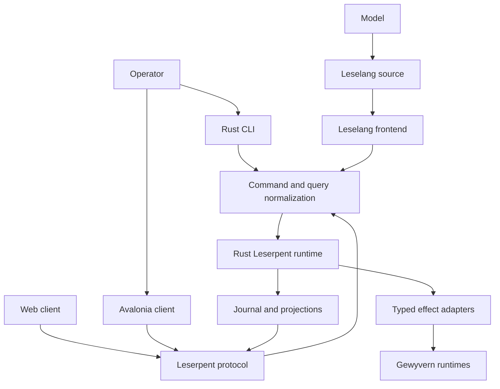

# Leserpent 2.0 Architecture

This document is the authoritative target architecture for the
`1.0.0 -> 2.0.0` Leserpent line. It describes intended behavior, not the
current 1.x implementation. Delivery order and exit gates live in the
[Leserpent 2.0 roadmap](leserpent-2-roadmap.md).

## Decision

Leserpent 2.0 is a Rust control runtime with three equivalent operator
frontends:

- Leselang programs, including model-generated programs
- the native `leserpent` CLI
- graphical clients, beginning with Avalonia

The current ASP.NET and TypeScript application remains the 1.x implementation
and migration bridge. It is not the semantic center of the 2.0 system.

## Non-Negotiable Invariants

1. GUI, CLI, and Leselang submit the same versioned `CommandEnvelope` and read
   the same versioned `Query` projections.
2. No frontend owns a control-plane capability that the other frontends cannot
   express.
3. Equivalent requests under the same identity, capability set, revision, and
   input state have equivalent effects regardless of their origin.
4. Avalonia view models contain presentation logic only. They cannot reach
   Gewyvern, persistence, deployment, or orchestration adapters directly.
5. Leselang has synchronous source semantics. Asynchrony remains an internal
   runtime implementation detail.
6. External effects are typed, journaled, bounded, cancellable, and resumable.
7. A model may propose Leselang but cannot bypass parsing, type checking,
   capabilities, confirmation policy, or effect limits.
8. UI-local state such as geometry, focus, and animation may remain
   frontend-specific. Domain state and operator actions may not.

These rules define atomic replaceability. Replacing GUI interaction with CLI or
Leselang may change presentation and transport, but not control semantics.

The executable proof for this rule is
`gewyvern_validate leserpent-parity-recovery`. It compares the current
CLI and Leselang command/query lowering against the same domain contract, then
exercises capability, confirmation, revision, principal-scoped idempotency,
continuation restart, lease fencing, snapshot fallback, worker-crash
settlement, outbox repair, Avalonia reconnect/cache state, and the real
Rust-to-.NET WebSocket path. Each Cargo suite must report a nonzero minimum test
count, the xUnit suite must emit one internally consistent nonzero success
summary, and external conformance runners must emit exactly one declared
success marker, preventing cfg, filter, or adapter drift from turning the proof
into a vacuous pass. Each summary binds the result to bounded kernel and
toolchain provenance and removes stale success metadata before execution.

## System Shape



The Rust runtime is authoritative. Frontends are replaceable projections and
intent producers.

## Rust Workspace

The intended source ownership is:

| Crate | Responsibility |
| --- | --- |
| `leselang-syntax` | lexer, parser, lossless syntax tree, diagnostics |
| `leselang-hir` | names, types, effect declarations, validated functions |
| `leselang-vm` | stackless evaluator, continuation images, deterministic steps |
| `leselang-observe` | validated, sanitized VM/runtime projections for UI consumers |
| `leselang-command` | operation DSL lowering into `CommandPlan` |
| `leselang-ui` | pure UI DSL lowering into `UiDocument` and `UiPatch` |
| `leserpent-domain` | validated IDs, commands, queries, events, revisions, capabilities, and plan authorization |
| `leserpent-runtime` | transactions, scheduling, policy, replay, projections |
| `leserpent-protocol` | IPC, HTTP, WebSocket, schema and compatibility |
| `leserpent-adapters` | typed Gewyvern health, status, deployment, discovery, and native secret-store integrations |
| `leserpent-cli` | native CLI parsing and rendering |
| `leserpentd` | local and remote runtime host |

Crates may initially be introduced behind one workspace package, but these
ownership boundaries must exist before frontend migration begins.

## Unified Intent Contract

All mutating entrypoints lower into one envelope:

```rust
pub struct CommandEnvelope {
    pub schema_version: u32,
    pub command_id: CommandId,
    pub idempotency_key: IdempotencyKey,
    pub expected_revision: Option<Revision>,
    pub principal: Principal,
    pub capabilities: CapabilitySet,
    pub origin: CommandOrigin,
    pub confirmation: Confirmation,
    pub dry_run: bool,
    pub command: Command,
}
```

`origin` is audit metadata. It must not select a different implementation.
Identity, capabilities, confirmation, and revision may change authorization,
but GUI origin alone may not grant authority.

Every command follows:

```text
decode -> validate -> authorize -> plan -> preview/confirm -> commit
       -> emit events -> update projections -> publish result
```

Queries read immutable projections. They never trigger hidden refreshes or
mutations. Explicit refresh is a command.

## Leselang Semantics

Leselang is a small functional language with synchronous source semantics:

- immutable values by default
- expressions and pattern matching
- pure functions unless their signature declares effects
- lexical capability visibility
- no promises, futures, callbacks, or `async/await` syntax
- structured `all`, `race`, `timeout`, `retry`, and `compensate`
  forms when concurrency or recovery is intentional

Evaluation runs until it completes, faults, yields, or requests an effect:

```rust
pub enum Step {
    Done(Value),
    Effect(EffectRequest),
    Yield(Continuation),
    Fault(Diagnostic),
}
```

An effect request contains a stable ID, capability requirement, deadline,
resource budget, input value, and continuation token. The runtime journals the
suspension before dispatch. Completion re-enters the continuation with a typed
`EffectResult`.

The VM must be stackless or trampolined. A suspended program cannot retain an
OS lock, database transaction, mutable borrow, socket, or host-language stack.
Continuation images are versioned data and can be rejected safely when their
schema is no longer compatible.

## Effect And Re-entry Rules

- A continuation token is single-consume.
- Duplicate effect completion is idempotent.
- Re-entry compares the expected state revision before committing.
- Cancellation and timeout are typed results, not host exceptions.
- Retry requires an explicit policy and a replay-safe effect.
- Loops have fuel, a deadline, or an external-event suspension point.
- Parallel branches merge in a deterministic declared order.
- Crash recovery reconstructs runnable work from the journal.
- Host adapters may use Rust async internally, but async types never enter
  Leselang or the domain contract.

## Adapter Secret Boundary

Rust effect targets carry validated `SecretKey` aliases, never secret values.
`SecretStore` resolves an alias immediately before network execution; missing,
invalid, or unavailable values fail before a connection is opened. Temporary
`SecretValue` instances redact `Debug` output, reject line breaks and oversized
values, and zeroize their allocation on drop. Adapter request buffers containing
authorization headers are also zeroized immediately after the socket write,
including write-failure paths.

The daemon supplies an allowlisted environment-backed store for the optional
Gewyvern admin token. An explicit secret alias instead resolves through the
native macOS Security.framework Keychain provider or Linux Secret Service;
selecting it never silently falls back to the environment. Linux loads
`libsecret-1.so.0` and `libglib-2.0.so.0` at runtime, so production hosts do not
need development packages or helper subprocesses. Configured in-memory storage
exists only as a provider and test boundary. Platform providers preserve target
and adapter semantics without adding platform code to the scheduler or domain
model.

Gewyvern targets expose two explicit transports. The existing HTTP constructor
accepts loopback socket addresses only. Remote targets require an
`https://HOST[:PORT]` origin, a regular non-symlink CA file bounded to 1 MiB,
and a secret alias; there is no HTTP or unauthenticated fallback. Rustls verifies
the DNS name or IP and negotiates HTTP/1.1. Both transports share strict,
bounded JSON response framing that rejects duplicate `Content-Length`, transfer
encoding, non-JSON content, truncation, and bytes beyond the declared body.

Deployment is a separate typed adapter capability, not a general HTTP or shell
escape hatch. `gewyvern.deployment.submit` accepts only a validated runtime ID,
idempotency key, pipeline kind, requester, explicit confirmation, and optional
target. It always posts to `/v1/deployments`, always requires the target secret,
and accepts only a matching `accepted` response. HTTP 200 is valid only for an
idempotent replay and HTTP 202 only for a new intent; echoed request fields must
match before the durable effect is completed.

The adapter is reached through the shared `runtime.deploy` operator command,
never by exposing the effect queue. Domain authorization uses the independent
`runtime.deploy` capability and requires confirmation for non-dry-run commands.
Leselang, CLI, and deterministic plan export share one lowering function. The
durable runtime derives requester, request ID, and confirmed state from the
command envelope, then materializes only the bounded runtime/pipeline/target
intent.

Avalonia remote workspaces adopt the same command boundary only when the strict
capability projection advertises authenticated deployment. UI IR declares a
bounded parameterized form with localized labels, required fields, maximum
lengths, and renderer-neutral input constraints. Avalonia generates controls
from that declaration and emits a typed `submit` event whose values are checked
again by the semantic renderer before mutation. Rust validates the same field
whitelist and constraints before lowering the event through the shared
`runtime.deploy` function. Runtime/revision context remains visible, mutation
fences cover success and ambiguous network outcomes, and principal, request
identity, capability, and confirmation are never editable fields.

Capability discovery is similarly target-scoped. The discovery adapter accepts
only a configured runtime ID and always reads `/v1/capabilities` from that
target; it has no subnet, broadcast, DNS enumeration, redirect, or target
creation surface. Core claims are typed, endpoint paths are bounded and
canonicalized, deployment claims must agree with the advertised endpoint, and
future extensions are accepted only as bounded boolean flags. The observation
omits the target origin and credentials. A shared revision-bound domain contract
validates the observation again before SQLite schema 9 atomically commits the
journal entry, effect completion, and updated runtime projection. Replay and
snapshot restore reproduce the same capability state; stale observations are
rejected without projection mutation.

Capability refresh is an operator command, not an effect-queue API. Leselang
`runtime.refresh_capabilities`, CLI `runtime refresh-capabilities`, and GUI
actions all lower to `RuntimeCapabilitiesRefresh` under the existing
`runtime.refresh` capability. Domain execution advances the runtime revision and
emits a typed event; only the durable runtime may translate that event into a
`gewyvern.capabilities.discover` request carrying the new expected revision.

Capability presentation consumes only the validated domain projection. Native
CLI inspect and renderer-neutral runtime workspaces distinguish unobserved from
observed state and expose only service/version, typed core flags, canonical
endpoint paths, and bounded boolean extensions. They do not receive or render
the configured target origin, secret alias, authorization header, or raw
adapter response.

The authenticated HTTPS vertical exercises this boundary without a mock wire
shortcut. A separate CLI process submits `RuntimeCapabilitiesRefresh`; the
daemon commits its revision, materializes the durable discovery task, executes
the real target-scoped HTTP adapter, atomically commits the observation, and
serves the resulting projection to a later CLI inspect. The proof asserts every
revision transition and verifies that the adapter's network origin is absent
from human output.

## UI Contract

Leselang UI functions are pure:

```text
State -> UiDocument
UiEvent -> CommandPlan
previous UiDocument + next UiDocument -> UiPatch
```

`UiDocument` uses stable node IDs, typed properties, bounded collections,
localization keys, accessibility metadata, and named actions. It contains no
Avalonia type names, C# expressions, HTML, JavaScript, shell text, or arbitrary
network locations.

The Avalonia renderer maps the neutral UI IR into native controls. The web
renderer may map the same IR into DOM. Unsupported presentation hints degrade
visually; unsupported commands fail at capability validation rather than being
silently omitted.

UI IR version 1 is a stable renderer-neutral boundary. Patch decoding validates
operation references and embedded node metadata without requiring renderer
state, while atomic application performs the remaining parent-context and graph
checks against the exact source revision. Unknown action or patch-operation
fields fail closed rather than being ignored by an older renderer.

The desktop event boundary observes every asynchronous reconnect and mutation
task. Window closure is an explicit lifetime fence: it cancels outstanding
requests, unsubscribes remote state, rejects queued post-close projections, and
contains shutdown-time disposal failures. This keeps renderer replacement and
application shutdown independent from transport timing.

Every GUI action must support:

- inspection as a normalized `CommandPlan`
- dry-run preview
- export to canonical Leselang
- replay through CLI or Leselang
- audit correlation by command and effect ID

## Process And Transport Boundaries

Desktop deployments should run `leserpentd` separately and connect through a
local Unix socket or named pipe. This provides crash isolation and lets the CLI
and GUI share one runtime.

Remote web and mobile clients use authenticated HTTPS and WebSocket transports.
The Gate 6 transport slice is a default-off HTTPS listener in `leserpentd`.
`POST /v1/wire` accepts the same bounded wire-v1 envelope as local IPC and
dispatches through the same domain function. `GET /v1/events` upgrades to an
authenticated WebSocket only when the client requests the
`leserpent.events.v1` subprotocol. The listener requires an explicit
address, certificate, private key, and environment-only bearer token; there is
no plaintext fallback. HTTP/1.1 headers are bounded, request bodies retain the
1 MiB protocol limit, ambiguous framing fails closed, and peer-controlled
failures are isolated per connection.

The event schema is versioned independently from request/response wire-v1.
Sessions receive endpoint-redacted runtime snapshots, revision heartbeats, and
an explicit `resync_required` event when a requested cursor is ahead of the
authority. A missing or older cursor receives a fresh snapshot; the daemon does
not claim durable delta replay. Session, frame, message, write-buffer, and
per-tick inbound work are bounded, and the event channel itself is read-only.
All versioned Rust wire envelopes now reject unknown fields, matching the
schema's fail-closed top-level contract and the strict .NET decoder. Health and
remote projection payloads apply the same rule: optional v1 fields may be
absent, but misspelled or undeclared fields cannot be silently ignored.

The current transport boundary has a named reproducible proof:
`gewyvern_validate leserpent-transport`. It composes wire-v1 and legacy fixtures,
CLI/Leselang parity, a real authenticated Unix-socket vertical path, and
fail-closed IPC plus HTTPS security tests into retained evidence. The HTTPS
suite includes a real TLS loopback, strict framing/authentication rejection,
private-key file checks, shared wire dispatch, a native CLI-to-daemon HTTPS
vertical path with explicit CA trust, and authenticated WebSocket snapshot and
cursor-resync tests. Explicit CA trust is the stable CLI trust policy; it does
not depend on ambient system roots. Both IPC and HTTPS credentials, plus their
temporary authenticated request/header buffers, use zeroizing storage so
transport teardown and error exits clear secret material. A future Windows
named-pipe adapter is optional because the native CLI already uses the same
authenticated HTTPS contract on that platform. The Avalonia desktop client now
consumes that event
contract with explicit CA and hostname verification, per-origin
endpoint-redacted snapshot cache, immediate stale-state presentation, a capped
eight-attempt reconnect loop, and cursor reset on `resync_required`. Its first
mutations are deliberately not generic: runtime-bound actions open explicit
confirmation and send only typed `runtime_refresh` or
`runtime_capabilities_refresh` commands through authenticated `POST /v1/wire`,
with `runtime.refresh` capability, principal, idempotency key, and the displayed
runtime revision. Stale state cannot mutate and ambiguous network failures are
not retried automatically. Strict capability decoding applies the same source,
version, endpoint, deployment-consistency, and extension bounds as the Rust
domain. Capability controls remain fenced until a projection newer than the
command revision carries an observed snapshot whose
`capabilities_observed_for_revision` binds it to that command. The optional
field keeps old snapshots readable; capability journal replay semantically
upgrades legacy outcomes while continuing to reject unrelated divergence. A real Rust-to-.NET vertical
proves both command bindings, real adapter execution, and subsequent WebSocket
revisions agree without persisting the runtime or adapter endpoint. Unknown
mutation outcomes require a later full snapshot; heartbeats carry revision
liveness but cannot resolve command ambiguity. Desktop token resolution and
mutation use macOS Keychain or Linux Secret Service through AOT-compatible
native bindings, scoped by canonical HTTPS origin. First-run setup accepts an
optional protected token, validates it before platform mutation, and clears the
control immediately after submission; an environment token is accepted only
when no platform item exists. Malformed stored credentials fail closed and no
secret enters the profile, UI IR, or cache.
Mobile clients, mobile secure-storage lifecycle, and mobile cache lifecycle
remain separate implementations that must pass the same versioned domain
contract.
Workspace filtering, bounded diagnostic export, live-refresh/backoff planning,
snapshot deltas, and severity retention live in `Leserpent.RemoteClient` rather
than an Avalonia assembly. These policies contain no renderer or transport
dependency; desktop controls consume them, while MobileCore runs the identical
public contract before a native workspace surface is added.
Remote fleet and runtime-workspace projection follow the same boundary.
`Leserpent.RemoteClient` maps remote state into the shared `UiDocument` model,
including filtering, capability-gated actions, parameterized deployment forms,
endpoint omission, and accessible empty states. Avalonia is only a renderer of
that document, while mobile hosts can substitute native controls without
forking projection semantics.
Remote mutation fencing is also frontend-independent. A successful command
retains its revision fence until the matching runtime projection arrives; an
ambiguous timeout or network failure retains an observation fence until a newer
authoritative snapshot arrives. Capability changes additionally require a
revision-bound capability observation, and heartbeat-only progress cannot
release either safety condition.
The corresponding action-availability projection is shared domain policy.
In-flight mutation, revision fence, observation fence, and non-live state have
a deterministic precedence. It independently reports mutation and inspection
availability with bounded reasons, so native renderers cannot accidentally
enable an action by interpreting presentation state differently.
Workspace creation and subsequent state refresh pass through one availability
application point, preventing a live/idle shortcut from overriding an
unresolved mutation fence. Authority health projection is shared too: ready,
queue pressure, saturation, and automation text are derived before renderer
selection.
The host-independent `Leserpent.MobileCore` now owns the first mobile lifecycle
contract: foreground creates one session after loading an endpoint-scoped vault
token, background invalidates its generation before disconnecting, reentry
reloads the credential, and retired-session events cannot update current state.
Android Keystore and iOS Keychain vault implementations are platform adapters
rather than transport or domain forks. Android stores only AES-256-GCM
envelopes in private preferences while its non-exportable master key remains in
Android Keystore. iOS uses generic-password Keychain items scoped as
`WhenUnlockedThisDeviceOnly`. `MobileCredentialVault` keeps both adapters
narrow: shared code enforces endpoint canonicalization, opaque hashed aliases,
token bounds, read/write validation, deletion, and cancellation before
platform access.
They do not embed privileged adapters. An optional embedded Rust library may be
added later for offline mobile operation, but it must implement the same
`leserpent-protocol` contract.

The Android entry client is a thin platform composition rather than a domain
fork. `MainActivity` delegates repeated start/stop callbacks to the shared
`MobileApplicationCoordinator`, which owns secure configuration replacement,
foreground session uniqueness, background disconnect, failure state, and
terminal disposal. Android persists only the canonical endpoint in private
preferences and a validated public CA in app-private files; tokens remain in
the Keystore-backed vault. The native shell may project connection and runtime
state, but mutations must arrive through renderer-neutral form events before
being exposed on Android.

Transport schemas are versioned independently from UI releases. Unknown fields
are ignored only where the schema explicitly allows forward compatibility.
Mutations always carry intent, identity, idempotency, and revision metadata.

## Persistence And Replay

The runtime owns:

- an append-only command/effect/event journal
- current domain projections
- Leselang continuation images
- audit records
- bounded per-runtime log records and sequence cursors
- migration metadata

SQLite is the default durable implementation, not the domain interface.
Snapshots accelerate startup but are rebuildable from supported journal
history. Dual-generation recovery validates every candidate and returns a
structured storage error when none is usable; authority startup contains no
panic-only fallback. Sensitive pairing material is stored through a platform
secret adapter and never serialized into UI IR, logs, model context, or ordinary
exports.

Runtime journal schema 10 adds strict Orchestra run and event storage. One
owner-fenced transaction writes the canonical run/event pair and reads both
records back before commit. Replaying the same event identity is idempotent only
when its canonical bytes are unchanged; payload drift or cross-runtime run-ID
reuse rolls the whole transaction back. The daemon exposes this primitive only
through the typed, capability-gated `orchestra_persist` wire operation. When a
daemon socket is configured, the 1.x host composes a daemon-backed store and
does not instantiate or dual-write its managed SQLite Orchestra provider.
Canonical history reads use the independently typed `orchestra_history`
operation. Runs and events are paged with a fixed 64-record ceiling; event
queries bind both runtime and run identity, and returned event IDs are projected
from the SQLite sequence. Frontends must exhaust these pages rather than access
the journal file or request an unbounded snapshot.
`orchestra_delete` is the matching bounded mutation: it accepts at most 128
unique runtime IDs, deletes runs and cascading events in one owner-fenced
transaction, and returns actual affected counts. The same schema enforces one
request ID per runtime and retains at most 32 current runs per runtime.

## Security Boundary

Model-generated programs are untrusted input. Before execution they pass:

1. syntax and size limits
2. type and effect checking
3. command and resource planning
4. capability validation
5. destination and adapter policy
6. dry-run and human confirmation when required
7. runtime fuel, deadline, memory, output, and concurrency limits

Leselang cannot dynamically load native libraries, invoke shell commands,
reflect over host types, construct raw HTTP requests, or execute generated
Rust/C#/XAML/JavaScript. Such behavior exists only as an explicitly installed
and capability-gated adapter.

## Performance Contract

### Platform support order

The native operator path is intentionally ordered by available proof quality:
the macOS product shell and shared Linux desktop semantics first, Android only
after the desktop application/profile/menu/release paradigm is stable, and iOS
after Android parity. Windows operators use the authenticated Web console during
this cycle. Windows Avalonia, NativeAOT, named-pipe, and installer work remain
valid future extensions, but they do not block desktop stabilization.

No-argument desktop launch is the product entry rather than a fixture shortcut.
It reads a bounded, atomically persisted profile containing only the HTTPS
origin and CA path, resolves the endpoint-scoped token from Keychain or Secret
Service, then constructs the same `RemoteMainWindow` used by explicit CLI
startup. Missing credentials or invalid profiles return to an accessible setup
window. Renderers never receive the token and fixture loading remains an
explicit conformance-only path.

Desktop connection management is a product operation rather than a second
bootstrap implementation. The macOS application menu and the renderer status
bar open the same setup window. A new validated remote session becomes the main
window before the previous session is disposed, so invalid replacement input
cannot destroy a working console. Forgetting a saved connection is explicit and
confirmed: the maintenance boundary reloads and compares the persisted profile,
deletes only its canonical endpoint credential, then clears the profile. A
stale UI cannot delete newly replaced state, and environment fallback is never
mutated.

Remembered desktop trust anchors are immutable application state rather than
ambient path references. `DesktopCertificateAuthorityStore` strictly decodes one
CA PEM, rejects trailing material, non-CA certificates, invalid signing usage,
links, and oversized files, then canonicalizes it into a SHA-256-named private
file. Startup migrates legacy external paths and rechecks that managed content
still matches its fingerprint path before constructing any transport. Pruning
is bounded to recognized regular certificate and crash-temporary names; unknown
entries fail closed. Ephemeral connections may use an external CA for the
current process, but never persist that path or create managed residue.

The design optimizes semantic work before renderer choice:

- owned or interned IDs instead of leaked `'static` strings
- compact versioned IR
- stackless VM frames
- incremental query projections
- keyed UI reconciliation and bounded patches
- streaming event transport with backpressure
- zero-copy decoding where measurement justifies it
- compiled Avalonia bindings and virtualized collections

Native AOT is a deployment target, not a substitute for measurement. Each
phase records cold start, resident memory, command latency, effect throughput,
UI patch cost, and binary/package size before tightening budgets.
The first desktop proof uses source-generated JSON metadata and an explicit
NativeAOT publish profile. Its runtime, compiler, linker, targeting, and
app-host packs share one pinned patch version, so SDK patch drift cannot silently
change the native dependency graph. macOS arm64 now packages that output through
the native `gewyvern_leserpent_bundle` boundary. The boundary rejects symlinks,
unknown payloads, and implicit replacement; excludes `.pdb` and `.dSYM`; and
emits stable plist identity, a checked `.icns`, a native application menu, and
Dock-reopen/explicit-Quit lifecycle behavior. The current stripped `.app` is
approximately 40 MiB before release signing. A physical Ubuntu x86_64 host
produces a five-file, approximately 76 MiB package with a stripped PIE ELF.
Both native executables pass the real control-tree fixtures. Windows native
desktop remains deliberately unclaimed until a suitable host exists; the Web
console is the current Windows access path.

The macOS release boundary is another native Rust entrypoint. It signs nested
dylibs inside-out, refuses non-Developer-ID identities, requires Hardened
Runtime and secure timestamps, and applies the checked empty entitlement set:
NativeAOT needs no JIT exception and this direct-distribution build is not App
Sandboxed. Notarization accepts only a pre-stored Keychain profile, packages
with `ditto --keepParent`, waits for explicit acceptance, removes the temporary
archive, staples and validates the ticket, and performs a final Gatekeeper
assessment. Ad-hoc verification is a separately labelled local-only mode and
cannot satisfy the formal release gate. Hardened ad-hoc code has no Team ID, so
individually signed native libraries cannot pass runtime library validation;
the verifier explicitly withholds a runtime-launch claim. Local UI smoke uses
an ordinary ad-hoc bundle, while formal Hardened Runtime launch requires one
Developer ID identity across the executable and all nested dylibs.

Packaged desktop startup is not a second composition path. Both normal
no-argument launch and its release probe call `DesktopProductStartup`, which
loads the bounded profile, resolves the canonical endpoint credential, creates
validated remote options, and preserves credential provenance. The macOS proof
uses only an isolated temporary profile and high loopback endpoint, refuses to
overwrite an existing Keychain item, generates the fixture token internally,
and deletes it in a guarded `finally`. A subsequent system Keychain lookup must
report no item. This proves the app bundle consumes saved profile and native
Keychain state without introducing a test-only credential provider.

The named `gewyvern_validate leserpent-benchmark` shelf now makes the
performance contract executable for runtime cold open, command-query latency,
effect enqueue throughput, UI document/patch/codec cost, .NET workspace-log
incremental merge cost, and release binary size. Budgets intentionally detect disaster regressions rather than compare
unrelated CPUs or filesystems; exact measurements are retained per host class.

Accessibility is a cross-boundary proof, not a renderer assumption. Rust rejects
unlabelled actions in the neutral IR; Avalonia then audits realized Automation
IDs, names, help text, action control types, and theme contrast. Accessibility and NativeAOT proof
processes use separate .NET artifacts roots, so concurrent release checks cannot
race on project intermediates, reference assemblies, or PDBs. Intermediate
graphs are removed after success while retained logs and release artifacts stay
within their named evidence shelf. The named managed shelf passes on macOS and
physical Linux/Xvfb, and macOS NativeAOT
consumes the same proof metrics. The checked theme floor is 4.723 against a 4.5
WCAG AA requirement.

## Compatibility And Migration

During migration, the 1.x ASP.NET service remains usable. New Rust components
first run beside it through a compatibility adapter:

```text
existing API <-> compatibility adapter <-> leserpent-protocol
```

No big-bang rewrite is permitted. A surface moves only after parity fixtures
prove that old and new implementations produce equivalent normalized commands,
authorization decisions, events, and projections.

The existing TypeScript dashboard remains a supported bridge until the shared
UI IR and at least one native client pass the same conformance suite.

## 2.0 Definition

Leserpent 2.0 is ready only when:

- Rust owns command, query, policy, journal, effect, and replay semantics
- Leselang, CLI, and Avalonia pass one parity matrix
- no C# or TypeScript frontend contains control-plane business logic
- model-generated programs execute only through the normal capability boundary
- suspended programs survive restart and resume exactly once
- GUI actions round-trip through canonical Leselang
- desktop and one mobile target pass release tests
- compatibility and rollback from the final 1.x bridge are documented
