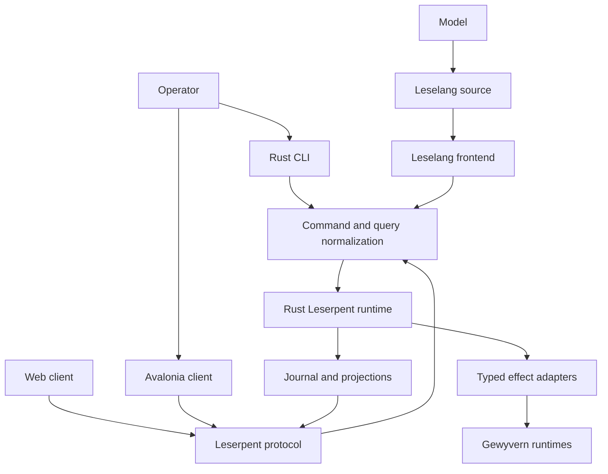

# Leserpent 2.0 Architecture

This document is the authoritative target architecture for the
`1.0.0 -> 2.0.0` Leserpent line. It describes intended behavior, not the
current 1.x implementation. Delivery order and exit gates live in the
[Leserpent 2.0 roadmap](leserpent-2-roadmap.md).

## Decision

Leserpent 2.0 is a Rust control runtime with three equivalent operator
frontends:

- Leselang programs, including model-generated programs
- the native `leserpent` CLI
- graphical clients, beginning with Avalonia

The current ASP.NET and TypeScript application remains the 1.x implementation
and migration bridge. It is not the semantic center of the 2.0 system.

## Non-Negotiable Invariants

1. GUI, CLI, and Leselang submit the same versioned `CommandEnvelope` and read
   the same versioned `Query` projections.
2. No frontend owns a control-plane capability that the other frontends cannot
   express.
3. Equivalent requests under the same identity, capability set, revision, and
   input state have equivalent effects regardless of their origin.
4. Avalonia view models contain presentation logic only. They cannot reach
   Gewyvern, persistence, deployment, or orchestration adapters directly.
5. Leselang has synchronous source semantics. Asynchrony remains an internal
   runtime implementation detail.
6. External effects are typed, journaled, bounded, cancellable, and resumable.
7. A model may propose Leselang but cannot bypass parsing, type checking,
   capabilities, confirmation policy, or effect limits.
8. UI-local state such as geometry, focus, and animation may remain
   frontend-specific. Domain state and operator actions may not.

These rules define atomic replaceability. Replacing GUI interaction with CLI or
Leselang may change presentation and transport, but not control semantics.

## System Shape



The Rust runtime is authoritative. Frontends are replaceable projections and
intent producers.

## Rust Workspace

The intended source ownership is:

| Crate | Responsibility |
| --- | --- |
| `leselang-syntax` | lexer, parser, lossless syntax tree, diagnostics |
| `leselang-hir` | names, types, effect declarations, validated functions |
| `leselang-vm` | stackless evaluator, continuation images, deterministic steps |
| `leselang-command` | operation DSL lowering into `CommandPlan` |
| `leselang-ui` | pure UI DSL lowering into `UiDocument` and `UiPatch` |
| `leserpent-domain` | IDs, commands, queries, events, revisions, capabilities |
| `leserpent-runtime` | transactions, scheduling, policy, replay, projections |
| `leserpent-protocol` | IPC, HTTP, WebSocket, schema and compatibility |
| `leserpent-adapters` | Gewyvern, storage, deployment, discovery integrations |
| `leserpent-cli` | native CLI parsing and rendering |
| `leserpentd` | local and remote runtime host |

Crates may initially be introduced behind one workspace package, but these
ownership boundaries must exist before frontend migration begins.

## Unified Intent Contract

All mutating entrypoints lower into one envelope:

```rust
pub struct CommandEnvelope {
    pub schema_version: u32,
    pub command_id: CommandId,
    pub idempotency_key: IdempotencyKey,
    pub expected_revision: Option<Revision>,
    pub principal: Principal,
    pub capabilities: CapabilitySet,
    pub origin: CommandOrigin,
    pub confirmation: Confirmation,
    pub dry_run: bool,
    pub command: Command,
}
```

`origin` is audit metadata. It must not select a different implementation.
Identity, capabilities, confirmation, and revision may change authorization,
but GUI origin alone may not grant authority.

Every command follows:

```text
decode -> validate -> authorize -> plan -> preview/confirm -> commit
       -> emit events -> update projections -> publish result
```

Queries read immutable projections. They never trigger hidden refreshes or
mutations. Explicit refresh is a command.

## Leselang Semantics

Leselang is a small functional language with synchronous source semantics:

- immutable values by default
- expressions and pattern matching
- pure functions unless their signature declares effects
- lexical capability visibility
- no promises, futures, callbacks, or `async/await` syntax
- structured `all`, `race`, `timeout`, `retry`, and `compensate`
  forms when concurrency or recovery is intentional

Evaluation runs until it completes, faults, yields, or requests an effect:

```rust
pub enum Step {
    Done(Value),
    Effect(EffectRequest),
    Yield(Continuation),
    Fault(Diagnostic),
}
```

An effect request contains a stable ID, capability requirement, deadline,
resource budget, input value, and continuation token. The runtime journals the
suspension before dispatch. Completion re-enters the continuation with a typed
`EffectResult`.

The VM must be stackless or trampolined. A suspended program cannot retain an
OS lock, database transaction, mutable borrow, socket, or host-language stack.
Continuation images are versioned data and can be rejected safely when their
schema is no longer compatible.

## Effect And Re-entry Rules

- A continuation token is single-consume.
- Duplicate effect completion is idempotent.
- Re-entry compares the expected state revision before committing.
- Cancellation and timeout are typed results, not host exceptions.
- Retry requires an explicit policy and a replay-safe effect.
- Loops have fuel, a deadline, or an external-event suspension point.
- Parallel branches merge in a deterministic declared order.
- Crash recovery reconstructs runnable work from the journal.
- Host adapters may use Rust async internally, but async types never enter
  Leselang or the domain contract.

## UI Contract

Leselang UI functions are pure:

```text
State -> UiDocument
UiEvent -> CommandPlan
previous UiDocument + next UiDocument -> UiPatch
```

`UiDocument` uses stable node IDs, typed properties, bounded collections,
localization keys, accessibility metadata, and named actions. It contains no
Avalonia type names, C# expressions, HTML, JavaScript, shell text, or arbitrary
network locations.

The Avalonia renderer maps the neutral UI IR into native controls. The web
renderer may map the same IR into DOM. Unsupported presentation hints degrade
visually; unsupported commands fail at capability validation rather than being
silently omitted.

Every GUI action must support:

- inspection as a normalized `CommandPlan`
- dry-run preview
- export to canonical Leselang
- replay through CLI or Leselang
- audit correlation by command and effect ID

## Process And Transport Boundaries

Desktop deployments should run `leserpentd` separately and connect through a
local Unix socket or named pipe. This provides crash isolation and lets the CLI
and GUI share one runtime.

Remote web and mobile clients use authenticated HTTPS and WebSocket transports.
They do not embed privileged adapters. An optional embedded Rust library may be
added later for offline mobile operation, but it must implement the same
`leserpent-protocol` contract.

Transport schemas are versioned independently from UI releases. Unknown fields
are ignored only where the schema explicitly allows forward compatibility.
Mutations always carry intent, identity, idempotency, and revision metadata.

## Persistence And Replay

The runtime owns:

- an append-only command/effect/event journal
- current domain projections
- Leselang continuation images
- audit records
- migration metadata

SQLite is the default durable implementation, not the domain interface.
Snapshots accelerate startup but are rebuildable from supported journal
history. Sensitive pairing material is stored through a platform secret
adapter and never serialized into UI IR, logs, model context, or ordinary
exports.

## Security Boundary

Model-generated programs are untrusted input. Before execution they pass:

1. syntax and size limits
2. type and effect checking
3. command and resource planning
4. capability validation
5. destination and adapter policy
6. dry-run and human confirmation when required
7. runtime fuel, deadline, memory, output, and concurrency limits

Leselang cannot dynamically load native libraries, invoke shell commands,
reflect over host types, construct raw HTTP requests, or execute generated
Rust/C#/XAML/JavaScript. Such behavior exists only as an explicitly installed
and capability-gated adapter.

## Performance Contract

The design optimizes semantic work before renderer choice:

- owned or interned IDs instead of leaked `'static` strings
- compact versioned IR
- stackless VM frames
- incremental query projections
- keyed UI reconciliation and bounded patches
- streaming event transport with backpressure
- zero-copy decoding where measurement justifies it
- compiled Avalonia bindings and virtualized collections

Native AOT is a deployment target, not a substitute for measurement. Each
phase records cold start, resident memory, command latency, effect throughput,
UI patch cost, and binary/package size before tightening budgets.

## Compatibility And Migration

During migration, the 1.x ASP.NET service remains usable. New Rust components
first run beside it through a compatibility adapter:

```text
existing API <-> compatibility adapter <-> leserpent-protocol
```

No big-bang rewrite is permitted. A surface moves only after parity fixtures
prove that old and new implementations produce equivalent normalized commands,
authorization decisions, events, and projections.

The existing TypeScript dashboard remains a supported bridge until the shared
UI IR and at least one native client pass the same conformance suite.

## 2.0 Definition

Leserpent 2.0 is ready only when:

- Rust owns command, query, policy, journal, effect, and replay semantics
- Leselang, CLI, and Avalonia pass one parity matrix
- no C# or TypeScript frontend contains control-plane business logic
- model-generated programs execute only through the normal capability boundary
- suspended programs survive restart and resume exactly once
- GUI actions round-trip through canonical Leselang
- desktop and one mobile target pass release tests
- compatibility and rollback from the final 1.x bridge are documented

